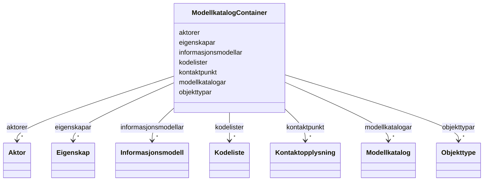

# Class: ModellkatalogContainer 


URI: [https://data.norge.no/modellkatalog/brreg-modellkatalog/ModellkatalogContainer](https://data.norge.no/modellkatalog/brreg-modellkatalog/ModellkatalogContainer)





<!-- no inheritance hierarchy -->

## Class Properties

| Property | Value |
| --- | --- |
| Tree Root | Yes |


## Eigenskapar


  
  

  
  

  
  

  
  

  
  

  
  

  
  


  
  

  
  

  
  

  
  

  
  

  
  

  
  


  
  

  
  

  
  

  
  

  
  

  
  

  
  


  
  
  
  
    
  

  
  
  
  
    
  

  
  
  
  
    
  

  
  
  
  
    
  

  
  
  
  
    
  

  
  
  
  
    
  

  
  
  
  
    
  


### Andre

| Namn | Kardinalitet og domene | Beskriving |
| --- | --- | --- |
| [modellkatalogar](modellkatalogar.md) | * <br/> [Modellkatalog](modellkatalog.md) |  |
| [informasjonsmodellar](informasjonsmodellar.md) | * <br/> [Informasjonsmodell](informasjonsmodell.md) |  |
| [objekttypar](objekttypar.md) | * <br/> [Objekttype](objekttype.md) |  |
| [kodelister](kodelister.md) | * <br/> [Kodeliste](kodeliste.md) |  |
| [eigenskapar](eigenskapar.md) | * <br/> [Eigenskap](eigenskap.md) |  |
| [aktorer](aktorer.md) | * <br/> [Aktor](aktor.md) |  |
| [kontaktpunkt](kontaktpunkt.md) | * <br/> [Kontaktopplysning](kontaktopplysning.md) |  |


## Identifier and Mapping Information


### Schema Source


* from schema: https://data.norge.no/modellkatalog/brreg-modellkatalog


## Mappings

| Mapping Type | Mapped Value |
| ---  | ---  |
| self | https://data.norge.no/modellkatalog/brreg-modellkatalog/ModellkatalogContainer |
| native | https://data.norge.no/modellkatalog/brreg-modellkatalog/ModellkatalogContainer |


## LinkML Source

<!-- TODO: investigate https://stackoverflow.com/questions/37606292/how-to-create-tabbed-code-blocks-in-mkdocs-or-sphinx -->

### Direct

<details>
```yaml
name: ModellkatalogContainer
from_schema: https://data.norge.no/modellkatalog/brreg-modellkatalog
rank: 1000
attributes:
  modellkatalogar:
    name: modellkatalogar
    from_schema: https://data.norge.no/modellkatalog/brreg-modellkatalog
    rank: 1000
    domain_of:
    - ModellkatalogContainer
    range: Modellkatalog
    multivalued: true
    inlined: true
    inlined_as_list: true
  informasjonsmodellar:
    name: informasjonsmodellar
    from_schema: https://data.norge.no/modellkatalog/brreg-modellkatalog
    rank: 1000
    domain_of:
    - ModellkatalogContainer
    range: Informasjonsmodell
    multivalued: true
    inlined: true
    inlined_as_list: true
  objekttypar:
    name: objekttypar
    from_schema: https://data.norge.no/modellkatalog/brreg-modellkatalog
    rank: 1000
    domain_of:
    - ModellkatalogContainer
    range: Objekttype
    multivalued: true
    inlined: true
    inlined_as_list: true
  kodelister:
    name: kodelister
    from_schema: https://data.norge.no/modellkatalog/brreg-modellkatalog
    rank: 1000
    domain_of:
    - ModellkatalogContainer
    range: Kodeliste
    multivalued: true
    inlined: true
    inlined_as_list: true
  eigenskapar:
    name: eigenskapar
    from_schema: https://data.norge.no/modellkatalog/brreg-modellkatalog
    rank: 1000
    domain_of:
    - ModellkatalogContainer
    range: Eigenskap
    multivalued: true
    inlined: true
    inlined_as_list: true
  aktorer:
    name: aktorer
    from_schema: https://data.norge.no/modellkatalog/brreg-modellkatalog
    rank: 1000
    domain_of:
    - ModellkatalogContainer
    range: Aktor
    multivalued: true
    inlined: true
    inlined_as_list: true
  kontaktpunkt:
    name: kontaktpunkt
    from_schema: https://data.norge.no/modellkatalog/brreg-modellkatalog
    rank: 1000
    domain_of:
    - Modellkatalog
    - Informasjonsmodell
    - ModellkatalogContainer
    range: Kontaktopplysning
    multivalued: true
    inlined: true
    inlined_as_list: true
tree_root: true

```
</details>

### Induced

<details>
```yaml
name: ModellkatalogContainer
from_schema: https://data.norge.no/modellkatalog/brreg-modellkatalog
rank: 1000
attributes:
  modellkatalogar:
    name: modellkatalogar
    from_schema: https://data.norge.no/modellkatalog/brreg-modellkatalog
    rank: 1000
    owner: ModellkatalogContainer
    domain_of:
    - ModellkatalogContainer
    range: Modellkatalog
    multivalued: true
    inlined: true
    inlined_as_list: true
  informasjonsmodellar:
    name: informasjonsmodellar
    from_schema: https://data.norge.no/modellkatalog/brreg-modellkatalog
    rank: 1000
    owner: ModellkatalogContainer
    domain_of:
    - ModellkatalogContainer
    range: Informasjonsmodell
    multivalued: true
    inlined: true
    inlined_as_list: true
  objekttypar:
    name: objekttypar
    from_schema: https://data.norge.no/modellkatalog/brreg-modellkatalog
    rank: 1000
    owner: ModellkatalogContainer
    domain_of:
    - ModellkatalogContainer
    range: Objekttype
    multivalued: true
    inlined: true
    inlined_as_list: true
  kodelister:
    name: kodelister
    from_schema: https://data.norge.no/modellkatalog/brreg-modellkatalog
    rank: 1000
    owner: ModellkatalogContainer
    domain_of:
    - ModellkatalogContainer
    range: Kodeliste
    multivalued: true
    inlined: true
    inlined_as_list: true
  eigenskapar:
    name: eigenskapar
    from_schema: https://data.norge.no/modellkatalog/brreg-modellkatalog
    rank: 1000
    owner: ModellkatalogContainer
    domain_of:
    - ModellkatalogContainer
    range: Eigenskap
    multivalued: true
    inlined: true
    inlined_as_list: true
  aktorer:
    name: aktorer
    from_schema: https://data.norge.no/modellkatalog/brreg-modellkatalog
    rank: 1000
    owner: ModellkatalogContainer
    domain_of:
    - ModellkatalogContainer
    range: Aktor
    multivalued: true
    inlined: true
    inlined_as_list: true
  kontaktpunkt:
    name: kontaktpunkt
    from_schema: https://data.norge.no/modellkatalog/brreg-modellkatalog
    rank: 1000
    owner: ModellkatalogContainer
    domain_of:
    - Modellkatalog
    - Informasjonsmodell
    - ModellkatalogContainer
    range: Kontaktopplysning
    multivalued: true
    inlined: true
    inlined_as_list: true
tree_root: true

```
</details>