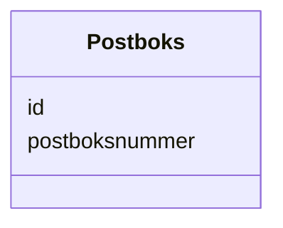

# Class: Postboks 


_Ei postboks registrert i Postboksregisteret._


URI: [ngr:Postboks](https://data.norge.no/vocabulary/ngr-adresse#Postboks)





<!-- no inheritance hierarchy -->

## Class Properties

| Property | Value |
| --- | --- |
| Class URI | [ngr:Postboks](https://data.norge.no/vocabulary/ngr-adresse#Postboks) |


## Eigenskapar


  
  

  
  
    
  


### Obligatorisk

| Namn | Kardinalitet og domene | Beskriving |
| --- | --- | --- |
| [postboksnummer](postboksnummer.md) | 1 <br/> [Integer](Integer.md) | Postboksnummer (heiltal) |


  
  

  
  


  
  

  
  


  
  
  
  
    
  

  
  
  
    
      
    
      
    
      
    
  
  


### Andre

| Namn | Kardinalitet og domene | Beskriving |
| --- | --- | --- |
| [id](id.md) | 1 <br/> [Uriorcurie](Uriorcurie.md) | URI-identifikator for ressursen |


## Usages

| used by | used in | type | used |
| ---  | --- | --- | --- |
| [AdresseContainer](AdresseContainer.md) | [postboksar](postboksar.md) | range | [Postboks](Postboks.md) |
| [Postboksadresse](Postboksadresse.md) | [postboks_ref](postboks_ref.md) | range | [Postboks](Postboks.md) |


## Identifier and Mapping Information


### Schema Source


* from schema: https://data.norge.no/linkml/ngr-adresse


## Mappings

| Mapping Type | Mapped Value |
| ---  | ---  |
| self | ngr:Postboks |
| native | https://data.norge.no/linkml/ngr-adresse/Postboks |


## LinkML Source

<!-- TODO: investigate https://stackoverflow.com/questions/37606292/how-to-create-tabbed-code-blocks-in-mkdocs-or-sphinx -->

### Direct

<details>
```yaml
name: Postboks
description: Ei postboks registrert i Postboksregisteret.
from_schema: https://data.norge.no/linkml/ngr-adresse
slots:
- id
- postboksnummer
slot_usage:
  postboksnummer:
    name: postboksnummer
    in_subset:
    - Obligatorisk
    required: true
class_uri: ngr:Postboks

```
</details>

### Induced

<details>
```yaml
name: Postboks
description: Ei postboks registrert i Postboksregisteret.
from_schema: https://data.norge.no/linkml/ngr-adresse
slot_usage:
  postboksnummer:
    name: postboksnummer
    in_subset:
    - Obligatorisk
    required: true
attributes:
  id:
    name: id
    description: URI-identifikator for ressursen.
    from_schema: https://data.norge.no/linkml/ngr-adresse
    rank: 1000
    identifier: true
    alias: id
    owner: Postboks
    domain_of:
    - GeografiskAdresse
    - Adressenavn
    - Adresseomrade
    - Adressekode
    - Husnummer
    - Bruksenhetsnummer
    - Representasjonspunkt
    - GeografiskOmrade
    - Postboks
    - Bygning
    - Bruksenhet
    range: uriorcurie
    required: true
  postboksnummer:
    name: postboksnummer
    description: Postboksnummer (heiltal).
    in_subset:
    - Obligatorisk
    from_schema: https://data.norge.no/linkml/ngr-adresse
    rank: 1000
    slot_uri: ngr:postboksnummer
    alias: postboksnummer
    owner: Postboks
    domain_of:
    - Postboks
    range: integer
    required: true
class_uri: ngr:Postboks

```
</details>