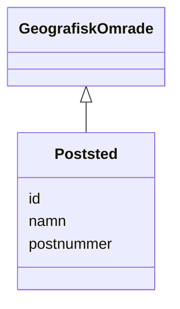

# Class: Poststed 


_Eit poststed identifisert med postnummer, forvalta av Postnummerregisteret._


URI: [ngr:Poststed](https://data.norge.no/vocabulary/ngr-adresse#Poststed)





## Inheritance
* [GeografiskOmrade](GeografiskOmrade.md)
    * **Poststed**


## Class Properties

| Property | Value |
| --- | --- |
| Class URI | [ngr:Poststed](https://data.norge.no/vocabulary/ngr-adresse#Poststed) |


## Eigenskapar


  
  
    
  


### Obligatorisk

| Namn | Kardinalitet og domene | Beskriving |
| --- | --- | --- |
| [postnummer](postnummer.md) | 1 <br/> [String](String.md) | Firesifra postnummer (locn:postCode) |


  
  


  
  


  
  
  
    
      
    
      
    
      
    
  
  


### Arva

| Namn | Kardinalitet og domene | Beskriving | Frå |
| --- | --- | --- | --- || [id](id.md) | 1 <br/> [Uriorcurie](Uriorcurie.md) | URI-identifikator for ressursen | [GeografiskOmrade](GeografiskOmrade.md) |
| [namn](namn.md) | 0..1 <br/> [String](String.md) | Namn på det geografiske området eller adressekomponenten | [GeografiskOmrade](GeografiskOmrade.md) |


## Usages

| used by | used in | type | used |
| ---  | --- | --- | --- |
| [AdresseContainer](AdresseContainer.md) | [poststeder](poststeder.md) | range | [Poststed](Poststed.md) |
| [Postboksadresse](Postboksadresse.md) | [poststed_ref](poststed_ref.md) | range | [Poststed](Poststed.md) |


## Identifier and Mapping Information


### Schema Source


* from schema: https://data.norge.no/linkml/ngr-adresse


## Mappings

| Mapping Type | Mapped Value |
| ---  | ---  |
| self | ngr:Poststed |
| native | https://data.norge.no/linkml/ngr-adresse/Poststed |


## LinkML Source

<!-- TODO: investigate https://stackoverflow.com/questions/37606292/how-to-create-tabbed-code-blocks-in-mkdocs-or-sphinx -->

### Direct

<details>
```yaml
name: Poststed
description: Eit poststed identifisert med postnummer, forvalta av Postnummerregisteret.
from_schema: https://data.norge.no/linkml/ngr-adresse
is_a: GeografiskOmrade
slots:
- postnummer
slot_usage:
  postnummer:
    name: postnummer
    in_subset:
    - Obligatorisk
    required: true
class_uri: ngr:Poststed

```
</details>

### Induced

<details>
```yaml
name: Poststed
description: Eit poststed identifisert med postnummer, forvalta av Postnummerregisteret.
from_schema: https://data.norge.no/linkml/ngr-adresse
is_a: GeografiskOmrade
slot_usage:
  postnummer:
    name: postnummer
    in_subset:
    - Obligatorisk
    required: true
attributes:
  postnummer:
    name: postnummer
    description: Firesifra postnummer (locn:postCode).
    in_subset:
    - Obligatorisk
    from_schema: https://data.norge.no/linkml/ngr-adresse
    rank: 1000
    slot_uri: locn:postCode
    alias: postnummer
    owner: Poststed
    domain_of:
    - Poststed
    range: string
    required: true
  id:
    name: id
    description: URI-identifikator for ressursen.
    from_schema: https://data.norge.no/linkml/ngr-adresse
    rank: 1000
    identifier: true
    alias: id
    owner: Poststed
    domain_of:
    - GeografiskAdresse
    - Adressenavn
    - Adresseomrade
    - Adressekode
    - Husnummer
    - Bruksenhetsnummer
    - Representasjonspunkt
    - GeografiskOmrade
    - Postboks
    - Bygning
    - Bruksenhet
    range: uriorcurie
    required: true
  namn:
    name: namn
    description: Namn på det geografiske området eller adressekomponenten.
    from_schema: https://data.norge.no/linkml/ngr-adresse
    rank: 1000
    slot_uri: ngr:namn
    alias: namn
    owner: Poststed
    domain_of:
    - Adresseomrade
    - GeografiskOmrade
    range: string
class_uri: ngr:Poststed

```
</details>