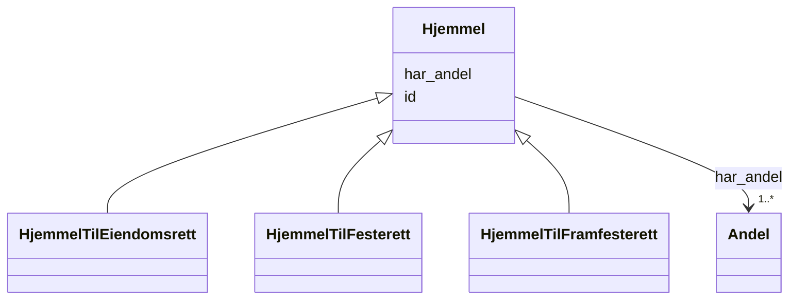

# Class: Hjemmel 


_Abstrakt klasse for heimelsdokument. Eit heimelsdokument fastset kven som har rett til eigedommen og i kva form, og består av ein eller fleire andeler med kvar sin rettigheitshavar._


* __NOTE__: this is an abstract class and should not be instantiated directly


URI: [ngre:Hjemmel](https://data.norge.no/vocabulary/ngr-eiendom#Hjemmel)





## Inheritance
* **Hjemmel**
    * [HjemmelTilEiendomsrett](HjemmelTilEiendomsrett.md)
    * [HjemmelTilFesterett](HjemmelTilFesterett.md)
    * [HjemmelTilFramfesterett](HjemmelTilFramfesterett.md)


## Class Properties

| Property | Value |
| --- | --- |
| Class URI | [ngre:Hjemmel](https://data.norge.no/vocabulary/ngr-eiendom#Hjemmel) |


## Eigenskapar


  
  

  
  
    
  


### Obligatorisk

| Namn | Kardinalitet og domene | Beskriving |
| --- | --- | --- |
| [har_andel](har_andel.md) | 1..* <br/> [Andel](Andel.md) | Andel(ar) i heimelsdokumentet |


  
  

  
  


  
  

  
  


  
  
  
  
    
  

  
  
  
    
      
    
      
    
      
    
  
  


### Andre

| Namn | Kardinalitet og domene | Beskriving |
| --- | --- | --- |
| [id](id.md) | 1 <br/> [Uriorcurie](Uriorcurie.md) | URI-identifikator for ressursen |


## Identifier and Mapping Information


### Schema Source


* from schema: https://data.norge.no/linkml/ngr-eiendom


## Mappings

| Mapping Type | Mapped Value |
| ---  | ---  |
| self | ngre:Hjemmel |
| native | https://data.norge.no/linkml/ngr-eiendom/Hjemmel |


## LinkML Source

<!-- TODO: investigate https://stackoverflow.com/questions/37606292/how-to-create-tabbed-code-blocks-in-mkdocs-or-sphinx -->

### Direct

<details>
```yaml
name: Hjemmel
description: Abstrakt klasse for heimelsdokument. Eit heimelsdokument fastset kven
  som har rett til eigedommen og i kva form, og består av ein eller fleire andeler
  med kvar sin rettigheitshavar.
from_schema: https://data.norge.no/linkml/ngr-eiendom
abstract: true
slots:
- id
- har_andel
slot_usage:
  har_andel:
    name: har_andel
    in_subset:
    - Obligatorisk
    required: true
    minimum_cardinality: 1
class_uri: ngre:Hjemmel

```
</details>

### Induced

<details>
```yaml
name: Hjemmel
description: Abstrakt klasse for heimelsdokument. Eit heimelsdokument fastset kven
  som har rett til eigedommen og i kva form, og består av ein eller fleire andeler
  med kvar sin rettigheitshavar.
from_schema: https://data.norge.no/linkml/ngr-eiendom
abstract: true
slot_usage:
  har_andel:
    name: har_andel
    in_subset:
    - Obligatorisk
    required: true
    minimum_cardinality: 1
attributes:
  id:
    name: id
    description: URI-identifikator for ressursen.
    from_schema: https://data.norge.no/linkml/ngr-eiendom
    rank: 1000
    identifier: true
    alias: id
    owner: Hjemmel
    domain_of:
    - FastEiendom
    - SamletFastEiendom
    - Borettslagsandel
    - Matrikkelenhet
    - Matrikkelnummer
    - Kommunenummer
    - Gaardsnummer
    - Bruksnummer
    - Festenummer
    - Seksjonsnummer
    - Bygning
    - Bygningsnummer
    - Representasjonspunkt
    - YtreInngang
    - Bruksenhet
    - Bruksenhetsnummer
    - Etasje
    - Teig
    - Anleggsprojeksjonsflate
    - Eierforhold
    - Hjemmel
    - Andel
    - Rettighetshaver
    - TinglystHeftelse
    - RettighetForAaBenytteEiendom
    - Borettslag
    - OffisiellAdresse
    - Person
    - Hovedenhet
    - Kommune
    range: uriorcurie
    required: true
  har_andel:
    name: har_andel
    description: Andel(ar) i heimelsdokumentet.
    in_subset:
    - Obligatorisk
    from_schema: https://data.norge.no/linkml/ngr-eiendom
    rank: 1000
    slot_uri: ngre:harAndel
    alias: har_andel
    owner: Hjemmel
    domain_of:
    - Hjemmel
    range: Andel
    required: true
    multivalued: true
    minimum_cardinality: 1
class_uri: ngre:Hjemmel

```
</details>