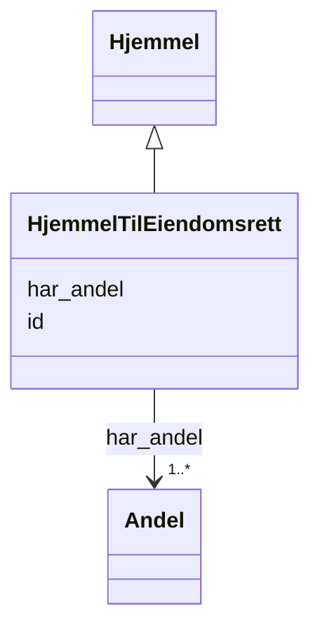

# Class: HjemmelTilEiendomsrett 


_Heimelsdokument for eigedomsrett (full eigarrett)._


URI: [ngre:HjemmelTilEiendomsrett](https://data.norge.no/vocabulary/ngr-eiendom#HjemmelTilEiendomsrett)





## Inheritance
* [Hjemmel](Hjemmel.md)
    * **HjemmelTilEiendomsrett**


## Class Properties

| Property | Value |
| --- | --- |
| Class URI | [ngre:HjemmelTilEiendomsrett](https://data.norge.no/vocabulary/ngr-eiendom#HjemmelTilEiendomsrett) |


## Eigenskapar


### Arva

| Namn | Kardinalitet og domene | Beskriving | Frå |
| --- | --- | --- | --- || [id](id.md) | 1 <br/> [Uriorcurie](Uriorcurie.md) | URI-identifikator for ressursen | [Hjemmel](Hjemmel.md) |
| [har_andel](har_andel.md) | 1..* <br/> [Andel](Andel.md) | Andel(ar) i heimelsdokumentet | [Hjemmel](Hjemmel.md) |


## Usages

| used by | used in | type | used |
| ---  | --- | --- | --- |
| [EiendomContainer](EiendomContainer.md) | [hjemmelEiendomsrett](hjemmelEiendomsrett.md) | range | [HjemmelTilEiendomsrett](HjemmelTilEiendomsrett.md) |
| [Eierforhold](Eierforhold.md) | [gjelder_hjemmel_eiendomsrett](gjelder_hjemmel_eiendomsrett.md) | range | [HjemmelTilEiendomsrett](HjemmelTilEiendomsrett.md) |
| [TinglystEierforhold](TinglystEierforhold.md) | [gjelder_hjemmel_eiendomsrett](gjelder_hjemmel_eiendomsrett.md) | range | [HjemmelTilEiendomsrett](HjemmelTilEiendomsrett.md) |
| [IkkeTinglystEierforhold](IkkeTinglystEierforhold.md) | [gjelder_hjemmel_eiendomsrett](gjelder_hjemmel_eiendomsrett.md) | range | [HjemmelTilEiendomsrett](HjemmelTilEiendomsrett.md) |


## Identifier and Mapping Information


### Schema Source


* from schema: https://data.norge.no/linkml/ngr-eiendom


## Mappings

| Mapping Type | Mapped Value |
| ---  | ---  |
| self | ngre:HjemmelTilEiendomsrett |
| native | https://data.norge.no/linkml/ngr-eiendom/HjemmelTilEiendomsrett |


## LinkML Source

<!-- TODO: investigate https://stackoverflow.com/questions/37606292/how-to-create-tabbed-code-blocks-in-mkdocs-or-sphinx -->

### Direct

<details>
```yaml
name: HjemmelTilEiendomsrett
description: Heimelsdokument for eigedomsrett (full eigarrett).
from_schema: https://data.norge.no/linkml/ngr-eiendom
is_a: Hjemmel
class_uri: ngre:HjemmelTilEiendomsrett

```
</details>

### Induced

<details>
```yaml
name: HjemmelTilEiendomsrett
description: Heimelsdokument for eigedomsrett (full eigarrett).
from_schema: https://data.norge.no/linkml/ngr-eiendom
is_a: Hjemmel
attributes:
  id:
    name: id
    description: URI-identifikator for ressursen.
    from_schema: https://data.norge.no/linkml/ngr-eiendom
    rank: 1000
    identifier: true
    alias: id
    owner: HjemmelTilEiendomsrett
    domain_of:
    - FastEiendom
    - SamletFastEiendom
    - Borettslagsandel
    - Matrikkelenhet
    - Matrikkelnummer
    - Kommunenummer
    - Gaardsnummer
    - Bruksnummer
    - Festenummer
    - Seksjonsnummer
    - Bygning
    - Bygningsnummer
    - Representasjonspunkt
    - YtreInngang
    - Bruksenhet
    - Bruksenhetsnummer
    - Etasje
    - Teig
    - Anleggsprojeksjonsflate
    - Eierforhold
    - Hjemmel
    - Andel
    - Rettighetshaver
    - TinglystHeftelse
    - RettighetForAaBenytteEiendom
    - Borettslag
    - OffisiellAdresse
    - Person
    - Hovedenhet
    - Kommune
    range: uriorcurie
    required: true
  har_andel:
    name: har_andel
    description: Andel(ar) i heimelsdokumentet.
    in_subset:
    - Obligatorisk
    from_schema: https://data.norge.no/linkml/ngr-eiendom
    rank: 1000
    slot_uri: ngre:harAndel
    alias: har_andel
    owner: HjemmelTilEiendomsrett
    domain_of:
    - Hjemmel
    range: Andel
    required: true
    multivalued: true
    minimum_cardinality: 1
class_uri: ngre:HjemmelTilEiendomsrett

```
</details>