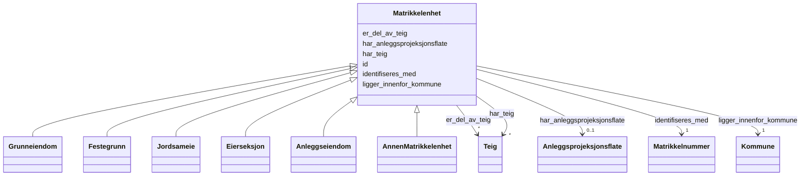

# Class: Matrikkelenhet 


_Abstrakt overklasse for alle typar matrikkeleiningar registrert i Matrikkelen. Ei matrikkelenheit er den grunnleggjande eininga for registrering av fast eigedom i Noreg._


* __NOTE__: this is an abstract class and should not be instantiated directly


URI: [ngre:Matrikkelenhet](https://data.norge.no/vocabulary/ngr-eiendom#Matrikkelenhet)





## Inheritance
* **Matrikkelenhet**
    * [Grunneiendom](Grunneiendom.md)
    * [Festegrunn](Festegrunn.md)
    * [Jordsameie](Jordsameie.md)
    * [Eierseksjon](Eierseksjon.md)
    * [Anleggseiendom](Anleggseiendom.md)
    * [AnnenMatrikkelenhet](AnnenMatrikkelenhet.md)


## Class Properties

| Property | Value |
| --- | --- |
| Class URI | [ngre:Matrikkelenhet](https://data.norge.no/vocabulary/ngr-eiendom#Matrikkelenhet) |


## Eigenskapar


  
  

  
  
    
  

  
  
    
  

  
  

  
  

  
  


### Obligatorisk

| Namn | Kardinalitet og domene | Beskriving |
| --- | --- | --- |
| [identifiseres_med](identifiseres_med.md) | 1 <br/> [Matrikkelnummer](Matrikkelnummer.md) | Matrikkelnummeret som identifiserer matrikkeleininga |
| [ligger_innenfor_kommune](ligger_innenfor_kommune.md) | 1 <br/> [Kommune](Kommune.md) | Kommunen matrikkeleininga ligg innanfor |


  
  

  
  

  
  

  
  
    
  

  
  

  
  


### Anbefalt

| Namn | Kardinalitet og domene | Beskriving |
| --- | --- | --- |
| [er_del_av_teig](er_del_av_teig.md) | * <br/> [Teig](Teig.md) | Teigen(e) matrikkeleininga er del av |


  
  

  
  

  
  

  
  

  
  
    
  

  
  
    
  


### Valgfri

| Namn | Kardinalitet og domene | Beskriving |
| --- | --- | --- |
| [har_teig](har_teig.md) | * <br/> [Teig](Teig.md) | Teigen(e) som tilhøyrer matrikkeleininga |
| [har_anleggsprojeksjonsflate](har_anleggsprojeksjonsflate.md) | 0..1 <br/> [Anleggsprojeksjonsflate](Anleggsprojeksjonsflate.md) | Anleggsprojeksjonsflata (fotavtrykket) for anleggseigedommen |


  
  
  
  
    
  

  
  
  
    
      
    
      
    
      
    
  
  

  
  
  
    
      
    
      
    
      
    
  
  

  
  
  
    
      
    
      
    
      
    
  
  

  
  
  
    
      
    
      
    
      
    
  
  

  
  
  
    
      
    
      
    
      
    
  
  


### Andre

| Namn | Kardinalitet og domene | Beskriving |
| --- | --- | --- |
| [id](id.md) | 1 <br/> [Uriorcurie](Uriorcurie.md) | URI-identifikator for ressursen |


## Usages

| used by | used in | type | used |
| ---  | --- | --- | --- |
| [FastEiendom](FastEiendom.md) | [identifiseres_av](identifiseres_av.md) | range | [Matrikkelenhet](Matrikkelenhet.md) |
| [FastEiendom](FastEiendom.md) | [bestar_av_matrikkelenhet](bestar_av_matrikkelenhet.md) | range | [Matrikkelenhet](Matrikkelenhet.md) |
| [Grunneiendom](Grunneiendom.md) | [kan_vaere_pa](kan_vaere_pa.md) | range | [Matrikkelenhet](Matrikkelenhet.md) |
| [Festegrunn](Festegrunn.md) | [kan_vaere_pa](kan_vaere_pa.md) | range | [Matrikkelenhet](Matrikkelenhet.md) |
| [Jordsameie](Jordsameie.md) | [kan_vaere_pa](kan_vaere_pa.md) | range | [Matrikkelenhet](Matrikkelenhet.md) |
| [Eierseksjon](Eierseksjon.md) | [kan_vaere_pa](kan_vaere_pa.md) | range | [Matrikkelenhet](Matrikkelenhet.md) |
| [Bygning](Bygning.md) | [er_knyttet_til_matrikkelenhet](er_knyttet_til_matrikkelenhet.md) | range | [Matrikkelenhet](Matrikkelenhet.md) |
| [Bruksenhet](Bruksenhet.md) | [er_tilknyttet_matrikkelenhet](er_tilknyttet_matrikkelenhet.md) | range | [Matrikkelenhet](Matrikkelenhet.md) |
| [Eierforhold](Eierforhold.md) | [gjelder_matrikkelenhet](gjelder_matrikkelenhet.md) | range | [Matrikkelenhet](Matrikkelenhet.md) |
| [TinglystEierforhold](TinglystEierforhold.md) | [gjelder_matrikkelenhet](gjelder_matrikkelenhet.md) | range | [Matrikkelenhet](Matrikkelenhet.md) |
| [IkkeTinglystEierforhold](IkkeTinglystEierforhold.md) | [gjelder_matrikkelenhet](gjelder_matrikkelenhet.md) | range | [Matrikkelenhet](Matrikkelenhet.md) |


## Identifier and Mapping Information


### Schema Source


* from schema: https://data.norge.no/linkml/ngr-eiendom


## Mappings

| Mapping Type | Mapped Value |
| ---  | ---  |
| self | ngre:Matrikkelenhet |
| native | https://data.norge.no/linkml/ngr-eiendom/Matrikkelenhet |


## LinkML Source

<!-- TODO: investigate https://stackoverflow.com/questions/37606292/how-to-create-tabbed-code-blocks-in-mkdocs-or-sphinx -->

### Direct

<details>
```yaml
name: Matrikkelenhet
description: Abstrakt overklasse for alle typar matrikkeleiningar registrert i Matrikkelen.
  Ei matrikkelenheit er den grunnleggjande eininga for registrering av fast eigedom
  i Noreg.
from_schema: https://data.norge.no/linkml/ngr-eiendom
abstract: true
slots:
- id
- identifiseres_med
- ligger_innenfor_kommune
- er_del_av_teig
- har_teig
- har_anleggsprojeksjonsflate
slot_usage:
  identifiseres_med:
    name: identifiseres_med
    in_subset:
    - Obligatorisk
    required: true
  ligger_innenfor_kommune:
    name: ligger_innenfor_kommune
    in_subset:
    - Obligatorisk
    required: true
  er_del_av_teig:
    name: er_del_av_teig
    in_subset:
    - Anbefalt
  har_teig:
    name: har_teig
    in_subset:
    - Valgfri
  har_anleggsprojeksjonsflate:
    name: har_anleggsprojeksjonsflate
    in_subset:
    - Valgfri
class_uri: ngre:Matrikkelenhet

```
</details>

### Induced

<details>
```yaml
name: Matrikkelenhet
description: Abstrakt overklasse for alle typar matrikkeleiningar registrert i Matrikkelen.
  Ei matrikkelenheit er den grunnleggjande eininga for registrering av fast eigedom
  i Noreg.
from_schema: https://data.norge.no/linkml/ngr-eiendom
abstract: true
slot_usage:
  identifiseres_med:
    name: identifiseres_med
    in_subset:
    - Obligatorisk
    required: true
  ligger_innenfor_kommune:
    name: ligger_innenfor_kommune
    in_subset:
    - Obligatorisk
    required: true
  er_del_av_teig:
    name: er_del_av_teig
    in_subset:
    - Anbefalt
  har_teig:
    name: har_teig
    in_subset:
    - Valgfri
  har_anleggsprojeksjonsflate:
    name: har_anleggsprojeksjonsflate
    in_subset:
    - Valgfri
attributes:
  id:
    name: id
    description: URI-identifikator for ressursen.
    from_schema: https://data.norge.no/linkml/ngr-eiendom
    rank: 1000
    identifier: true
    alias: id
    owner: Matrikkelenhet
    domain_of:
    - FastEiendom
    - SamletFastEiendom
    - Borettslagsandel
    - Matrikkelenhet
    - Matrikkelnummer
    - Kommunenummer
    - Gaardsnummer
    - Bruksnummer
    - Festenummer
    - Seksjonsnummer
    - Bygning
    - Bygningsnummer
    - Representasjonspunkt
    - YtreInngang
    - Bruksenhet
    - Bruksenhetsnummer
    - Etasje
    - Teig
    - Anleggsprojeksjonsflate
    - Eierforhold
    - Hjemmel
    - Andel
    - Rettighetshaver
    - TinglystHeftelse
    - RettighetForAaBenytteEiendom
    - Borettslag
    - OffisiellAdresse
    - Person
    - Hovedenhet
    - Kommune
    range: uriorcurie
    required: true
  identifiseres_med:
    name: identifiseres_med
    description: Matrikkelnummeret som identifiserer matrikkeleininga.
    in_subset:
    - Obligatorisk
    from_schema: https://data.norge.no/linkml/ngr-eiendom
    rank: 1000
    slot_uri: ngre:identifiseresMed
    alias: identifiseres_med
    owner: Matrikkelenhet
    domain_of:
    - Matrikkelenhet
    range: Matrikkelnummer
    required: true
  ligger_innenfor_kommune:
    name: ligger_innenfor_kommune
    description: Kommunen matrikkeleininga ligg innanfor.
    in_subset:
    - Obligatorisk
    from_schema: https://data.norge.no/linkml/ngr-eiendom
    rank: 1000
    slot_uri: ngre:liggerInnenforKommune
    alias: ligger_innenfor_kommune
    owner: Matrikkelenhet
    domain_of:
    - Matrikkelenhet
    range: Kommune
    required: true
  er_del_av_teig:
    name: er_del_av_teig
    description: Teigen(e) matrikkeleininga er del av.
    in_subset:
    - Anbefalt
    from_schema: https://data.norge.no/linkml/ngr-eiendom
    rank: 1000
    slot_uri: ngre:erDelAvTeig
    alias: er_del_av_teig
    owner: Matrikkelenhet
    domain_of:
    - Matrikkelenhet
    range: Teig
    multivalued: true
  har_teig:
    name: har_teig
    description: Teigen(e) som tilhøyrer matrikkeleininga.
    in_subset:
    - Valgfri
    from_schema: https://data.norge.no/linkml/ngr-eiendom
    rank: 1000
    slot_uri: ngre:harTeig
    alias: har_teig
    owner: Matrikkelenhet
    domain_of:
    - Matrikkelenhet
    range: Teig
    multivalued: true
  har_anleggsprojeksjonsflate:
    name: har_anleggsprojeksjonsflate
    description: Anleggsprojeksjonsflata (fotavtrykket) for anleggseigedommen.
    in_subset:
    - Valgfri
    from_schema: https://data.norge.no/linkml/ngr-eiendom
    rank: 1000
    slot_uri: ngre:harAnleggsprojeksjonsflate
    alias: har_anleggsprojeksjonsflate
    owner: Matrikkelenhet
    domain_of:
    - Matrikkelenhet
    range: Anleggsprojeksjonsflate
class_uri: ngre:Matrikkelenhet

```
</details>