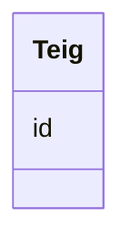

# Class: Teig 


_Eit samanhengande areal med same type grenser. Mangler ofte vannareal som høyrer til eigedommen. Grensene kan ha manglande eller dårleg nøyaktigheit._


URI: [ngre:Teig](https://data.norge.no/vocabulary/ngr-eiendom#Teig)





<!-- no inheritance hierarchy -->

## Class Properties

| Property | Value |
| --- | --- |
| Class URI | [ngre:Teig](https://data.norge.no/vocabulary/ngr-eiendom#Teig) |


## Eigenskapar


  
  


  
  


  
  


  
  
  
  
    
  


### Andre

| Namn | Kardinalitet og domene | Beskriving |
| --- | --- | --- |
| [id](id.md) | 1 <br/> [Uriorcurie](Uriorcurie.md) | URI-identifikator for ressursen |


## Usages

| used by | used in | type | used |
| ---  | --- | --- | --- |
| [EiendomContainer](EiendomContainer.md) | [teiger](teiger.md) | range | [Teig](Teig.md) |
| [Matrikkelenhet](Matrikkelenhet.md) | [er_del_av_teig](er_del_av_teig.md) | range | [Teig](Teig.md) |
| [Matrikkelenhet](Matrikkelenhet.md) | [har_teig](har_teig.md) | range | [Teig](Teig.md) |
| [Grunneiendom](Grunneiendom.md) | [er_del_av_teig](er_del_av_teig.md) | range | [Teig](Teig.md) |
| [Grunneiendom](Grunneiendom.md) | [har_teig](har_teig.md) | range | [Teig](Teig.md) |
| [Festegrunn](Festegrunn.md) | [er_del_av_teig](er_del_av_teig.md) | range | [Teig](Teig.md) |
| [Festegrunn](Festegrunn.md) | [har_teig](har_teig.md) | range | [Teig](Teig.md) |
| [Jordsameie](Jordsameie.md) | [er_del_av_teig](er_del_av_teig.md) | range | [Teig](Teig.md) |
| [Jordsameie](Jordsameie.md) | [har_teig](har_teig.md) | range | [Teig](Teig.md) |
| [Eierseksjon](Eierseksjon.md) | [er_del_av_teig](er_del_av_teig.md) | range | [Teig](Teig.md) |
| [Eierseksjon](Eierseksjon.md) | [har_teig](har_teig.md) | range | [Teig](Teig.md) |
| [Anleggseiendom](Anleggseiendom.md) | [er_del_av_teig](er_del_av_teig.md) | range | [Teig](Teig.md) |
| [Anleggseiendom](Anleggseiendom.md) | [har_teig](har_teig.md) | range | [Teig](Teig.md) |
| [AnnenMatrikkelenhet](AnnenMatrikkelenhet.md) | [er_del_av_teig](er_del_av_teig.md) | range | [Teig](Teig.md) |
| [AnnenMatrikkelenhet](AnnenMatrikkelenhet.md) | [har_teig](har_teig.md) | range | [Teig](Teig.md) |


## Identifier and Mapping Information


### Schema Source


* from schema: https://data.norge.no/linkml/ngr-eiendom


## Mappings

| Mapping Type | Mapped Value |
| ---  | ---  |
| self | ngre:Teig |
| native | https://data.norge.no/linkml/ngr-eiendom/Teig |


## LinkML Source

<!-- TODO: investigate https://stackoverflow.com/questions/37606292/how-to-create-tabbed-code-blocks-in-mkdocs-or-sphinx -->

### Direct

<details>
```yaml
name: Teig
description: Eit samanhengande areal med same type grenser. Mangler ofte vannareal
  som høyrer til eigedommen. Grensene kan ha manglande eller dårleg nøyaktigheit.
from_schema: https://data.norge.no/linkml/ngr-eiendom
slots:
- id
class_uri: ngre:Teig

```
</details>

### Induced

<details>
```yaml
name: Teig
description: Eit samanhengande areal med same type grenser. Mangler ofte vannareal
  som høyrer til eigedommen. Grensene kan ha manglande eller dårleg nøyaktigheit.
from_schema: https://data.norge.no/linkml/ngr-eiendom
attributes:
  id:
    name: id
    description: URI-identifikator for ressursen.
    from_schema: https://data.norge.no/linkml/ngr-eiendom
    rank: 1000
    identifier: true
    alias: id
    owner: Teig
    domain_of:
    - FastEiendom
    - SamletFastEiendom
    - Borettslagsandel
    - Matrikkelenhet
    - Matrikkelnummer
    - Kommunenummer
    - Gaardsnummer
    - Bruksnummer
    - Festenummer
    - Seksjonsnummer
    - Bygning
    - Bygningsnummer
    - Representasjonspunkt
    - YtreInngang
    - Bruksenhet
    - Bruksenhetsnummer
    - Etasje
    - Teig
    - Anleggsprojeksjonsflate
    - Eierforhold
    - Hjemmel
    - Andel
    - Rettighetshaver
    - TinglystHeftelse
    - RettighetForAaBenytteEiendom
    - Borettslag
    - OffisiellAdresse
    - Person
    - Hovedenhet
    - Kommune
    range: uriorcurie
    required: true
class_uri: ngre:Teig

```
</details>