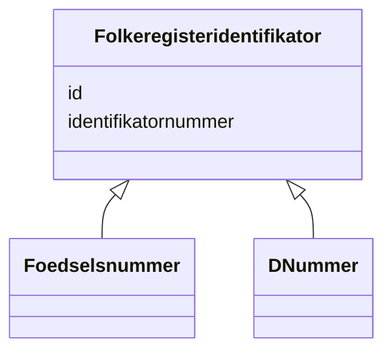

# Class: Folkeregisteridentifikator 


_Abstrakt overklasse for unik identifikator i Folkeregisteret. Konkrete underklassar er Fødselsnummer og D-nummer._


* __NOTE__: this is an abstract class and should not be instantiated directly


URI: [ngrp:Folkeregisteridentifikator](https://data.norge.no/vocabulary/ngr-person#Folkeregisteridentifikator)





## Inheritance
* **Folkeregisteridentifikator**
    * [Foedselsnummer](Foedselsnummer.md)
    * [DNummer](DNummer.md)


## Class Properties

| Property | Value |
| --- | --- |
| Class URI | [ngrp:Folkeregisteridentifikator](https://data.norge.no/vocabulary/ngr-person#Folkeregisteridentifikator) |


## Eigenskapar


  
  

  
  


  
  

  
  


  
  

  
  


  
  
  
  
    
  

  
  
  
  
    
  


### Andre

| Namn | Kardinalitet og domene | Beskriving |
| --- | --- | --- |
| [id](id.md) | 1 <br/> [Uriorcurie](Uriorcurie.md) | URI-identifikator for ressursen |
| [identifikatornummer](identifikatornummer.md) | 0..1 <br/> [String](String.md) | Sjølve identifikatoren som tekststreng (11 siffer for fødselsnummer/D-nummer) |


## Usages

| used by | used in | type | used |
| ---  | --- | --- | --- |
| [Person](Person.md) | [har_folkeregisteridentifikator](har_folkeregisteridentifikator.md) | range | [Folkeregisteridentifikator](Folkeregisteridentifikator.md) |


## Identifier and Mapping Information


### Schema Source


* from schema: https://data.norge.no/linkml/ngr-person


## Mappings

| Mapping Type | Mapped Value |
| ---  | ---  |
| self | ngrp:Folkeregisteridentifikator |
| native | https://data.norge.no/linkml/ngr-person/Folkeregisteridentifikator |


## LinkML Source

<!-- TODO: investigate https://stackoverflow.com/questions/37606292/how-to-create-tabbed-code-blocks-in-mkdocs-or-sphinx -->

### Direct

<details>
```yaml
name: Folkeregisteridentifikator
description: Abstrakt overklasse for unik identifikator i Folkeregisteret. Konkrete
  underklassar er Fødselsnummer og D-nummer.
from_schema: https://data.norge.no/linkml/ngr-person
abstract: true
slots:
- id
- identifikatornummer
class_uri: ngrp:Folkeregisteridentifikator

```
</details>

### Induced

<details>
```yaml
name: Folkeregisteridentifikator
description: Abstrakt overklasse for unik identifikator i Folkeregisteret. Konkrete
  underklassar er Fødselsnummer og D-nummer.
from_schema: https://data.norge.no/linkml/ngr-person
abstract: true
attributes:
  id:
    name: id
    description: URI-identifikator for ressursen.
    from_schema: https://data.norge.no/linkml/ngr-person
    rank: 1000
    identifier: true
    alias: id
    owner: Folkeregisteridentifikator
    domain_of:
    - Person
    - Personnavn
    - Folkeregisteridentifikator
    - Personidentifikasjon
    - FalskIdentitet
    - Identifikasjonsdokument
    - Identitetsgrunnlag
    - Kjoenn
    - Sivilstand
    - Personstatus
    - Statsborgerskap
    - Opphold
    - Foedsel
    - Dodsfall
    - KontaktinformasjonDoedsbo
    - ForeldreansvarForelder
    - ForeldreansvarBarn
    - FamilierelasjonForelder
    - FamilierelasjonBarn
    - FamilierelasjonEktefelle
    - InnflyttingTilNorge
    - UtflyttingFraNorge
    - GeografiskAdresse
    - Adressebeskyttelse
    - Verge
    - RettsligHandleevne
    - ReservasjonMotKommunikasjonPaaNett
    - Kontaktopplysninger
    - SpraakForElektroniskKommunikasjon
    range: uriorcurie
    required: true
  identifikatornummer:
    name: identifikatornummer
    description: Sjølve identifikatoren som tekststreng (11 siffer for fødselsnummer/D-nummer).
    from_schema: https://data.norge.no/linkml/ngr-person
    rank: 1000
    slot_uri: ngrp:identifikatornummer
    alias: identifikatornummer
    owner: Folkeregisteridentifikator
    domain_of:
    - Folkeregisteridentifikator
    - Personidentifikasjon
    range: string
class_uri: ngrp:Folkeregisteridentifikator

```
</details>