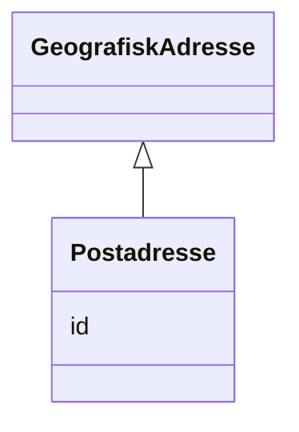

# Class: Postadresse 


_Postadressa verksemda mottar post på._


URI: [ngrv:Postadresse](https://data.norge.no/vocabulary/ngr-virksomhet#Postadresse)





## Inheritance
* [GeografiskAdresse](GeografiskAdresse.md)
    * **Postadresse**


## Class Properties

| Property | Value |
| --- | --- |
| Class URI | [ngrv:Postadresse](https://data.norge.no/vocabulary/ngr-virksomhet#Postadresse) |


## Eigenskapar


### Arva

| Namn | Kardinalitet og domene | Beskriving | Frå |
| --- | --- | --- | --- || [id](id.md) | 1 <br/> [Uriorcurie](Uriorcurie.md) | URI-identifikator for ressursen | [GeografiskAdresse](GeografiskAdresse.md) |


## Usages

| used by | used in | type | used |
| ---  | --- | --- | --- |
| [VirksomhetContainer](VirksomhetContainer.md) | [postadresser](postadresser.md) | range | [Postadresse](Postadresse.md) |
| [Virksomhet](Virksomhet.md) | [mottar_post_paa](mottar_post_paa.md) | range | [Postadresse](Postadresse.md) |
| [Underenhet](Underenhet.md) | [mottar_post_paa](mottar_post_paa.md) | range | [Postadresse](Postadresse.md) |
| [Hovedenhet](Hovedenhet.md) | [mottar_post_paa](mottar_post_paa.md) | range | [Postadresse](Postadresse.md) |


## Identifier and Mapping Information


### Schema Source


* from schema: https://data.norge.no/linkml/ngr-virksomhet


## Mappings

| Mapping Type | Mapped Value |
| ---  | ---  |
| self | ngrv:Postadresse |
| native | https://data.norge.no/linkml/ngr-virksomhet/Postadresse |


## LinkML Source

<!-- TODO: investigate https://stackoverflow.com/questions/37606292/how-to-create-tabbed-code-blocks-in-mkdocs-or-sphinx -->

### Direct

<details>
```yaml
name: Postadresse
description: Postadressa verksemda mottar post på.
from_schema: https://data.norge.no/linkml/ngr-virksomhet
is_a: GeografiskAdresse
class_uri: ngrv:Postadresse

```
</details>

### Induced

<details>
```yaml
name: Postadresse
description: Postadressa verksemda mottar post på.
from_schema: https://data.norge.no/linkml/ngr-virksomhet
is_a: GeografiskAdresse
attributes:
  id:
    name: id
    description: URI-identifikator for ressursen.
    from_schema: https://data.norge.no/linkml/ngr-virksomhet
    rank: 1000
    identifier: true
    alias: id
    owner: Postadresse
    domain_of:
    - Virksomhet
    - Tilstand
    - Organisasjonsform
    - Naeringskode
    - Sektorkode
    - Kontaktinformasjon
    - Varslingsadresse
    - Aktivitet
    - RolleIVirksomhet
    - Rolleinnehaver
    - Signaturrett
    - Prokura
    - GeografiskAdresse
    - Person
    range: uriorcurie
    required: true
class_uri: ngrv:Postadresse

```
</details>