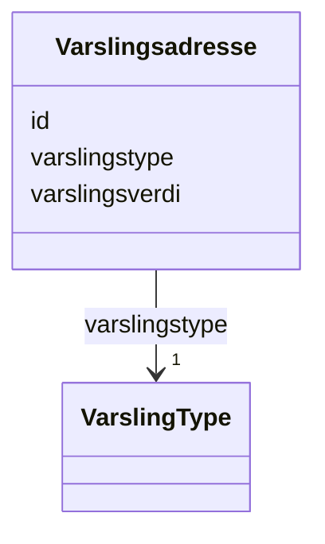

# Class: Varslingsadresse 


_Offisiell varslingsadresse for verksemda – e-post eller mobilnummer som vert brukt for offisielle meldingar frå offentlege styresmakter._


URI: [ngrv:Varslingsadresse](https://data.norge.no/vocabulary/ngr-virksomhet#Varslingsadresse)





<!-- no inheritance hierarchy -->

## Class Properties

| Property | Value |
| --- | --- |
| Class URI | [ngrv:Varslingsadresse](https://data.norge.no/vocabulary/ngr-virksomhet#Varslingsadresse) |


## Eigenskapar


  
  

  
  
    
  

  
  
    
  


### Obligatorisk

| Namn | Kardinalitet og domene | Beskriving |
| --- | --- | --- |
| [varslingstype](varslingstype.md) | 1 <br/> [VarslingType](VarslingType.md) | Kanaltype for varsling (EPOST eller MOBILTELEFON) |
| [varslingsverdi](varslingsverdi.md) | 1 <br/> [String](String.md) | Verdien for varslingskanalen (e-postadresse eller mobilnummer) |


  
  

  
  

  
  


  
  

  
  

  
  


  
  
  
  
    
  

  
  
  
    
      
    
      
    
      
    
  
  

  
  
  
    
      
    
      
    
      
    
  
  


### Andre

| Namn | Kardinalitet og domene | Beskriving |
| --- | --- | --- |
| [id](id.md) | 1 <br/> [Uriorcurie](Uriorcurie.md) | URI-identifikator for ressursen |


## Usages

| used by | used in | type | used |
| ---  | --- | --- | --- |
| [VirksomhetContainer](VirksomhetContainer.md) | [varslingsadresser](varslingsadresser.md) | range | [Varslingsadresse](Varslingsadresse.md) |
| [Virksomhet](Virksomhet.md) | [har_varslingsadresse](har_varslingsadresse.md) | range | [Varslingsadresse](Varslingsadresse.md) |
| [Underenhet](Underenhet.md) | [har_varslingsadresse](har_varslingsadresse.md) | range | [Varslingsadresse](Varslingsadresse.md) |
| [Hovedenhet](Hovedenhet.md) | [har_varslingsadresse](har_varslingsadresse.md) | range | [Varslingsadresse](Varslingsadresse.md) |


## Identifier and Mapping Information


### Schema Source


* from schema: https://data.norge.no/linkml/ngr-virksomhet


## Mappings

| Mapping Type | Mapped Value |
| ---  | ---  |
| self | ngrv:Varslingsadresse |
| native | https://data.norge.no/linkml/ngr-virksomhet/Varslingsadresse |


## LinkML Source

<!-- TODO: investigate https://stackoverflow.com/questions/37606292/how-to-create-tabbed-code-blocks-in-mkdocs-or-sphinx -->

### Direct

<details>
```yaml
name: Varslingsadresse
description: Offisiell varslingsadresse for verksemda – e-post eller mobilnummer som
  vert brukt for offisielle meldingar frå offentlege styresmakter.
from_schema: https://data.norge.no/linkml/ngr-virksomhet
slots:
- id
- varslingstype
- varslingsverdi
slot_usage:
  varslingstype:
    name: varslingstype
    in_subset:
    - Obligatorisk
    required: true
  varslingsverdi:
    name: varslingsverdi
    in_subset:
    - Obligatorisk
    required: true
class_uri: ngrv:Varslingsadresse

```
</details>

### Induced

<details>
```yaml
name: Varslingsadresse
description: Offisiell varslingsadresse for verksemda – e-post eller mobilnummer som
  vert brukt for offisielle meldingar frå offentlege styresmakter.
from_schema: https://data.norge.no/linkml/ngr-virksomhet
slot_usage:
  varslingstype:
    name: varslingstype
    in_subset:
    - Obligatorisk
    required: true
  varslingsverdi:
    name: varslingsverdi
    in_subset:
    - Obligatorisk
    required: true
attributes:
  id:
    name: id
    description: URI-identifikator for ressursen.
    from_schema: https://data.norge.no/linkml/ngr-virksomhet
    rank: 1000
    identifier: true
    alias: id
    owner: Varslingsadresse
    domain_of:
    - Virksomhet
    - Tilstand
    - Organisasjonsform
    - Naeringskode
    - Sektorkode
    - Kontaktinformasjon
    - Varslingsadresse
    - Aktivitet
    - RolleIVirksomhet
    - Rolleinnehaver
    - Signaturrett
    - Prokura
    - GeografiskAdresse
    - Person
    range: uriorcurie
    required: true
  varslingstype:
    name: varslingstype
    description: Kanaltype for varsling (EPOST eller MOBILTELEFON).
    in_subset:
    - Obligatorisk
    from_schema: https://data.norge.no/linkml/ngr-virksomhet
    rank: 1000
    slot_uri: ngrv:varslingstype
    alias: varslingstype
    owner: Varslingsadresse
    domain_of:
    - Varslingsadresse
    range: VarslingType
    required: true
  varslingsverdi:
    name: varslingsverdi
    description: Verdien for varslingskanalen (e-postadresse eller mobilnummer).
    in_subset:
    - Obligatorisk
    from_schema: https://data.norge.no/linkml/ngr-virksomhet
    rank: 1000
    slot_uri: ngrv:varslingsverdi
    alias: varslingsverdi
    owner: Varslingsadresse
    domain_of:
    - Varslingsadresse
    range: string
    required: true
class_uri: ngrv:Varslingsadresse

```
</details>