# enhetsregisteret-bvrinn

```mermaid
erDiagram
Adressenummer {
    uriorcurie id  
    Husbokstav bokstav  
}
Aktivitet {
    uriorcurie id  
    Dato datoGyldigFra  
}
Ansvarsandel {
    uriorcurie id  
    float prosent  
}
Beliggenhetsadresse {
    uriorcurie id  
    string coNavn  
    string vNavn  
}
Broek {
    uriorcurie id  
    integer nevner  
    integer teller  
}
DelerEierskifte {
    uriorcurie id  
    string beskrivelse  
    OrganisasjonsnummerList underenhet  
}
EierskifteAktivitet {
    uriorcurie id  
    Dato eierskiftedato  
    boolean gjelderHeleAktiviteten  
    Organisasjonsnummer organisasjonsnummerHovedenhet  
    TypeEierskifte typeEierskifte  
}
Fagsystemreferanse {
    uriorcurie id  
    FagsystemId fagsystemID  
    Organisasjonsnummer orgnrFagsystem  
    Tekst50 referanseFagsystem  
}
Foretaksinformasjon {
    uriorcurie id  
    boolean oenskesRegistrertIForetaksregisteret  
    boolean oenskesSlettetIForetaksregisteret  
}
Forretningsadresse {
    uriorcurie id  
    string coNavn  
    boolean utgaar  
    string vNavn  
}
Gebyransvarlig {
    uriorcurie id  
    E_postadresse e_postadresse  
    string eksternFakturareferanse  
    GebyransvarligType gebyransvarligType  
}
Innrapportering {
    uriorcurie id  
    InnsendertjenesteType innsendertjenste  
    DatoKlokkeslett innsendingstidspunkt  
    URL lenkeForEttersending  
    Maalform maalformForTilbakemelding  
    Tjenestevariant tjenestevariant  
    Versjonsnummer versjon  
}
Innsender {
    uriorcurie id  
    E_postadresse e_postadresse  
    string test  
}
InternasjonalAdresse {
    uriorcurie id  
    string adresseidentifikator  
    string adressenavn  
    string adressenummer  
    string boenhet  
    string byEllerStedsnavn  
    string bygning  
    string distriktEllerBydel  
    string etasjenummer  
    stringList friAdressetekst  
    Landkode landkode  
    string postboks  
    string postkode  
    string region  
}
Kontaktopplysning {
    uriorcurie id  
    E_postadresse e_postadresse  
    boolean e_postadresseUtgaar  
    boolean mobilnummerUtgaar  
    URL nettadresse  
    boolean nettadresseUtgaar  
    boolean telefonnummerUtgaar  
}
Matrikkelnummer {
    uriorcurie id  
    integer bruksnummer  
    integer festenummer  
    integer gaardsnummer  
    Kommunenummer kommunenummer  
}
Mobilnummer {
    uriorcurie id  
    InternasjonaltPrefiks internasjonaltPrefiks  
    NasjonaltNummer nasjonaltNummer  
}
Omdanning {
    uriorcurie id  
    Organisasjonsform nyOrganisasjonsform  
}
Person {
    uriorcurie id  
    string fulltNavn  
    PersonMappingId mappingId  
}
Postadresse {
    uriorcurie id  
    string coNavn  
    boolean utgaar  
    string vNavn  
}
Postboksadresse {
    uriorcurie id  
    Kommunenummer kommunenummer  
    string postboksanleggsnavn  
    Postboksnummer postboksnummer  
    Postnummer postnummer  
}
Prokura {
    uriorcurie id  
    boolean bekreftelseProtokoll  
    boolean utgaar  
}
Prokurabestemmelse {
    uriorcurie id  
    SignaturrettEllerProkuraregel regel  
}
Rolle {
    uriorcurie id  
    Rolletype rolletype  
    PersonMappingId tildelerAvRolle  
}
Rolleinnehaver {
    uriorcurie id  
    Organisasjonsnummer avdelingskontor  
    boolean fratredenErVarslet  
    boolean oenskerAAFratre  
    ValgtAv valgtAv  
}
Rollesett {
    uriorcurie id  
    integer minsteAntall  
    Mengdeangivelse minsteMengdeangivelse  
    Rolletype rolletype  
}
Rolletypegruppe {
    uriorcurie id  
    boolean bekreftelseProtokoll  
    boolean kjoennssammensetningAnsattvalgte  
    boolean kjoennssammensetningStyre  
    Rolletypegruppe_2 rollegruppe  
    boolean utgaar  
}
SignaturberettigetEllerProkurist {
    uriorcurie id  
}
Signaturrett {
    uriorcurie id  
    boolean bekreftelseProtokoll  
    boolean utgaar  
}
Signaturrettsbestemmelse {
    uriorcurie id  
    SignaturrettEllerProkuraregel regel  
}
Signering {
    uriorcurie id  
}
Stedsadresse {
    uriorcurie id  
    Kommunenummer kommunenummer  
    Postnummer postnummer  
    string stedsnavn  
}
Telefonnummer {
    uriorcurie id  
    InternasjonaltPrefiks internasjonaltPrefiks  
    NasjonaltNummer nasjonaltNummer  
}
TypeAktivitet {
    uriorcurie id  
    Aktivitetskode aktivitetskode  
    integer rekkefoelge  
    Tekst1000 tekst  
}
Varslingsadresse {
    uriorcurie id  
    E_postadresse e_postadresse  
}
Vegadresse {
    uriorcurie id  
    string adressenavn  
    string adressetilleggsnavn  
    Bruksenhetsnummer bruksenhetsnummer  
    Kommunenummer kommunenummer  
    Postnummer postnummer  
    string vegadresseId  
}
Virksomhet {
    uriorcurie id  
    Virksomhetsnavn navn  
    Organisasjonsnummer virksomhetsidentifikator  
}
VirksomhetsinformasjonHovedenhet {
    uriorcurie id  
    Ansvarsform ansvarsform  
    boolean bekreftelseProtokollOpploesningOgOmgjoering  
    boolean bekreftelseProtokollSletting  
    Dato datoForAvtale  
    string formaal  
    boolean harAnsvarsbegrensning  
    Maalform maalform  
    boolean meldtOmgjoeringAvOpploesning  
    boolean meldtOpploesning  
    Virksomhetsnavn navn  
    boolean oppfyllerKravTilNaeringsvirksomhet  
    Organisasjonsform organisasjonsform  
    Organisasjonsnummer organisasjonsnummer  
    TilknyttetRegistertypeList registrertITilknyttetRegister  
    Dato stiftelsesdato  
    Dato vedtektsdato  
    boolean venterAAFaaAnsatte  
    Virksomhetstype virksomhetstype  
}
VirksomhetsinformasjonUnderenhet {
    uriorcurie id  
    Virksomhetsnavn navn  
    Dato nedleggelsesdato  
    Dato oppstartsdato  
    Organisasjonsnummer organisasjonsnummer  
}

Adressenummer ||--|| Adressenummer : "nummer"
Aktivitet ||--|| Aktivitet : "aktivitet"
Ansvarsandel ||--|o Broek : "broek"
Beliggenhetsadresse ||--|o Stedsadresse : "stedsadresse"
Beliggenhetsadresse ||--|o Vegadresse : "vegadresse"
EierskifteAktivitet ||--|o DelerEierskifte : "hvilkeDeler"
Forretningsadresse ||--|o Stedsadresse : "stedsadresse"
Forretningsadresse ||--|o Vegadresse : "vegadresse"
Gebyransvarlig ||--|o Mobilnummer : "mobilnummer"
Gebyransvarlig ||--|o Person : "person"
Gebyransvarlig ||--|o Virksomhet : "virksomhet"
Innrapportering ||--|o Fagsystemreferanse : "fagsystemReferanse"
Innrapportering ||--|o Gebyransvarlig : "gebyransvarlig"
Innrapportering ||--|o Signering : "signering"
Innrapportering ||--|| Innsender : "innsender"
Innrapportering ||--|| VirksomhetsinformasjonHovedenhet : "virksomhetsinformasjon"
Innsender ||--|o Mobilnummer : "mobilnummer"
Innsender ||--|o Person : "person"
Innsender ||--|o Virksomhet : "virksomhet"
Kontaktopplysning ||--|o Mobilnummer : "mobilnummer"
Kontaktopplysning ||--|o Telefonnummer : "telefonnummer"
Postadresse ||--|o InternasjonalAdresse : "internasjonalAdresse"
Postadresse ||--|o Postboksadresse : "postboksadresse"
Postadresse ||--|o Stedsadresse : "stedsadresse"
Postadresse ||--|o Vegadresse : "vegadresse"
Prokura ||--}o Prokurabestemmelse : "prokurabestemmelse"
Prokurabestemmelse ||--}| Rollesett : "rollesett"
Rolle ||--|| Rolleinnehaver : "rolleinnehaver"
Rolleinnehaver ||--|o Ansvarsandel : "ansvarsandel"
Rolleinnehaver ||--|o Person : "person"
Rolleinnehaver ||--|o Virksomhet : "virksomhet"
Rollesett ||--}o SignaturberettigetEllerProkurist : "signaturberettigetEllerProkurist"
Rolletypegruppe ||--}o Rolle : "rolle"
SignaturberettigetEllerProkurist ||--|o Person : "person"
SignaturberettigetEllerProkurist ||--|o Virksomhet : "virksomhet"
Signaturrett ||--}o Signaturrettsbestemmelse : "signaturrettsbestemmelsse"
Signaturrettsbestemmelse ||--}| Rollesett : "rollesett"
Varslingsadresse ||--|o Mobilnummer : "mobilnummer"
Vegadresse ||--|| Adressenummer : "nummer"
VirksomhetsinformasjonHovedenhet ||--|o Aktivitet : "aktivitet"
VirksomhetsinformasjonHovedenhet ||--|o Foretaksinformasjon : "foretaksinformasjon"
VirksomhetsinformasjonHovedenhet ||--|o Forretningsadresse : "forretningsadresse"
VirksomhetsinformasjonHovedenhet ||--|o Kontaktopplysning : "kontaktopplysning"
VirksomhetsinformasjonHovedenhet ||--|o Omdanning : "omdanning"
VirksomhetsinformasjonHovedenhet ||--|o Postadresse : "postadresse"
VirksomhetsinformasjonHovedenhet ||--|o Prokura : "prokura"
VirksomhetsinformasjonHovedenhet ||--|o Signaturrett : "signaturrett"
VirksomhetsinformasjonHovedenhet ||--|o Varslingsadresse : "varslingsadresse"
VirksomhetsinformasjonHovedenhet ||--}o EierskifteAktivitet : "eierskifte"
VirksomhetsinformasjonHovedenhet ||--}o Matrikkelnummer : "matrikkelnummer"
VirksomhetsinformasjonHovedenhet ||--}o Rolletypegruppe : "rolletypegruppe"
VirksomhetsinformasjonHovedenhet ||--}o VirksomhetsinformasjonUnderenhet : "virksomhetsinformasjonUnderenhet"
VirksomhetsinformasjonUnderenhet ||--|o Aktivitet : "aktivitet"
VirksomhetsinformasjonUnderenhet ||--|o Beliggenhetsadresse : "beliggenhetsadresse"
VirksomhetsinformasjonUnderenhet ||--|o Kontaktopplysning : "kontaktopplysning"
VirksomhetsinformasjonUnderenhet ||--|o Postadresse : "postadresse"


```

<!-- Valfri skildring av bvrinn. Vert vist i portalen mellom ER-diagrammet og klasselista. -->
<!-- Fyll ut eller slett denne fila. -->

Generert frå JSON Schema 'generated'.

URI: https://example.org/generated

Name: generated

## Classes

### Obligatorisk

| Class | Description |
| --- | --- |
| [Adressenummer](klasser/adressenummer.md) | TODO: beskriv klassen |
| [Aktivitet](klasser/aktivitet.md) | TODO: beskriv klassen |
| [EierskifteAktivitet](klasser/eierskifteaktivitet.md) | TODO: beskriv klassen |
| [Fagsystemreferanse](klasser/fagsystemreferanse.md) | TODO: beskriv klassen |
| [Gebyransvarlig](klasser/gebyransvarlig.md) | TODO: beskriv klassen |
| [Innrapportering](klasser/innrapportering.md) | TODO: beskriv klassen |
| [Innsender](klasser/innsender.md) | TODO: beskriv klassen |
| [InternasjonalAdresse](klasser/internasjonaladresse.md) | TODO: beskriv klassen |
| [Mobilnummer](klasser/mobilnummer.md) | TODO: beskriv klassen |
| [Omdanning](klasser/omdanning.md) | TODO: beskriv klassen |
| [Person](klasser/person.md) | TODO: beskriv klassen |
| [Postboksadresse](klasser/postboksadresse.md) | TODO: beskriv klassen |
| [Prokurabestemmelse](klasser/prokurabestemmelse.md) | TODO: beskriv klassen |
| [Rolle](klasser/rolle.md) | TODO: beskriv klassen |
| [Rollesett](klasser/rollesett.md) | TODO: beskriv klassen |
| [Rolletypegruppe](klasser/rolletypegruppe.md) | TODO: beskriv klassen |
| [Signaturrettsbestemmelse](klasser/signaturrettsbestemmelse.md) | TODO: beskriv klassen |
| [Stedsadresse](klasser/stedsadresse.md) | TODO: beskriv klassen |
| [Telefonnummer](klasser/telefonnummer.md) | TODO: beskriv klassen |
| [TypeAktivitet](klasser/typeaktivitet.md) | TODO: beskriv klassen |
| [Vegadresse](klasser/vegadresse.md) | TODO: beskriv klassen |
| [Virksomhet](klasser/virksomhet.md) | TODO: beskriv klassen |
| [VirksomhetsinformasjonHovedenhet](klasser/virksomhetsinformasjonhovedenhet.md) | TODO: beskriv klassen |

### Anbefalt

| Class | Description |
| --- | --- |
| [Ansvarsandel](klasser/ansvarsandel.md) | TODO: beskriv klassen |
| [Beliggenhetsadresse](klasser/beliggenhetsadresse.md) | TODO: beskriv klassen |
| [Broek](klasser/broek.md) | TODO: beskriv klassen |
| [DelerEierskifte](klasser/delereierskifte.md) | TODO: beskriv klassen |
| [Foretaksinformasjon](klasser/foretaksinformasjon.md) | TODO: beskriv klassen |
| [Forretningsadresse](klasser/forretningsadresse.md) | TODO: beskriv klassen |
| [Kontaktopplysning](klasser/kontaktopplysning.md) | TODO: beskriv klassen |
| [Matrikkelnummer](klasser/matrikkelnummer.md) | TODO: beskriv klassen |
| [Postadresse](klasser/postadresse.md) | TODO: beskriv klassen |
| [Prokura](klasser/prokura.md) | TODO: beskriv klassen |
| [Rolleinnehaver](klasser/rolleinnehaver.md) | TODO: beskriv klassen |
| [SignaturberettigetEllerProkurist](klasser/signaturberettigetellerprokurist.md) | TODO: beskriv klassen |
| [Signaturrett](klasser/signaturrett.md) | TODO: beskriv klassen |
| [Varslingsadresse](klasser/varslingsadresse.md) | TODO: beskriv klassen |
| [VirksomhetsinformasjonUnderenhet](klasser/virksomhetsinformasjonunderenhet.md) | TODO: beskriv klassen |

### Andre

| Class | Description |
| --- | --- |
| [Signering](klasser/signering.md) | TODO: beskriv klassen |

## Slots

| Slot | Description |
| --- | --- |
| [adresseidentifikator](klasser/adresseidentifikator.md) | TODO: beskriv eigenskapen |
| [adressenavn](klasser/adressenavn.md) | TODO: beskriv eigenskapen |
| [adressenummer](klasser/adressenummer.md) | TODO: beskriv eigenskapen |
| [adressetilleggsnavn](klasser/adressetilleggsnavn.md) | TODO: beskriv eigenskapen |
| [aktivitet](klasser/aktivitet.md) | TODO: beskriv eigenskapen |
| [aktivitetskode](klasser/aktivitetskode.md) | TODO: beskriv eigenskapen |
| [ansvarsandel](klasser/ansvarsandel.md) | TODO: beskriv eigenskapen |
| [ansvarsform](klasser/ansvarsform.md) | TODO: beskriv eigenskapen |
| [avdelingskontor](klasser/avdelingskontor.md) | TODO: beskriv eigenskapen |
| [bekreftelseProtokoll](klasser/bekreftelseprotokoll.md) | TODO: beskriv eigenskapen |
| [bekreftelseProtokollOpploesningOgOmgjoering](klasser/bekreftelseprotokollopploesningogomgjoering.md) | TODO: beskriv eigenskapen |
| [bekreftelseProtokollSletting](klasser/bekreftelseprotokollsletting.md) | TODO: beskriv eigenskapen |
| [beliggenhetsadresse](klasser/beliggenhetsadresse.md) | TODO: beskriv eigenskapen |
| [beskrivelse](klasser/beskrivelse.md) | TODO: beskriv eigenskapen |
| [boenhet](klasser/boenhet.md) | TODO: beskriv eigenskapen |
| [bokstav](klasser/bokstav.md) | TODO: beskriv eigenskapen |
| [broek](klasser/broek.md) | TODO: beskriv eigenskapen |
| [bruksenhetsnummer](klasser/bruksenhetsnummer.md) | TODO: beskriv eigenskapen |
| [bruksnummer](klasser/bruksnummer.md) | TODO: beskriv eigenskapen |
| [byEllerStedsnavn](klasser/byellerstedsnavn.md) | TODO: beskriv eigenskapen |
| [bygning](klasser/bygning.md) | TODO: beskriv eigenskapen |
| [coNavn](klasser/conavn.md) | TODO: beskriv eigenskapen |
| [datoForAvtale](klasser/datoforavtale.md) | TODO: beskriv eigenskapen |
| [datoGyldigFra](klasser/datogyldigfra.md) | TODO: beskriv eigenskapen |
| [distriktEllerBydel](klasser/distriktellerbydel.md) | TODO: beskriv eigenskapen |
| [e_postadresse](klasser/e_postadresse.md) | The type of property E-postadresse (E-postadresse) has subclasses |
| [e_postadresseUtgaar](klasser/e_postadresseutgaar.md) | TODO: beskriv eigenskapen |
| [eierskifte](klasser/eierskifte.md) | TODO: beskriv eigenskapen |
| [eierskiftedato](klasser/eierskiftedato.md) | TODO: beskriv eigenskapen |
| [eksternFakturareferanse](klasser/eksternfakturareferanse.md) | TODO: beskriv eigenskapen |
| [etasjenummer](klasser/etasjenummer.md) | TODO: beskriv eigenskapen |
| [fagsystemID](klasser/fagsystemid.md) | TODO: beskriv eigenskapen |
| [fagsystemReferanse](klasser/fagsystemreferanse.md) | TODO: beskriv eigenskapen |
| [festenummer](klasser/festenummer.md) | TODO: beskriv eigenskapen |
| [foretaksinformasjon](klasser/foretaksinformasjon.md) | TODO: beskriv eigenskapen |
| [formaal](klasser/formaal.md) | TODO: beskriv eigenskapen |
| [forretningsadresse](klasser/forretningsadresse.md) | TODO: beskriv eigenskapen |
| [fratredenErVarslet](klasser/fratredenervarslet.md) | TODO: beskriv eigenskapen |
| [friAdressetekst](klasser/friadressetekst.md) | TODO: beskriv eigenskapen |
| [fulltNavn](klasser/fulltnavn.md) | TODO: beskriv eigenskapen |
| [gaardsnummer](klasser/gaardsnummer.md) | TODO: beskriv eigenskapen |
| [gebyransvarlig](klasser/gebyransvarlig.md) | TODO: beskriv eigenskapen |
| [gebyransvarligType](klasser/gebyransvarligtype.md) | TODO: beskriv eigenskapen |
| [gjelderHeleAktiviteten](klasser/gjelderheleaktiviteten.md) | TODO: beskriv eigenskapen |
| [harAnsvarsbegrensning](klasser/haransvarsbegrensning.md) | TODO: beskriv eigenskapen |
| [hvilkeDeler](klasser/hvilkedeler.md) | TODO: beskriv eigenskapen |
| [id](klasser/id.md) | Unik URI-identifikator for ressursen |
| [innsender](klasser/innsender.md) | TODO: beskriv eigenskapen |
| [innsendertjenste](klasser/innsendertjenste.md) | TODO: beskriv eigenskapen |
| [innsendingstidspunkt](klasser/innsendingstidspunkt.md) | TODO: beskriv eigenskapen |
| [internasjonalAdresse](klasser/internasjonaladresse.md) | TODO: beskriv eigenskapen |
| [internasjonaltPrefiks](klasser/internasjonaltprefiks.md) | TODO: beskriv eigenskapen |
| [kjoennssammensetningAnsattvalgte](klasser/kjoennssammensetningansattvalgte.md) | TODO: beskriv eigenskapen |
| [kjoennssammensetningStyre](klasser/kjoennssammensetningstyre.md) | TODO: beskriv eigenskapen |
| [kommunenummer](klasser/kommunenummer.md) | TODO: beskriv eigenskapen |
| [kontaktopplysning](klasser/kontaktopplysning.md) | TODO: beskriv eigenskapen |
| [landkode](klasser/landkode.md) | TODO: beskriv eigenskapen |
| [lenkeForEttersending](klasser/lenkeforettersending.md) | TODO: beskriv eigenskapen |
| [maalform](klasser/maalform.md) | TODO: beskriv eigenskapen |
| [maalformForTilbakemelding](klasser/maalformfortilbakemelding.md) | TODO: beskriv eigenskapen |
| [mappingId](klasser/mappingid.md) | TODO: beskriv eigenskapen |
| [matrikkelnummer](klasser/matrikkelnummer.md) | TODO: beskriv eigenskapen |
| [meldtOmgjoeringAvOpploesning](klasser/meldtomgjoeringavopploesning.md) | TODO: beskriv eigenskapen |
| [meldtOpploesning](klasser/meldtopploesning.md) | TODO: beskriv eigenskapen |
| [minsteAntall](klasser/minsteantall.md) | TODO: beskriv eigenskapen |
| [minsteMengdeangivelse](klasser/minstemengdeangivelse.md) | TODO: beskriv eigenskapen |
| [mobilnummer](klasser/mobilnummer.md) | TODO: beskriv eigenskapen |
| [mobilnummerUtgaar](klasser/mobilnummerutgaar.md) | TODO: beskriv eigenskapen |
| [nasjonaltNummer](klasser/nasjonaltnummer.md) | TODO: beskriv eigenskapen |
| [navn](klasser/navn.md) | TODO: beskriv eigenskapen |
| [nedleggelsesdato](klasser/nedleggelsesdato.md) | TODO: beskriv eigenskapen |
| [nettadresse](klasser/nettadresse.md) | TODO: beskriv eigenskapen |
| [nettadresseUtgaar](klasser/nettadresseutgaar.md) | TODO: beskriv eigenskapen |
| [nevner](klasser/nevner.md) | TODO: beskriv eigenskapen |
| [nummer](klasser/nummer.md) | TODO: beskriv eigenskapen |
| [nyOrganisasjonsform](klasser/nyorganisasjonsform.md) | TODO: beskriv eigenskapen |
| [oenskerAAFratre](klasser/oenskeraafratre.md) | TODO: beskriv eigenskapen |
| [oenskesRegistrertIForetaksregisteret](klasser/oenskesregistrertiforetaksregisteret.md) | TODO: beskriv eigenskapen |
| [oenskesSlettetIForetaksregisteret](klasser/oenskesslettetiforetaksregisteret.md) | TODO: beskriv eigenskapen |
| [omdanning](klasser/omdanning.md) | TODO: beskriv eigenskapen |
| [oppfyllerKravTilNaeringsvirksomhet](klasser/oppfyllerkravtilnaeringsvirksomhet.md) | TODO: beskriv eigenskapen |
| [oppstartsdato](klasser/oppstartsdato.md) | TODO: beskriv eigenskapen |
| [organisasjonsform](klasser/organisasjonsform.md) | TODO: beskriv eigenskapen |
| [organisasjonsnummer](klasser/organisasjonsnummer.md) | TODO: beskriv eigenskapen |
| [organisasjonsnummerHovedenhet](klasser/organisasjonsnummerhovedenhet.md) | TODO: beskriv eigenskapen |
| [orgnrFagsystem](klasser/orgnrfagsystem.md) | TODO: beskriv eigenskapen |
| [person](klasser/person.md) | TODO: beskriv eigenskapen |
| [postadresse](klasser/postadresse.md) | TODO: beskriv eigenskapen |
| [postboks](klasser/postboks.md) | TODO: beskriv eigenskapen |
| [postboksadresse](klasser/postboksadresse.md) | TODO: beskriv eigenskapen |
| [postboksanleggsnavn](klasser/postboksanleggsnavn.md) | TODO: beskriv eigenskapen |
| [postboksnummer](klasser/postboksnummer.md) | TODO: beskriv eigenskapen |
| [postkode](klasser/postkode.md) | TODO: beskriv eigenskapen |
| [postnummer](klasser/postnummer.md) | TODO: beskriv eigenskapen |
| [prokura](klasser/prokura.md) | TODO: beskriv eigenskapen |
| [prokurabestemmelse](klasser/prokurabestemmelse.md) | TODO: beskriv eigenskapen |
| [prosent](klasser/prosent.md) | TODO: beskriv eigenskapen |
| [referanseFagsystem](klasser/referansefagsystem.md) | TODO: beskriv eigenskapen |
| [regel](klasser/regel.md) | TODO: beskriv eigenskapen |
| [region](klasser/region.md) | TODO: beskriv eigenskapen |
| [registrertITilknyttetRegister](klasser/registrertitilknyttetregister.md) | TODO: beskriv eigenskapen |
| [rekkefoelge](klasser/rekkefoelge.md) | TODO: beskriv eigenskapen |
| [rolle](klasser/rolle.md) | TODO: beskriv eigenskapen |
| [rollegruppe](klasser/rollegruppe.md) | TODO: beskriv eigenskapen |
| [rolleinnehaver](klasser/rolleinnehaver.md) | TODO: beskriv eigenskapen |
| [rollesett](klasser/rollesett.md) | TODO: beskriv eigenskapen |
| [rolletype](klasser/rolletype.md) | TODO: beskriv eigenskapen |
| [rolletypegruppe](klasser/rolletypegruppe.md) | TODO: beskriv eigenskapen |
| [signaturberettigetEllerProkurist](klasser/signaturberettigetellerprokurist.md) | TODO: beskriv eigenskapen |
| [signaturrett](klasser/signaturrett.md) | TODO: beskriv eigenskapen |
| [signaturrettsbestemmelsse](klasser/signaturrettsbestemmelsse.md) | TODO: beskriv eigenskapen |
| [signering](klasser/signering.md) | TODO: beskriv eigenskapen |
| [stedsadresse](klasser/stedsadresse.md) | TODO: beskriv eigenskapen |
| [stedsnavn](klasser/stedsnavn.md) | TODO: beskriv eigenskapen |
| [stiftelsesdato](klasser/stiftelsesdato.md) | TODO: beskriv eigenskapen |
| [tekst](klasser/tekst.md) | TODO: beskriv eigenskapen |
| [telefonnummer](klasser/telefonnummer.md) | TODO: beskriv eigenskapen |
| [telefonnummerUtgaar](klasser/telefonnummerutgaar.md) | TODO: beskriv eigenskapen |
| [teller](klasser/teller.md) | TODO: beskriv eigenskapen |
| [test](klasser/test.md) | TODO: beskriv eigenskapen |
| [tildelerAvRolle](klasser/tildeleravrolle.md) | TODO: beskriv eigenskapen |
| [tjenestevariant](klasser/tjenestevariant.md) | TODO: beskriv eigenskapen |
| [typeEierskifte](klasser/typeeierskifte.md) | TODO: beskriv eigenskapen |
| [underenhet](klasser/underenhet.md) | TODO: beskriv eigenskapen |
| [utgaar](klasser/utgaar.md) | TODO: beskriv eigenskapen |
| [valgtAv](klasser/valgtav.md) | TODO: beskriv eigenskapen |
| [varslingsadresse](klasser/varslingsadresse.md) | TODO: beskriv eigenskapen |
| [vedtektsdato](klasser/vedtektsdato.md) | TODO: beskriv eigenskapen |
| [vegadresse](klasser/vegadresse.md) | TODO: beskriv eigenskapen |
| [vegadresseId](klasser/vegadresseid.md) | TODO: beskriv eigenskapen |
| [venterAAFaaAnsatte](klasser/venteraafaaansatte.md) | TODO: beskriv eigenskapen |
| [versjon](klasser/versjon.md) | TODO: beskriv eigenskapen |
| [virksomhet](klasser/virksomhet.md) | TODO: beskriv eigenskapen |
| [virksomhetsidentifikator](klasser/virksomhetsidentifikator.md) | TODO: beskriv eigenskapen |
| [virksomhetsinformasjon](klasser/virksomhetsinformasjon.md) | TODO: beskriv eigenskapen |
| [virksomhetsinformasjonUnderenhet](klasser/virksomhetsinformasjonunderenhet.md) | TODO: beskriv eigenskapen |
| [virksomhetstype](klasser/virksomhetstype.md) | TODO: beskriv eigenskapen |
| [vNavn](klasser/vnavn.md) | TODO: beskriv eigenskapen |

## Enumerations

| Enumeration | Description |
| --- | --- |
| [GebyransvarligType](klasser/gebyransvarligtype.md) | TODO: beskriv enumet |
| [Maalform](klasser/maalform.md) | TODO: beskriv enumet |
| [Rolletype](klasser/rolletype.md) | TODO: beskriv enumet |
| [TypeEierskifte](klasser/typeeierskifte.md) | TODO: beskriv enumet |

## Types

| Type | Description |
| --- | --- |
| [Aktivitetskode](klasser/aktivitetskode.md) | TODO: beskriv typen |
| [Ansvarsform](klasser/ansvarsform.md) | TODO: beskriv typen |
| [Bruksenhetsnummer](klasser/bruksenhetsnummer.md) | TODO: beskriv typen |
| [Dato](klasser/dato.md) | TODO: beskriv typen |
| [DatoKlokkeslett](klasser/datoklokkeslett.md) | TODO: beskriv typen |
| [EPostadresse](klasser/epostadresse.md) | TODO: beskriv typen |
| [FagsystemId](klasser/fagsystemid.md) | TODO: beskriv typen |
| [Husbokstav](klasser/husbokstav.md) | TODO: beskriv typen |
| [Husnummer](klasser/husnummer.md) | TODO: beskriv typen |
| [InnsendertjenesteType](klasser/innsendertjenestetype.md) | TODO: beskriv typen |
| [InternasjonaltPrefiks](klasser/internasjonaltprefiks.md) | TODO: beskriv typen |
| [Kommunenummer](klasser/kommunenummer.md) | TODO: beskriv typen |
| [Landkode](klasser/landkode.md) | TODO: beskriv typen |
| [Mengdeangivelse](klasser/mengdeangivelse.md) | TODO: beskriv typen |
| [NasjonaltNummer](klasser/nasjonaltnummer.md) | TODO: beskriv typen |
| [Organisasjonsform](klasser/organisasjonsform.md) | TODO: beskriv typen |
| [Organisasjonsnummer](klasser/organisasjonsnummer.md) | TODO: beskriv typen |
| [PersonMappingId](klasser/personmappingid.md) | TODO: beskriv typen |
| [Postboksnummer](klasser/postboksnummer.md) | TODO: beskriv typen |
| [Postnummer](klasser/postnummer.md) | TODO: beskriv typen |
| [Rolletypegruppe2](klasser/rolletypegruppe2.md) | TODO: beskriv typen |
| [SignaturrettEllerProkuraregel](klasser/signaturrettellerprokuraregel.md) | TODO: beskriv typen |
| [Tekst1000](klasser/tekst1000.md) | TODO: beskriv typen |
| [Tekst50](klasser/tekst50.md) | TODO: beskriv typen |
| [TilknyttetRegistertype](klasser/tilknyttetregistertype.md) | TODO: beskriv typen |
| [Tjenestevariant](klasser/tjenestevariant.md) | TODO: beskriv typen |
| [URL](klasser/url.md) | Tester ikke på patterns siden lovlig patterns kan skifte |
| [ValgtAv](klasser/valgtav.md) | TODO: beskriv typen |
| [Versjonsnummer](klasser/versjonsnummer.md) | TODO: beskriv typen |
| [Virksomhetsnavn](klasser/virksomhetsnavn.md) | TODO: beskriv typen |
| [Virksomhetstype](klasser/virksomhetstype.md) | TODO: beskriv typen |

## Subsets

| Subset | Description |
| --- | --- |
| [Anbefalt](klasser/anbefalt.md) | Anbefalte eigenskapar |
| [Obligatorisk](klasser/obligatorisk.md) | Obligatoriske eigenskapar |
| [Valgfri](klasser/valgfri.md) | Valfrie eigenskapar |

## Generated artifacts

| Artefakt | Fil |
|----------|-----|
| SHACL shapes | [enhetsregisteret-bvrinn-shapes.ttl](enhetsregisteret-bvrinn-shapes.ttl) |
| JSON-LD kontekst | [enhetsregisteret-bvrinn-context.jsonld](enhetsregisteret-bvrinn-context.jsonld) |
| JSON Schema | [enhetsregisteret-bvrinn-schema.json](enhetsregisteret-bvrinn-schema.json) |
| OWL ontologi | [enhetsregisteret-bvrinn-ontology.ttl](enhetsregisteret-bvrinn-ontology.ttl) |
| RDF/Turtle skjema | [enhetsregisteret-bvrinn-schema.ttl](enhetsregisteret-bvrinn-schema.ttl) |
| Python-klasser | [enhetsregisteret-bvrinn-model.py](enhetsregisteret-bvrinn-model.py) |
| Protobuf-skjema | [enhetsregisteret-bvrinn-schema.proto](enhetsregisteret-bvrinn-schema.proto) |
| ER-diagram (Mermaid) | [enhetsregisteret-bvrinn-erdiagram.md](enhetsregisteret-bvrinn-erdiagram.md) |
| PlantUML-diagram | [enhetsregisteret-bvrinn.svg](diagrams/enhetsregisteret-bvrinn.svg) · [enhetsregisteret-bvrinn.puml](diagrams/enhetsregisteret-bvrinn.puml) |
