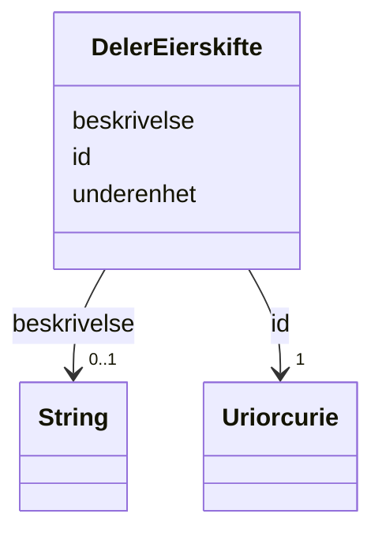

# Class: DelerEierskifte 


_TODO: beskriv klassen_


URI: [generated:DelerEierskifte](https://example.org/generated/DelerEierskifte)





<!-- no inheritance hierarchy -->

## Class Properties

| Property | Value |
| --- | --- |
| Class URI | [generated:DelerEierskifte](https://example.org/generated/DelerEierskifte) |


## Eigenskapar


  
  

  
  

  
  


  
  

  
  
    
  

  
  
    
  


### Anbefalt

| Namn | Kardinalitet og domene | Beskriving |
| --- | --- | --- |
| [beskrivelse](beskrivelse.md) | 0..1 <br/> [xsd:string](http://www.w3.org/2001/XMLSchema#string) | TODO: beskriv eigenskapen |
| [underenhet](underenhet.md) | * <br/> [Organisasjonsnummer](organisasjonsnummer.md) | TODO: beskriv eigenskapen |


  
  

  
  

  
  


  
  
  
  
    
  

  
  
  
    
      
    
      
    
      
    
  
  

  
  
  
    
      
    
      
    
      
    
  
  


### Andre

| Namn | Kardinalitet og domene | Beskriving |
| --- | --- | --- |
| [id](id.md) | 1 <br/> [xsd:anyURI](http://www.w3.org/2001/XMLSchema#anyURI) | Unik URI-identifikator for ressursen |


## Usages

| used by | used in | type | used |
| ---  | --- | --- | --- |
| [EierskifteAktivitet](eierskifteaktivitet.md) | [hvilkeDeler](hvilkedeler.md) | range | [DelerEierskifte](delereierskifte.md) |
| [GeneratedContainer](generatedcontainer.md) | [delerEierskifteer](delereierskifteer.md) | range | [DelerEierskifte](delereierskifte.md) |


## Identifier and Mapping Information


### Annotations

| property | value |
| --- | --- |
| begrepsidentifikator | https://concept-catalog.fellesdatakatalog.digdir.no/collections/TODO |


### Schema Source


* from schema: https://example.org/generated


## Mappings

| Mapping Type | Mapped Value |
| ---  | ---  |
| self | generated:DelerEierskifte |
| native | generated:DelerEierskifte |


## LinkML Source

<!-- TODO: investigate https://stackoverflow.com/questions/37606292/how-to-create-tabbed-code-blocks-in-mkdocs-or-sphinx -->

### Direct

<details>
```yaml
name: DelerEierskifte
annotations:
  begrepsidentifikator:
    tag: begrepsidentifikator
    value: https://concept-catalog.fellesdatakatalog.digdir.no/collections/TODO
description: 'TODO: beskriv klassen'
from_schema: https://example.org/generated
rank: 1000
slots:
- id
- beskrivelse
- underenhet
slot_usage:
  beskrivelse:
    name: beskrivelse
    in_subset:
    - Anbefalt
  underenhet:
    name: underenhet
    in_subset:
    - Anbefalt
class_uri: generated:DelerEierskifte

```
</details>

### Induced

<details>
```yaml
name: DelerEierskifte
annotations:
  begrepsidentifikator:
    tag: begrepsidentifikator
    value: https://concept-catalog.fellesdatakatalog.digdir.no/collections/TODO
description: 'TODO: beskriv klassen'
from_schema: https://example.org/generated
rank: 1000
slot_usage:
  beskrivelse:
    name: beskrivelse
    in_subset:
    - Anbefalt
  underenhet:
    name: underenhet
    in_subset:
    - Anbefalt
attributes:
  id:
    name: id
    description: Unik URI-identifikator for ressursen.
    from_schema: https://example.org/generated
    rank: 1000
    identifier: true
    owner: DelerEierskifte
    domain_of:
    - Innrapportering
    - VirksomhetsinformasjonHovedenhet
    - Forretningsadresse
    - Stedsadresse
    - Vegadresse
    - Adressenummer
    - Varslingsadresse
    - Mobilnummer
    - Postadresse
    - Postboksadresse
    - InternasjonalAdresse
    - Kontaktopplysning
    - Telefonnummer
    - VirksomhetsinformasjonUnderenhet
    - Beliggenhetsadresse
    - Aktivitet
    - TypeAktivitet
    - Omdanning
    - Rolletypegruppe
    - Rolle
    - Rolleinnehaver
    - Ansvarsandel
    - Broek
    - Virksomhet
    - Person
    - Prokura
    - Prokurabestemmelse
    - Rollesett
    - SignaturberettigetEllerProkurist
    - Signaturrett
    - Signaturrettsbestemmelse
    - Foretaksinformasjon
    - EierskifteAktivitet
    - DelerEierskifte
    - Matrikkelnummer
    - Innsender
    - Fagsystemreferanse
    - Signering
    - Gebyransvarlig
    range: uriorcurie
    required: true
  beskrivelse:
    name: beskrivelse
    description: 'TODO: beskriv eigenskapen'
    in_subset:
    - Anbefalt
    from_schema: https://example.org/generated
    rank: 1000
    slot_uri: generated:beskrivelse
    owner: DelerEierskifte
    domain_of:
    - DelerEierskifte
    range: string
  underenhet:
    name: underenhet
    description: 'TODO: beskriv eigenskapen'
    in_subset:
    - Anbefalt
    from_schema: https://example.org/generated
    rank: 1000
    slot_uri: generated:underenhet
    owner: DelerEierskifte
    domain_of:
    - DelerEierskifte
    range: Organisasjonsnummer
    multivalued: true
class_uri: generated:DelerEierskifte

```
</details>