# Class: GeneratedContainer 


_TODO: beskriv containerklassen_


URI: [generated:GeneratedContainer](https://example.org/generated/GeneratedContainer)

```mermaid
 classDiagram
    class GeneratedContainer
    click GeneratedContainer href "../GeneratedContainer/"
      GeneratedContainer : adressenummerer
        
          
    
        
        
        GeneratedContainer --> "*" Adressenummer : adressenummerer
        click Adressenummer href "../Adressenummer/"
    

        
      GeneratedContainer : aktiviteter
        
          
    
        
        
        GeneratedContainer --> "*" Aktivitet : aktiviteter
        click Aktivitet href "../Aktivitet/"
    

        
      GeneratedContainer : ansvarsandeler
        
          
    
        
        
        GeneratedContainer --> "*" Ansvarsandel : ansvarsandeler
        click Ansvarsandel href "../Ansvarsandel/"
    

        
      GeneratedContainer : beliggenhetsadresseer
        
          
    
        
        
        GeneratedContainer --> "*" Beliggenhetsadresse : beliggenhetsadresseer
        click Beliggenhetsadresse href "../Beliggenhetsadresse/"
    

        
      GeneratedContainer : broeker
        
          
    
        
        
        GeneratedContainer --> "*" Broek : broeker
        click Broek href "../Broek/"
    

        
      GeneratedContainer : delerEierskifteer
        
          
    
        
        
        GeneratedContainer --> "*" DelerEierskifte : delerEierskifteer
        click DelerEierskifte href "../DelerEierskifte/"
    

        
      GeneratedContainer : eierskifteAktiviteter
        
          
    
        
        
        GeneratedContainer --> "*" EierskifteAktivitet : eierskifteAktiviteter
        click EierskifteAktivitet href "../EierskifteAktivitet/"
    

        
      GeneratedContainer : fagsystemreferanseer
        
          
    
        
        
        GeneratedContainer --> "*" Fagsystemreferanse : fagsystemreferanseer
        click Fagsystemreferanse href "../Fagsystemreferanse/"
    

        
      GeneratedContainer : foretaksinformasjoner
        
          
    
        
        
        GeneratedContainer --> "*" Foretaksinformasjon : foretaksinformasjoner
        click Foretaksinformasjon href "../Foretaksinformasjon/"
    

        
      GeneratedContainer : forretningsadresseer
        
          
    
        
        
        GeneratedContainer --> "*" Forretningsadresse : forretningsadresseer
        click Forretningsadresse href "../Forretningsadresse/"
    

        
      GeneratedContainer : gebyransvarliger
        
          
    
        
        
        GeneratedContainer --> "*" Gebyransvarlig : gebyransvarliger
        click Gebyransvarlig href "../Gebyransvarlig/"
    

        
      GeneratedContainer : innrapporteringer
        
          
    
        
        
        GeneratedContainer --> "*" Innrapportering : innrapporteringer
        click Innrapportering href "../Innrapportering/"
    

        
      GeneratedContainer : innsenderer
        
          
    
        
        
        GeneratedContainer --> "*" Innsender : innsenderer
        click Innsender href "../Innsender/"
    

        
      GeneratedContainer : internasjonalAdresseer
        
          
    
        
        
        GeneratedContainer --> "*" InternasjonalAdresse : internasjonalAdresseer
        click InternasjonalAdresse href "../InternasjonalAdresse/"
    

        
      GeneratedContainer : kontaktopplysninger
        
          
    
        
        
        GeneratedContainer --> "*" Kontaktopplysning : kontaktopplysninger
        click Kontaktopplysning href "../Kontaktopplysning/"
    

        
      GeneratedContainer : matrikkelnummerer
        
          
    
        
        
        GeneratedContainer --> "*" Matrikkelnummer : matrikkelnummerer
        click Matrikkelnummer href "../Matrikkelnummer/"
    

        
      GeneratedContainer : mobilnummerer
        
          
    
        
        
        GeneratedContainer --> "*" Mobilnummer : mobilnummerer
        click Mobilnummer href "../Mobilnummer/"
    

        
      GeneratedContainer : omdanninger
        
          
    
        
        
        GeneratedContainer --> "*" Omdanning : omdanninger
        click Omdanning href "../Omdanning/"
    

        
      GeneratedContainer : personer
        
          
    
        
        
        GeneratedContainer --> "*" Person : personer
        click Person href "../Person/"
    

        
      GeneratedContainer : postadresseer
        
          
    
        
        
        GeneratedContainer --> "*" Postadresse : postadresseer
        click Postadresse href "../Postadresse/"
    

        
      GeneratedContainer : postboksadresseer
        
          
    
        
        
        GeneratedContainer --> "*" Postboksadresse : postboksadresseer
        click Postboksadresse href "../Postboksadresse/"
    

        
      GeneratedContainer : prokurabestemmelseer
        
          
    
        
        
        GeneratedContainer --> "*" Prokurabestemmelse : prokurabestemmelseer
        click Prokurabestemmelse href "../Prokurabestemmelse/"
    

        
      GeneratedContainer : prokuraer
        
          
    
        
        
        GeneratedContainer --> "*" Prokura : prokuraer
        click Prokura href "../Prokura/"
    

        
      GeneratedContainer : rolleer
        
          
    
        
        
        GeneratedContainer --> "*" Rolle : rolleer
        click Rolle href "../Rolle/"
    

        
      GeneratedContainer : rolleinnehaverer
        
          
    
        
        
        GeneratedContainer --> "*" Rolleinnehaver : rolleinnehaverer
        click Rolleinnehaver href "../Rolleinnehaver/"
    

        
      GeneratedContainer : rollesetter
        
          
    
        
        
        GeneratedContainer --> "*" Rollesett : rollesetter
        click Rollesett href "../Rollesett/"
    

        
      GeneratedContainer : rolletypegruppeer
        
          
    
        
        
        GeneratedContainer --> "*" Rolletypegruppe : rolletypegruppeer
        click Rolletypegruppe href "../Rolletypegruppe/"
    

        
      GeneratedContainer : signaturberettigetEllerProkurister
        
          
    
        
        
        GeneratedContainer --> "*" SignaturberettigetEllerProkurist : signaturberettigetEllerProkurister
        click SignaturberettigetEllerProkurist href "../SignaturberettigetEllerProkurist/"
    

        
      GeneratedContainer : signaturretter
        
          
    
        
        
        GeneratedContainer --> "*" Signaturrett : signaturretter
        click Signaturrett href "../Signaturrett/"
    

        
      GeneratedContainer : signaturrettsbestemmelseer
        
          
    
        
        
        GeneratedContainer --> "*" Signaturrettsbestemmelse : signaturrettsbestemmelseer
        click Signaturrettsbestemmelse href "../Signaturrettsbestemmelse/"
    

        
      GeneratedContainer : signeringer
        
          
    
        
        
        GeneratedContainer --> "*" Signering : signeringer
        click Signering href "../Signering/"
    

        
      GeneratedContainer : stedsadresseer
        
          
    
        
        
        GeneratedContainer --> "*" Stedsadresse : stedsadresseer
        click Stedsadresse href "../Stedsadresse/"
    

        
      GeneratedContainer : telefonnummerer
        
          
    
        
        
        GeneratedContainer --> "*" Telefonnummer : telefonnummerer
        click Telefonnummer href "../Telefonnummer/"
    

        
      GeneratedContainer : typeAktiviteter
        
          
    
        
        
        GeneratedContainer --> "*" TypeAktivitet : typeAktiviteter
        click TypeAktivitet href "../TypeAktivitet/"
    

        
      GeneratedContainer : varslingsadresseer
        
          
    
        
        
        GeneratedContainer --> "*" Varslingsadresse : varslingsadresseer
        click Varslingsadresse href "../Varslingsadresse/"
    

        
      GeneratedContainer : vegadresseer
        
          
    
        
        
        GeneratedContainer --> "*" Vegadresse : vegadresseer
        click Vegadresse href "../Vegadresse/"
    

        
      GeneratedContainer : virksomheter
        
          
    
        
        
        GeneratedContainer --> "*" Virksomhet : virksomheter
        click Virksomhet href "../Virksomhet/"
    

        
      GeneratedContainer : virksomhetsinformasjonHovedenheter
        
          
    
        
        
        GeneratedContainer --> "*" VirksomhetsinformasjonHovedenhet : virksomhetsinformasjonHovedenheter
        click VirksomhetsinformasjonHovedenhet href "../VirksomhetsinformasjonHovedenhet/"
    

        
      GeneratedContainer : virksomhetsinformasjonUnderenheter
        
          
    
        
        
        GeneratedContainer --> "*" VirksomhetsinformasjonUnderenhet : virksomhetsinformasjonUnderenheter
        click VirksomhetsinformasjonUnderenhet href "../VirksomhetsinformasjonUnderenhet/"
    

        
      
```





<!-- no inheritance hierarchy -->

## Class Properties

| Property | Value |
| --- | --- |
| Tree Root | Yes |


## Eigenskapar


  
  

  
  

  
  

  
  

  
  

  
  

  
  

  
  

  
  

  
  

  
  

  
  

  
  

  
  

  
  

  
  

  
  

  
  

  
  

  
  

  
  

  
  

  
  

  
  

  
  

  
  

  
  

  
  

  
  

  
  

  
  

  
  

  
  

  
  

  
  

  
  

  
  

  
  

  
  


  
  

  
  

  
  

  
  

  
  

  
  

  
  

  
  

  
  

  
  

  
  

  
  

  
  

  
  

  
  

  
  

  
  

  
  

  
  

  
  

  
  

  
  

  
  

  
  

  
  

  
  

  
  

  
  

  
  

  
  

  
  

  
  

  
  

  
  

  
  

  
  

  
  

  
  

  
  


  
  

  
  

  
  

  
  

  
  

  
  

  
  

  
  

  
  

  
  

  
  

  
  

  
  

  
  

  
  

  
  

  
  

  
  

  
  

  
  

  
  

  
  

  
  

  
  

  
  

  
  

  
  

  
  

  
  

  
  

  
  

  
  

  
  

  
  

  
  

  
  

  
  

  
  

  
  


  
  
  
  
    
  

  
  
  
  
    
  

  
  
  
  
    
  

  
  
  
  
    
  

  
  
  
  
    
  

  
  
  
  
    
  

  
  
  
  
    
  

  
  
  
  
    
  

  
  
  
  
    
  

  
  
  
  
    
  

  
  
  
  
    
  

  
  
  
  
    
  

  
  
  
  
    
  

  
  
  
  
    
  

  
  
  
  
    
  

  
  
  
  
    
  

  
  
  
  
    
  

  
  
  
  
    
  

  
  
  
  
    
  

  
  
  
  
    
  

  
  
  
  
    
  

  
  
  
  
    
  

  
  
  
  
    
  

  
  
  
  
    
  

  
  
  
  
    
  

  
  
  
  
    
  

  
  
  
  
    
  

  
  
  
  
    
  

  
  
  
  
    
  

  
  
  
  
    
  

  
  
  
  
    
  

  
  
  
  
    
  

  
  
  
  
    
  

  
  
  
  
    
  

  
  
  
  
    
  

  
  
  
  
    
  

  
  
  
  
    
  

  
  
  
  
    
  

  
  
  
  
    
  


### Andre

| Namn | Kardinalitet og domene | Beskriving |
| --- | --- | --- |
| [innrapporteringer](innrapporteringer.md) | * <br/> [Innrapportering](innrapportering.md) | TODO: beskriv eigenskapen |
| [virksomhetsinformasjonHovedenheter](virksomhetsinformasjonhovedenheter.md) | * <br/> [VirksomhetsinformasjonHovedenhet](virksomhetsinformasjonhovedenhet.md) | TODO: beskriv eigenskapen |
| [forretningsadresseer](forretningsadresseer.md) | * <br/> [Forretningsadresse](forretningsadresse.md) | TODO: beskriv eigenskapen |
| [stedsadresseer](stedsadresseer.md) | * <br/> [Stedsadresse](stedsadresse.md) | TODO: beskriv eigenskapen |
| [vegadresseer](vegadresseer.md) | * <br/> [Vegadresse](vegadresse.md) | TODO: beskriv eigenskapen |
| [adressenummerer](adressenummerer.md) | * <br/> [Adressenummer](adressenummer.md) | TODO: beskriv eigenskapen |
| [varslingsadresseer](varslingsadresseer.md) | * <br/> [Varslingsadresse](varslingsadresse.md) | TODO: beskriv eigenskapen |
| [mobilnummerer](mobilnummerer.md) | * <br/> [Mobilnummer](mobilnummer.md) | TODO: beskriv eigenskapen |
| [postadresseer](postadresseer.md) | * <br/> [Postadresse](postadresse.md) | TODO: beskriv eigenskapen |
| [postboksadresseer](postboksadresseer.md) | * <br/> [Postboksadresse](postboksadresse.md) | TODO: beskriv eigenskapen |
| [internasjonalAdresseer](internasjonaladresseer.md) | * <br/> [InternasjonalAdresse](internasjonaladresse.md) | TODO: beskriv eigenskapen |
| [kontaktopplysninger](kontaktopplysninger.md) | * <br/> [Kontaktopplysning](kontaktopplysning.md) | TODO: beskriv eigenskapen |
| [telefonnummerer](telefonnummerer.md) | * <br/> [Telefonnummer](telefonnummer.md) | TODO: beskriv eigenskapen |
| [virksomhetsinformasjonUnderenheter](virksomhetsinformasjonunderenheter.md) | * <br/> [VirksomhetsinformasjonUnderenhet](virksomhetsinformasjonunderenhet.md) | TODO: beskriv eigenskapen |
| [beliggenhetsadresseer](beliggenhetsadresseer.md) | * <br/> [Beliggenhetsadresse](beliggenhetsadresse.md) | TODO: beskriv eigenskapen |
| [aktiviteter](aktiviteter.md) | * <br/> [Aktivitet](aktivitet.md) | TODO: beskriv eigenskapen |
| [typeAktiviteter](typeaktiviteter.md) | * <br/> [TypeAktivitet](typeaktivitet.md) | TODO: beskriv eigenskapen |
| [omdanninger](omdanninger.md) | * <br/> [Omdanning](omdanning.md) | TODO: beskriv eigenskapen |
| [rolletypegruppeer](rolletypegruppeer.md) | * <br/> [Rolletypegruppe](rolletypegruppe.md) | TODO: beskriv eigenskapen |
| [rolleer](rolleer.md) | * <br/> [Rolle](rolle.md) | TODO: beskriv eigenskapen |
| [rolleinnehaverer](rolleinnehaverer.md) | * <br/> [Rolleinnehaver](rolleinnehaver.md) | TODO: beskriv eigenskapen |
| [ansvarsandeler](ansvarsandeler.md) | * <br/> [Ansvarsandel](ansvarsandel.md) | TODO: beskriv eigenskapen |
| [broeker](broeker.md) | * <br/> [Broek](broek.md) | TODO: beskriv eigenskapen |
| [virksomheter](virksomheter.md) | * <br/> [Virksomhet](virksomhet.md) | TODO: beskriv eigenskapen |
| [personer](personer.md) | * <br/> [Person](person.md) | TODO: beskriv eigenskapen |
| [prokuraer](prokuraer.md) | * <br/> [Prokura](prokura.md) | TODO: beskriv eigenskapen |
| [prokurabestemmelseer](prokurabestemmelseer.md) | * <br/> [Prokurabestemmelse](prokurabestemmelse.md) | TODO: beskriv eigenskapen |
| [rollesetter](rollesetter.md) | * <br/> [Rollesett](rollesett.md) | TODO: beskriv eigenskapen |
| [signaturberettigetEllerProkurister](signaturberettigetellerprokurister.md) | * <br/> [SignaturberettigetEllerProkurist](signaturberettigetellerprokurist.md) | TODO: beskriv eigenskapen |
| [signaturretter](signaturretter.md) | * <br/> [Signaturrett](signaturrett.md) | TODO: beskriv eigenskapen |
| [signaturrettsbestemmelseer](signaturrettsbestemmelseer.md) | * <br/> [Signaturrettsbestemmelse](signaturrettsbestemmelse.md) | TODO: beskriv eigenskapen |
| [foretaksinformasjoner](foretaksinformasjoner.md) | * <br/> [Foretaksinformasjon](foretaksinformasjon.md) | TODO: beskriv eigenskapen |
| [eierskifteAktiviteter](eierskifteaktiviteter.md) | * <br/> [EierskifteAktivitet](eierskifteaktivitet.md) | TODO: beskriv eigenskapen |
| [delerEierskifteer](delereierskifteer.md) | * <br/> [DelerEierskifte](delereierskifte.md) | TODO: beskriv eigenskapen |
| [matrikkelnummerer](matrikkelnummerer.md) | * <br/> [Matrikkelnummer](matrikkelnummer.md) | TODO: beskriv eigenskapen |
| [innsenderer](innsenderer.md) | * <br/> [Innsender](innsender.md) | TODO: beskriv eigenskapen |
| [fagsystemreferanseer](fagsystemreferanseer.md) | * <br/> [Fagsystemreferanse](fagsystemreferanse.md) | TODO: beskriv eigenskapen |
| [signeringer](signeringer.md) | * <br/> [Signering](signering.md) | TODO: beskriv eigenskapen |
| [gebyransvarliger](gebyransvarliger.md) | * <br/> [Gebyransvarlig](gebyransvarlig.md) | TODO: beskriv eigenskapen |


## Identifier and Mapping Information


### Schema Source


* from schema: https://example.org/generated


## Mappings

| Mapping Type | Mapped Value |
| ---  | ---  |
| self | generated:GeneratedContainer |
| native | generated:GeneratedContainer |


## LinkML Source

<!-- TODO: investigate https://stackoverflow.com/questions/37606292/how-to-create-tabbed-code-blocks-in-mkdocs-or-sphinx -->

### Direct

<details>
```yaml
name: GeneratedContainer
description: 'TODO: beskriv containerklassen'
from_schema: https://example.org/generated
rank: 1000
attributes:
  innrapporteringer:
    name: innrapporteringer
    description: 'TODO: beskriv eigenskapen'
    from_schema: https://example.org/generated
    rank: 1000
    domain_of:
    - GeneratedContainer
    range: Innrapportering
    multivalued: true
    inlined: true
    inlined_as_list: true
  virksomhetsinformasjonHovedenheter:
    name: virksomhetsinformasjonHovedenheter
    description: 'TODO: beskriv eigenskapen'
    from_schema: https://example.org/generated
    rank: 1000
    domain_of:
    - GeneratedContainer
    range: VirksomhetsinformasjonHovedenhet
    multivalued: true
    inlined: true
    inlined_as_list: true
  forretningsadresseer:
    name: forretningsadresseer
    description: 'TODO: beskriv eigenskapen'
    from_schema: https://example.org/generated
    rank: 1000
    domain_of:
    - GeneratedContainer
    range: Forretningsadresse
    multivalued: true
    inlined: true
    inlined_as_list: true
  stedsadresseer:
    name: stedsadresseer
    description: 'TODO: beskriv eigenskapen'
    from_schema: https://example.org/generated
    rank: 1000
    domain_of:
    - GeneratedContainer
    range: Stedsadresse
    multivalued: true
    inlined: true
    inlined_as_list: true
  vegadresseer:
    name: vegadresseer
    description: 'TODO: beskriv eigenskapen'
    from_schema: https://example.org/generated
    rank: 1000
    domain_of:
    - GeneratedContainer
    range: Vegadresse
    multivalued: true
    inlined: true
    inlined_as_list: true
  adressenummerer:
    name: adressenummerer
    description: 'TODO: beskriv eigenskapen'
    from_schema: https://example.org/generated
    rank: 1000
    domain_of:
    - GeneratedContainer
    range: Adressenummer
    multivalued: true
    inlined: true
    inlined_as_list: true
  varslingsadresseer:
    name: varslingsadresseer
    description: 'TODO: beskriv eigenskapen'
    from_schema: https://example.org/generated
    rank: 1000
    domain_of:
    - GeneratedContainer
    range: Varslingsadresse
    multivalued: true
    inlined: true
    inlined_as_list: true
  mobilnummerer:
    name: mobilnummerer
    description: 'TODO: beskriv eigenskapen'
    from_schema: https://example.org/generated
    rank: 1000
    domain_of:
    - GeneratedContainer
    range: Mobilnummer
    multivalued: true
    inlined: true
    inlined_as_list: true
  postadresseer:
    name: postadresseer
    description: 'TODO: beskriv eigenskapen'
    from_schema: https://example.org/generated
    rank: 1000
    domain_of:
    - GeneratedContainer
    range: Postadresse
    multivalued: true
    inlined: true
    inlined_as_list: true
  postboksadresseer:
    name: postboksadresseer
    description: 'TODO: beskriv eigenskapen'
    from_schema: https://example.org/generated
    rank: 1000
    domain_of:
    - GeneratedContainer
    range: Postboksadresse
    multivalued: true
    inlined: true
    inlined_as_list: true
  internasjonalAdresseer:
    name: internasjonalAdresseer
    description: 'TODO: beskriv eigenskapen'
    from_schema: https://example.org/generated
    rank: 1000
    domain_of:
    - GeneratedContainer
    range: InternasjonalAdresse
    multivalued: true
    inlined: true
    inlined_as_list: true
  kontaktopplysninger:
    name: kontaktopplysninger
    description: 'TODO: beskriv eigenskapen'
    from_schema: https://example.org/generated
    rank: 1000
    domain_of:
    - GeneratedContainer
    range: Kontaktopplysning
    multivalued: true
    inlined: true
    inlined_as_list: true
  telefonnummerer:
    name: telefonnummerer
    description: 'TODO: beskriv eigenskapen'
    from_schema: https://example.org/generated
    rank: 1000
    domain_of:
    - GeneratedContainer
    range: Telefonnummer
    multivalued: true
    inlined: true
    inlined_as_list: true
  virksomhetsinformasjonUnderenheter:
    name: virksomhetsinformasjonUnderenheter
    description: 'TODO: beskriv eigenskapen'
    from_schema: https://example.org/generated
    rank: 1000
    domain_of:
    - GeneratedContainer
    range: VirksomhetsinformasjonUnderenhet
    multivalued: true
    inlined: true
    inlined_as_list: true
  beliggenhetsadresseer:
    name: beliggenhetsadresseer
    description: 'TODO: beskriv eigenskapen'
    from_schema: https://example.org/generated
    rank: 1000
    domain_of:
    - GeneratedContainer
    range: Beliggenhetsadresse
    multivalued: true
    inlined: true
    inlined_as_list: true
  aktiviteter:
    name: aktiviteter
    description: 'TODO: beskriv eigenskapen'
    from_schema: https://example.org/generated
    rank: 1000
    domain_of:
    - GeneratedContainer
    range: Aktivitet
    multivalued: true
    inlined: true
    inlined_as_list: true
  typeAktiviteter:
    name: typeAktiviteter
    description: 'TODO: beskriv eigenskapen'
    from_schema: https://example.org/generated
    rank: 1000
    domain_of:
    - GeneratedContainer
    range: TypeAktivitet
    multivalued: true
    inlined: true
    inlined_as_list: true
  omdanninger:
    name: omdanninger
    description: 'TODO: beskriv eigenskapen'
    from_schema: https://example.org/generated
    rank: 1000
    domain_of:
    - GeneratedContainer
    range: Omdanning
    multivalued: true
    inlined: true
    inlined_as_list: true
  rolletypegruppeer:
    name: rolletypegruppeer
    description: 'TODO: beskriv eigenskapen'
    from_schema: https://example.org/generated
    rank: 1000
    domain_of:
    - GeneratedContainer
    range: Rolletypegruppe
    multivalued: true
    inlined: true
    inlined_as_list: true
  rolleer:
    name: rolleer
    description: 'TODO: beskriv eigenskapen'
    from_schema: https://example.org/generated
    rank: 1000
    domain_of:
    - GeneratedContainer
    range: Rolle
    multivalued: true
    inlined: true
    inlined_as_list: true
  rolleinnehaverer:
    name: rolleinnehaverer
    description: 'TODO: beskriv eigenskapen'
    from_schema: https://example.org/generated
    rank: 1000
    domain_of:
    - GeneratedContainer
    range: Rolleinnehaver
    multivalued: true
    inlined: true
    inlined_as_list: true
  ansvarsandeler:
    name: ansvarsandeler
    description: 'TODO: beskriv eigenskapen'
    from_schema: https://example.org/generated
    rank: 1000
    domain_of:
    - GeneratedContainer
    range: Ansvarsandel
    multivalued: true
    inlined: true
    inlined_as_list: true
  broeker:
    name: broeker
    description: 'TODO: beskriv eigenskapen'
    from_schema: https://example.org/generated
    rank: 1000
    domain_of:
    - GeneratedContainer
    range: Broek
    multivalued: true
    inlined: true
    inlined_as_list: true
  virksomheter:
    name: virksomheter
    description: 'TODO: beskriv eigenskapen'
    from_schema: https://example.org/generated
    rank: 1000
    domain_of:
    - GeneratedContainer
    range: Virksomhet
    multivalued: true
    inlined: true
    inlined_as_list: true
  personer:
    name: personer
    description: 'TODO: beskriv eigenskapen'
    from_schema: https://example.org/generated
    rank: 1000
    domain_of:
    - GeneratedContainer
    range: Person
    multivalued: true
    inlined: true
    inlined_as_list: true
  prokuraer:
    name: prokuraer
    description: 'TODO: beskriv eigenskapen'
    from_schema: https://example.org/generated
    rank: 1000
    domain_of:
    - GeneratedContainer
    range: Prokura
    multivalued: true
    inlined: true
    inlined_as_list: true
  prokurabestemmelseer:
    name: prokurabestemmelseer
    description: 'TODO: beskriv eigenskapen'
    from_schema: https://example.org/generated
    rank: 1000
    domain_of:
    - GeneratedContainer
    range: Prokurabestemmelse
    multivalued: true
    inlined: true
    inlined_as_list: true
  rollesetter:
    name: rollesetter
    description: 'TODO: beskriv eigenskapen'
    from_schema: https://example.org/generated
    rank: 1000
    domain_of:
    - GeneratedContainer
    range: Rollesett
    multivalued: true
    inlined: true
    inlined_as_list: true
  signaturberettigetEllerProkurister:
    name: signaturberettigetEllerProkurister
    description: 'TODO: beskriv eigenskapen'
    from_schema: https://example.org/generated
    rank: 1000
    domain_of:
    - GeneratedContainer
    range: SignaturberettigetEllerProkurist
    multivalued: true
    inlined: true
    inlined_as_list: true
  signaturretter:
    name: signaturretter
    description: 'TODO: beskriv eigenskapen'
    from_schema: https://example.org/generated
    rank: 1000
    domain_of:
    - GeneratedContainer
    range: Signaturrett
    multivalued: true
    inlined: true
    inlined_as_list: true
  signaturrettsbestemmelseer:
    name: signaturrettsbestemmelseer
    description: 'TODO: beskriv eigenskapen'
    from_schema: https://example.org/generated
    rank: 1000
    domain_of:
    - GeneratedContainer
    range: Signaturrettsbestemmelse
    multivalued: true
    inlined: true
    inlined_as_list: true
  foretaksinformasjoner:
    name: foretaksinformasjoner
    description: 'TODO: beskriv eigenskapen'
    from_schema: https://example.org/generated
    rank: 1000
    domain_of:
    - GeneratedContainer
    range: Foretaksinformasjon
    multivalued: true
    inlined: true
    inlined_as_list: true
  eierskifteAktiviteter:
    name: eierskifteAktiviteter
    description: 'TODO: beskriv eigenskapen'
    from_schema: https://example.org/generated
    rank: 1000
    domain_of:
    - GeneratedContainer
    range: EierskifteAktivitet
    multivalued: true
    inlined: true
    inlined_as_list: true
  delerEierskifteer:
    name: delerEierskifteer
    description: 'TODO: beskriv eigenskapen'
    from_schema: https://example.org/generated
    rank: 1000
    domain_of:
    - GeneratedContainer
    range: DelerEierskifte
    multivalued: true
    inlined: true
    inlined_as_list: true
  matrikkelnummerer:
    name: matrikkelnummerer
    description: 'TODO: beskriv eigenskapen'
    from_schema: https://example.org/generated
    rank: 1000
    domain_of:
    - GeneratedContainer
    range: Matrikkelnummer
    multivalued: true
    inlined: true
    inlined_as_list: true
  innsenderer:
    name: innsenderer
    description: 'TODO: beskriv eigenskapen'
    from_schema: https://example.org/generated
    rank: 1000
    domain_of:
    - GeneratedContainer
    range: Innsender
    multivalued: true
    inlined: true
    inlined_as_list: true
  fagsystemreferanseer:
    name: fagsystemreferanseer
    description: 'TODO: beskriv eigenskapen'
    from_schema: https://example.org/generated
    rank: 1000
    domain_of:
    - GeneratedContainer
    range: Fagsystemreferanse
    multivalued: true
    inlined: true
    inlined_as_list: true
  signeringer:
    name: signeringer
    description: 'TODO: beskriv eigenskapen'
    from_schema: https://example.org/generated
    rank: 1000
    domain_of:
    - GeneratedContainer
    range: Signering
    multivalued: true
    inlined: true
    inlined_as_list: true
  gebyransvarliger:
    name: gebyransvarliger
    description: 'TODO: beskriv eigenskapen'
    from_schema: https://example.org/generated
    rank: 1000
    domain_of:
    - GeneratedContainer
    range: Gebyransvarlig
    multivalued: true
    inlined: true
    inlined_as_list: true
tree_root: true

```
</details>

### Induced

<details>
```yaml
name: GeneratedContainer
description: 'TODO: beskriv containerklassen'
from_schema: https://example.org/generated
rank: 1000
attributes:
  innrapporteringer:
    name: innrapporteringer
    description: 'TODO: beskriv eigenskapen'
    from_schema: https://example.org/generated
    rank: 1000
    owner: GeneratedContainer
    domain_of:
    - GeneratedContainer
    range: Innrapportering
    multivalued: true
    inlined: true
    inlined_as_list: true
  virksomhetsinformasjonHovedenheter:
    name: virksomhetsinformasjonHovedenheter
    description: 'TODO: beskriv eigenskapen'
    from_schema: https://example.org/generated
    rank: 1000
    owner: GeneratedContainer
    domain_of:
    - GeneratedContainer
    range: VirksomhetsinformasjonHovedenhet
    multivalued: true
    inlined: true
    inlined_as_list: true
  forretningsadresseer:
    name: forretningsadresseer
    description: 'TODO: beskriv eigenskapen'
    from_schema: https://example.org/generated
    rank: 1000
    owner: GeneratedContainer
    domain_of:
    - GeneratedContainer
    range: Forretningsadresse
    multivalued: true
    inlined: true
    inlined_as_list: true
  stedsadresseer:
    name: stedsadresseer
    description: 'TODO: beskriv eigenskapen'
    from_schema: https://example.org/generated
    rank: 1000
    owner: GeneratedContainer
    domain_of:
    - GeneratedContainer
    range: Stedsadresse
    multivalued: true
    inlined: true
    inlined_as_list: true
  vegadresseer:
    name: vegadresseer
    description: 'TODO: beskriv eigenskapen'
    from_schema: https://example.org/generated
    rank: 1000
    owner: GeneratedContainer
    domain_of:
    - GeneratedContainer
    range: Vegadresse
    multivalued: true
    inlined: true
    inlined_as_list: true
  adressenummerer:
    name: adressenummerer
    description: 'TODO: beskriv eigenskapen'
    from_schema: https://example.org/generated
    rank: 1000
    owner: GeneratedContainer
    domain_of:
    - GeneratedContainer
    range: Adressenummer
    multivalued: true
    inlined: true
    inlined_as_list: true
  varslingsadresseer:
    name: varslingsadresseer
    description: 'TODO: beskriv eigenskapen'
    from_schema: https://example.org/generated
    rank: 1000
    owner: GeneratedContainer
    domain_of:
    - GeneratedContainer
    range: Varslingsadresse
    multivalued: true
    inlined: true
    inlined_as_list: true
  mobilnummerer:
    name: mobilnummerer
    description: 'TODO: beskriv eigenskapen'
    from_schema: https://example.org/generated
    rank: 1000
    owner: GeneratedContainer
    domain_of:
    - GeneratedContainer
    range: Mobilnummer
    multivalued: true
    inlined: true
    inlined_as_list: true
  postadresseer:
    name: postadresseer
    description: 'TODO: beskriv eigenskapen'
    from_schema: https://example.org/generated
    rank: 1000
    owner: GeneratedContainer
    domain_of:
    - GeneratedContainer
    range: Postadresse
    multivalued: true
    inlined: true
    inlined_as_list: true
  postboksadresseer:
    name: postboksadresseer
    description: 'TODO: beskriv eigenskapen'
    from_schema: https://example.org/generated
    rank: 1000
    owner: GeneratedContainer
    domain_of:
    - GeneratedContainer
    range: Postboksadresse
    multivalued: true
    inlined: true
    inlined_as_list: true
  internasjonalAdresseer:
    name: internasjonalAdresseer
    description: 'TODO: beskriv eigenskapen'
    from_schema: https://example.org/generated
    rank: 1000
    owner: GeneratedContainer
    domain_of:
    - GeneratedContainer
    range: InternasjonalAdresse
    multivalued: true
    inlined: true
    inlined_as_list: true
  kontaktopplysninger:
    name: kontaktopplysninger
    description: 'TODO: beskriv eigenskapen'
    from_schema: https://example.org/generated
    rank: 1000
    owner: GeneratedContainer
    domain_of:
    - GeneratedContainer
    range: Kontaktopplysning
    multivalued: true
    inlined: true
    inlined_as_list: true
  telefonnummerer:
    name: telefonnummerer
    description: 'TODO: beskriv eigenskapen'
    from_schema: https://example.org/generated
    rank: 1000
    owner: GeneratedContainer
    domain_of:
    - GeneratedContainer
    range: Telefonnummer
    multivalued: true
    inlined: true
    inlined_as_list: true
  virksomhetsinformasjonUnderenheter:
    name: virksomhetsinformasjonUnderenheter
    description: 'TODO: beskriv eigenskapen'
    from_schema: https://example.org/generated
    rank: 1000
    owner: GeneratedContainer
    domain_of:
    - GeneratedContainer
    range: VirksomhetsinformasjonUnderenhet
    multivalued: true
    inlined: true
    inlined_as_list: true
  beliggenhetsadresseer:
    name: beliggenhetsadresseer
    description: 'TODO: beskriv eigenskapen'
    from_schema: https://example.org/generated
    rank: 1000
    owner: GeneratedContainer
    domain_of:
    - GeneratedContainer
    range: Beliggenhetsadresse
    multivalued: true
    inlined: true
    inlined_as_list: true
  aktiviteter:
    name: aktiviteter
    description: 'TODO: beskriv eigenskapen'
    from_schema: https://example.org/generated
    rank: 1000
    owner: GeneratedContainer
    domain_of:
    - GeneratedContainer
    range: Aktivitet
    multivalued: true
    inlined: true
    inlined_as_list: true
  typeAktiviteter:
    name: typeAktiviteter
    description: 'TODO: beskriv eigenskapen'
    from_schema: https://example.org/generated
    rank: 1000
    owner: GeneratedContainer
    domain_of:
    - GeneratedContainer
    range: TypeAktivitet
    multivalued: true
    inlined: true
    inlined_as_list: true
  omdanninger:
    name: omdanninger
    description: 'TODO: beskriv eigenskapen'
    from_schema: https://example.org/generated
    rank: 1000
    owner: GeneratedContainer
    domain_of:
    - GeneratedContainer
    range: Omdanning
    multivalued: true
    inlined: true
    inlined_as_list: true
  rolletypegruppeer:
    name: rolletypegruppeer
    description: 'TODO: beskriv eigenskapen'
    from_schema: https://example.org/generated
    rank: 1000
    owner: GeneratedContainer
    domain_of:
    - GeneratedContainer
    range: Rolletypegruppe
    multivalued: true
    inlined: true
    inlined_as_list: true
  rolleer:
    name: rolleer
    description: 'TODO: beskriv eigenskapen'
    from_schema: https://example.org/generated
    rank: 1000
    owner: GeneratedContainer
    domain_of:
    - GeneratedContainer
    range: Rolle
    multivalued: true
    inlined: true
    inlined_as_list: true
  rolleinnehaverer:
    name: rolleinnehaverer
    description: 'TODO: beskriv eigenskapen'
    from_schema: https://example.org/generated
    rank: 1000
    owner: GeneratedContainer
    domain_of:
    - GeneratedContainer
    range: Rolleinnehaver
    multivalued: true
    inlined: true
    inlined_as_list: true
  ansvarsandeler:
    name: ansvarsandeler
    description: 'TODO: beskriv eigenskapen'
    from_schema: https://example.org/generated
    rank: 1000
    owner: GeneratedContainer
    domain_of:
    - GeneratedContainer
    range: Ansvarsandel
    multivalued: true
    inlined: true
    inlined_as_list: true
  broeker:
    name: broeker
    description: 'TODO: beskriv eigenskapen'
    from_schema: https://example.org/generated
    rank: 1000
    owner: GeneratedContainer
    domain_of:
    - GeneratedContainer
    range: Broek
    multivalued: true
    inlined: true
    inlined_as_list: true
  virksomheter:
    name: virksomheter
    description: 'TODO: beskriv eigenskapen'
    from_schema: https://example.org/generated
    rank: 1000
    owner: GeneratedContainer
    domain_of:
    - GeneratedContainer
    range: Virksomhet
    multivalued: true
    inlined: true
    inlined_as_list: true
  personer:
    name: personer
    description: 'TODO: beskriv eigenskapen'
    from_schema: https://example.org/generated
    rank: 1000
    owner: GeneratedContainer
    domain_of:
    - GeneratedContainer
    range: Person
    multivalued: true
    inlined: true
    inlined_as_list: true
  prokuraer:
    name: prokuraer
    description: 'TODO: beskriv eigenskapen'
    from_schema: https://example.org/generated
    rank: 1000
    owner: GeneratedContainer
    domain_of:
    - GeneratedContainer
    range: Prokura
    multivalued: true
    inlined: true
    inlined_as_list: true
  prokurabestemmelseer:
    name: prokurabestemmelseer
    description: 'TODO: beskriv eigenskapen'
    from_schema: https://example.org/generated
    rank: 1000
    owner: GeneratedContainer
    domain_of:
    - GeneratedContainer
    range: Prokurabestemmelse
    multivalued: true
    inlined: true
    inlined_as_list: true
  rollesetter:
    name: rollesetter
    description: 'TODO: beskriv eigenskapen'
    from_schema: https://example.org/generated
    rank: 1000
    owner: GeneratedContainer
    domain_of:
    - GeneratedContainer
    range: Rollesett
    multivalued: true
    inlined: true
    inlined_as_list: true
  signaturberettigetEllerProkurister:
    name: signaturberettigetEllerProkurister
    description: 'TODO: beskriv eigenskapen'
    from_schema: https://example.org/generated
    rank: 1000
    owner: GeneratedContainer
    domain_of:
    - GeneratedContainer
    range: SignaturberettigetEllerProkurist
    multivalued: true
    inlined: true
    inlined_as_list: true
  signaturretter:
    name: signaturretter
    description: 'TODO: beskriv eigenskapen'
    from_schema: https://example.org/generated
    rank: 1000
    owner: GeneratedContainer
    domain_of:
    - GeneratedContainer
    range: Signaturrett
    multivalued: true
    inlined: true
    inlined_as_list: true
  signaturrettsbestemmelseer:
    name: signaturrettsbestemmelseer
    description: 'TODO: beskriv eigenskapen'
    from_schema: https://example.org/generated
    rank: 1000
    owner: GeneratedContainer
    domain_of:
    - GeneratedContainer
    range: Signaturrettsbestemmelse
    multivalued: true
    inlined: true
    inlined_as_list: true
  foretaksinformasjoner:
    name: foretaksinformasjoner
    description: 'TODO: beskriv eigenskapen'
    from_schema: https://example.org/generated
    rank: 1000
    owner: GeneratedContainer
    domain_of:
    - GeneratedContainer
    range: Foretaksinformasjon
    multivalued: true
    inlined: true
    inlined_as_list: true
  eierskifteAktiviteter:
    name: eierskifteAktiviteter
    description: 'TODO: beskriv eigenskapen'
    from_schema: https://example.org/generated
    rank: 1000
    owner: GeneratedContainer
    domain_of:
    - GeneratedContainer
    range: EierskifteAktivitet
    multivalued: true
    inlined: true
    inlined_as_list: true
  delerEierskifteer:
    name: delerEierskifteer
    description: 'TODO: beskriv eigenskapen'
    from_schema: https://example.org/generated
    rank: 1000
    owner: GeneratedContainer
    domain_of:
    - GeneratedContainer
    range: DelerEierskifte
    multivalued: true
    inlined: true
    inlined_as_list: true
  matrikkelnummerer:
    name: matrikkelnummerer
    description: 'TODO: beskriv eigenskapen'
    from_schema: https://example.org/generated
    rank: 1000
    owner: GeneratedContainer
    domain_of:
    - GeneratedContainer
    range: Matrikkelnummer
    multivalued: true
    inlined: true
    inlined_as_list: true
  innsenderer:
    name: innsenderer
    description: 'TODO: beskriv eigenskapen'
    from_schema: https://example.org/generated
    rank: 1000
    owner: GeneratedContainer
    domain_of:
    - GeneratedContainer
    range: Innsender
    multivalued: true
    inlined: true
    inlined_as_list: true
  fagsystemreferanseer:
    name: fagsystemreferanseer
    description: 'TODO: beskriv eigenskapen'
    from_schema: https://example.org/generated
    rank: 1000
    owner: GeneratedContainer
    domain_of:
    - GeneratedContainer
    range: Fagsystemreferanse
    multivalued: true
    inlined: true
    inlined_as_list: true
  signeringer:
    name: signeringer
    description: 'TODO: beskriv eigenskapen'
    from_schema: https://example.org/generated
    rank: 1000
    owner: GeneratedContainer
    domain_of:
    - GeneratedContainer
    range: Signering
    multivalued: true
    inlined: true
    inlined_as_list: true
  gebyransvarliger:
    name: gebyransvarliger
    description: 'TODO: beskriv eigenskapen'
    from_schema: https://example.org/generated
    rank: 1000
    owner: GeneratedContainer
    domain_of:
    - GeneratedContainer
    range: Gebyransvarlig
    multivalued: true
    inlined: true
    inlined_as_list: true
tree_root: true

```
</details>