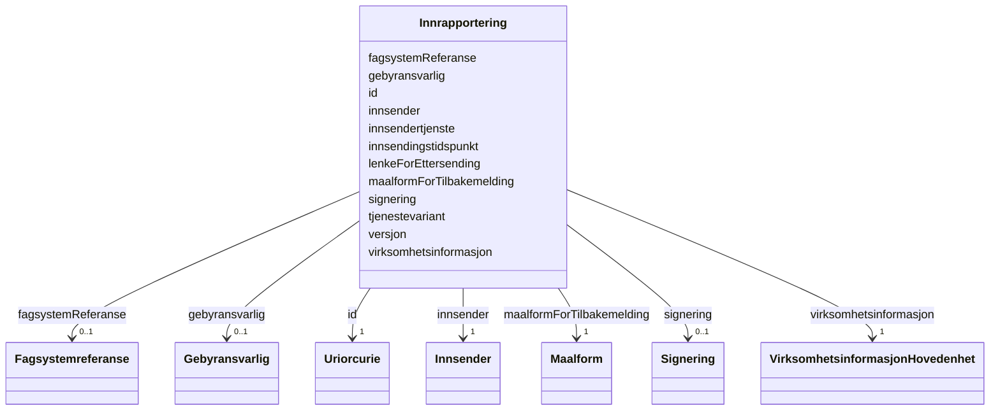

# Class: Innrapportering 


_TODO: beskriv klassen_


URI: [generated:Innrapportering](https://example.org/generated/Innrapportering)





<!-- no inheritance hierarchy -->

## Class Properties

| Property | Value |
| --- | --- |
| Class URI | [generated:Innrapportering](https://example.org/generated/Innrapportering) |


## Eigenskapar


  
  

  
  
    
  

  
  
    
  

  
  
    
  

  
  
    
  

  
  
    
  

  
  
    
  

  
  
    
  

  
  

  
  

  
  

  
  


### Obligatorisk

| Namn | Kardinalitet og domene | Beskriving |
| --- | --- | --- |
| [versjon](versjon.md) | 1 <br/> [Versjonsnummer](versjonsnummer.md) | TODO: beskriv eigenskapen |
| [innsendertjenste](innsendertjenste.md) | 1 <br/> [InnsendertjenesteType](innsendertjenestetype.md) | TODO: beskriv eigenskapen |
| [innsendingstidspunkt](innsendingstidspunkt.md) | 1 <br/> [DatoKlokkeslett](datoklokkeslett.md) | TODO: beskriv eigenskapen |
| [maalformForTilbakemelding](maalformfortilbakemelding.md) | 1 <br/> [Maalform](maalform.md) | TODO: beskriv eigenskapen |
| [tjenestevariant](tjenestevariant.md) | 1 <br/> [Tjenestevariant](tjenestevariant.md) | TODO: beskriv eigenskapen |
| [virksomhetsinformasjon](virksomhetsinformasjon.md) | 1 <br/> [VirksomhetsinformasjonHovedenhet](virksomhetsinformasjonhovedenhet.md) | TODO: beskriv eigenskapen |
| [innsender](innsender.md) | 1 <br/> [Innsender](innsender.md) | TODO: beskriv eigenskapen |


  
  

  
  

  
  

  
  

  
  

  
  

  
  

  
  

  
  
    
  

  
  
    
  

  
  
    
  

  
  
    
  


### Anbefalt

| Namn | Kardinalitet og domene | Beskriving |
| --- | --- | --- |
| [fagsystemReferanse](fagsystemreferanse.md) | 0..1 <br/> [Fagsystemreferanse](fagsystemreferanse.md) | TODO: beskriv eigenskapen |
| [signering](signering.md) | 0..1 <br/> [Signering](signering.md) | TODO: beskriv eigenskapen |
| [gebyransvarlig](gebyransvarlig.md) | 0..1 <br/> [Gebyransvarlig](gebyransvarlig.md) | TODO: beskriv eigenskapen |
| [lenkeForEttersending](lenkeforettersending.md) | 0..1 <br/> [URL](url.md) | TODO: beskriv eigenskapen |


  
  

  
  

  
  

  
  

  
  

  
  

  
  

  
  

  
  

  
  

  
  

  
  


  
  
  
  
    
  

  
  
  
    
      
    
      
    
      
    
  
  

  
  
  
    
      
    
      
    
      
    
  
  

  
  
  
    
      
    
      
    
      
    
  
  

  
  
  
    
      
    
      
    
      
    
  
  

  
  
  
    
      
    
      
    
      
    
  
  

  
  
  
    
      
    
      
    
      
    
  
  

  
  
  
    
      
    
      
    
      
    
  
  

  
  
  
    
      
    
      
    
      
    
  
  

  
  
  
    
      
    
      
    
      
    
  
  

  
  
  
    
      
    
      
    
      
    
  
  

  
  
  
    
      
    
      
    
      
    
  
  


### Andre

| Namn | Kardinalitet og domene | Beskriving |
| --- | --- | --- |
| [id](id.md) | 1 <br/> [xsd:anyURI](http://www.w3.org/2001/XMLSchema#anyURI) | Unik URI-identifikator for ressursen |


## Usages

| used by | used in | type | used |
| ---  | --- | --- | --- |
| [GeneratedContainer](generatedcontainer.md) | [innrapporteringer](innrapporteringer.md) | range | [Innrapportering](innrapportering.md) |


## Identifier and Mapping Information


### Annotations

| property | value |
| --- | --- |
| begrepsidentifikator | https://concept-catalog.fellesdatakatalog.digdir.no/collections/TODO |


### Schema Source


* from schema: https://example.org/generated


## Mappings

| Mapping Type | Mapped Value |
| ---  | ---  |
| self | generated:Innrapportering |
| native | generated:Innrapportering |


## LinkML Source

<!-- TODO: investigate https://stackoverflow.com/questions/37606292/how-to-create-tabbed-code-blocks-in-mkdocs-or-sphinx -->

### Direct

<details>
```yaml
name: Innrapportering
annotations:
  begrepsidentifikator:
    tag: begrepsidentifikator
    value: https://concept-catalog.fellesdatakatalog.digdir.no/collections/TODO
description: 'TODO: beskriv klassen'
from_schema: https://example.org/generated
rank: 1000
slots:
- id
- versjon
- innsendertjenste
- innsendingstidspunkt
- maalformForTilbakemelding
- tjenestevariant
- virksomhetsinformasjon
- innsender
- fagsystemReferanse
- signering
- gebyransvarlig
- lenkeForEttersending
slot_usage:
  versjon:
    name: versjon
    in_subset:
    - Obligatorisk
    required: true
  innsendertjenste:
    name: innsendertjenste
    in_subset:
    - Obligatorisk
    required: true
  innsendingstidspunkt:
    name: innsendingstidspunkt
    in_subset:
    - Obligatorisk
    required: true
  maalformForTilbakemelding:
    name: maalformForTilbakemelding
    in_subset:
    - Obligatorisk
    required: true
  tjenestevariant:
    name: tjenestevariant
    in_subset:
    - Obligatorisk
    required: true
  virksomhetsinformasjon:
    name: virksomhetsinformasjon
    in_subset:
    - Obligatorisk
    required: true
  innsender:
    name: innsender
    in_subset:
    - Obligatorisk
    required: true
  fagsystemReferanse:
    name: fagsystemReferanse
    in_subset:
    - Anbefalt
  signering:
    name: signering
    in_subset:
    - Anbefalt
  gebyransvarlig:
    name: gebyransvarlig
    in_subset:
    - Anbefalt
  lenkeForEttersending:
    name: lenkeForEttersending
    in_subset:
    - Anbefalt
class_uri: generated:Innrapportering

```
</details>

### Induced

<details>
```yaml
name: Innrapportering
annotations:
  begrepsidentifikator:
    tag: begrepsidentifikator
    value: https://concept-catalog.fellesdatakatalog.digdir.no/collections/TODO
description: 'TODO: beskriv klassen'
from_schema: https://example.org/generated
rank: 1000
slot_usage:
  versjon:
    name: versjon
    in_subset:
    - Obligatorisk
    required: true
  innsendertjenste:
    name: innsendertjenste
    in_subset:
    - Obligatorisk
    required: true
  innsendingstidspunkt:
    name: innsendingstidspunkt
    in_subset:
    - Obligatorisk
    required: true
  maalformForTilbakemelding:
    name: maalformForTilbakemelding
    in_subset:
    - Obligatorisk
    required: true
  tjenestevariant:
    name: tjenestevariant
    in_subset:
    - Obligatorisk
    required: true
  virksomhetsinformasjon:
    name: virksomhetsinformasjon
    in_subset:
    - Obligatorisk
    required: true
  innsender:
    name: innsender
    in_subset:
    - Obligatorisk
    required: true
  fagsystemReferanse:
    name: fagsystemReferanse
    in_subset:
    - Anbefalt
  signering:
    name: signering
    in_subset:
    - Anbefalt
  gebyransvarlig:
    name: gebyransvarlig
    in_subset:
    - Anbefalt
  lenkeForEttersending:
    name: lenkeForEttersending
    in_subset:
    - Anbefalt
attributes:
  id:
    name: id
    description: Unik URI-identifikator for ressursen.
    from_schema: https://example.org/generated
    rank: 1000
    identifier: true
    owner: Innrapportering
    domain_of:
    - Innrapportering
    - VirksomhetsinformasjonHovedenhet
    - Forretningsadresse
    - Stedsadresse
    - Vegadresse
    - Adressenummer
    - Varslingsadresse
    - Mobilnummer
    - Postadresse
    - Postboksadresse
    - InternasjonalAdresse
    - Kontaktopplysning
    - Telefonnummer
    - VirksomhetsinformasjonUnderenhet
    - Beliggenhetsadresse
    - Aktivitet
    - TypeAktivitet
    - Omdanning
    - Rolletypegruppe
    - Rolle
    - Rolleinnehaver
    - Ansvarsandel
    - Broek
    - Virksomhet
    - Person
    - Prokura
    - Prokurabestemmelse
    - Rollesett
    - SignaturberettigetEllerProkurist
    - Signaturrett
    - Signaturrettsbestemmelse
    - Foretaksinformasjon
    - EierskifteAktivitet
    - DelerEierskifte
    - Matrikkelnummer
    - Innsender
    - Fagsystemreferanse
    - Signering
    - Gebyransvarlig
    range: uriorcurie
    required: true
  versjon:
    name: versjon
    description: 'TODO: beskriv eigenskapen'
    in_subset:
    - Obligatorisk
    from_schema: https://example.org/generated
    rank: 1000
    slot_uri: generated:versjon
    owner: Innrapportering
    domain_of:
    - Innrapportering
    range: Versjonsnummer
    required: true
  innsendertjenste:
    name: innsendertjenste
    description: 'TODO: beskriv eigenskapen'
    in_subset:
    - Obligatorisk
    from_schema: https://example.org/generated
    rank: 1000
    slot_uri: generated:innsendertjenste
    owner: Innrapportering
    domain_of:
    - Innrapportering
    range: InnsendertjenesteType
    required: true
  innsendingstidspunkt:
    name: innsendingstidspunkt
    description: 'TODO: beskriv eigenskapen'
    in_subset:
    - Obligatorisk
    from_schema: https://example.org/generated
    rank: 1000
    slot_uri: generated:innsendingstidspunkt
    owner: Innrapportering
    domain_of:
    - Innrapportering
    range: DatoKlokkeslett
    required: true
  maalformForTilbakemelding:
    name: maalformForTilbakemelding
    description: 'TODO: beskriv eigenskapen'
    in_subset:
    - Obligatorisk
    from_schema: https://example.org/generated
    rank: 1000
    slot_uri: generated:maalformForTilbakemelding
    owner: Innrapportering
    domain_of:
    - Innrapportering
    range: Maalform
    required: true
  tjenestevariant:
    name: tjenestevariant
    description: 'TODO: beskriv eigenskapen'
    in_subset:
    - Obligatorisk
    from_schema: https://example.org/generated
    rank: 1000
    slot_uri: generated:tjenestevariant
    owner: Innrapportering
    domain_of:
    - Innrapportering
    range: Tjenestevariant
    required: true
  virksomhetsinformasjon:
    name: virksomhetsinformasjon
    description: 'TODO: beskriv eigenskapen'
    in_subset:
    - Obligatorisk
    from_schema: https://example.org/generated
    rank: 1000
    slot_uri: generated:virksomhetsinformasjon
    owner: Innrapportering
    domain_of:
    - Innrapportering
    range: VirksomhetsinformasjonHovedenhet
    required: true
  innsender:
    name: innsender
    description: 'TODO: beskriv eigenskapen'
    in_subset:
    - Obligatorisk
    from_schema: https://example.org/generated
    rank: 1000
    slot_uri: generated:innsender
    owner: Innrapportering
    domain_of:
    - Innrapportering
    range: Innsender
    required: true
  fagsystemReferanse:
    name: fagsystemReferanse
    description: 'TODO: beskriv eigenskapen'
    in_subset:
    - Anbefalt
    from_schema: https://example.org/generated
    rank: 1000
    slot_uri: generated:fagsystemReferanse
    owner: Innrapportering
    domain_of:
    - Innrapportering
    range: Fagsystemreferanse
  signering:
    name: signering
    description: 'TODO: beskriv eigenskapen'
    in_subset:
    - Anbefalt
    from_schema: https://example.org/generated
    rank: 1000
    slot_uri: generated:signering
    owner: Innrapportering
    domain_of:
    - Innrapportering
    range: Signering
  gebyransvarlig:
    name: gebyransvarlig
    description: 'TODO: beskriv eigenskapen'
    in_subset:
    - Anbefalt
    from_schema: https://example.org/generated
    rank: 1000
    slot_uri: generated:gebyransvarlig
    owner: Innrapportering
    domain_of:
    - Innrapportering
    range: Gebyransvarlig
  lenkeForEttersending:
    name: lenkeForEttersending
    description: 'TODO: beskriv eigenskapen'
    in_subset:
    - Anbefalt
    from_schema: https://example.org/generated
    rank: 1000
    slot_uri: generated:lenkeForEttersending
    owner: Innrapportering
    domain_of:
    - Innrapportering
    range: URL
class_uri: generated:Innrapportering

```
</details>