# Class: VirksomhetsinformasjonHovedenhet 


_TODO: beskriv klassen_


URI: [generated:VirksomhetsinformasjonHovedenhet](https://example.org/generated/VirksomhetsinformasjonHovedenhet)

```mermaid
 classDiagram
    class VirksomhetsinformasjonHovedenhet
    click VirksomhetsinformasjonHovedenhet href "../VirksomhetsinformasjonHovedenhet/"
      VirksomhetsinformasjonHovedenhet : aktivitet
        
          
    
        
        
        VirksomhetsinformasjonHovedenhet --> "0..1" Aktivitet : aktivitet
        click Aktivitet href "../Aktivitet/"
    

        
      VirksomhetsinformasjonHovedenhet : ansvarsform
        
      VirksomhetsinformasjonHovedenhet : bekreftelseProtokollOpploesningOgOmgjoering
        
          
    
        
        
        VirksomhetsinformasjonHovedenhet --> "0..1" Boolean : bekreftelseProtokollOpploesningOgOmgjoering
        click Boolean href "../http://www.w3.org/2001/XMLSchema#boolean/"
    

        
      VirksomhetsinformasjonHovedenhet : bekreftelseProtokollSletting
        
          
    
        
        
        VirksomhetsinformasjonHovedenhet --> "0..1" Boolean : bekreftelseProtokollSletting
        click Boolean href "../http://www.w3.org/2001/XMLSchema#boolean/"
    

        
      VirksomhetsinformasjonHovedenhet : datoForAvtale
        
      VirksomhetsinformasjonHovedenhet : eierskifte
        
          
    
        
        
        VirksomhetsinformasjonHovedenhet --> "*" EierskifteAktivitet : eierskifte
        click EierskifteAktivitet href "../EierskifteAktivitet/"
    

        
      VirksomhetsinformasjonHovedenhet : foretaksinformasjon
        
          
    
        
        
        VirksomhetsinformasjonHovedenhet --> "0..1" Foretaksinformasjon : foretaksinformasjon
        click Foretaksinformasjon href "../Foretaksinformasjon/"
    

        
      VirksomhetsinformasjonHovedenhet : formaal
        
          
    
        
        
        VirksomhetsinformasjonHovedenhet --> "0..1" String : formaal
        click String href "../http://www.w3.org/2001/XMLSchema#string/"
    

        
      VirksomhetsinformasjonHovedenhet : forretningsadresse
        
          
    
        
        
        VirksomhetsinformasjonHovedenhet --> "0..1" Forretningsadresse : forretningsadresse
        click Forretningsadresse href "../Forretningsadresse/"
    

        
      VirksomhetsinformasjonHovedenhet : harAnsvarsbegrensning
        
          
    
        
        
        VirksomhetsinformasjonHovedenhet --> "0..1" Boolean : harAnsvarsbegrensning
        click Boolean href "../http://www.w3.org/2001/XMLSchema#boolean/"
    

        
      VirksomhetsinformasjonHovedenhet : id
        
          
    
        
        
        VirksomhetsinformasjonHovedenhet --> "1" Uriorcurie : id
        click Uriorcurie href "../http://www.w3.org/2001/XMLSchema#anyURI/"
    

        
      VirksomhetsinformasjonHovedenhet : kontaktopplysning
        
          
    
        
        
        VirksomhetsinformasjonHovedenhet --> "0..1" Kontaktopplysning : kontaktopplysning
        click Kontaktopplysning href "../Kontaktopplysning/"
    

        
      VirksomhetsinformasjonHovedenhet : maalform
        
          
    
        
        
        VirksomhetsinformasjonHovedenhet --> "0..1" Maalform : maalform
        click Maalform href "../Maalform/"
    

        
      VirksomhetsinformasjonHovedenhet : matrikkelnummer
        
          
    
        
        
        VirksomhetsinformasjonHovedenhet --> "*" Matrikkelnummer : matrikkelnummer
        click Matrikkelnummer href "../Matrikkelnummer/"
    

        
      VirksomhetsinformasjonHovedenhet : meldtOmgjoeringAvOpploesning
        
          
    
        
        
        VirksomhetsinformasjonHovedenhet --> "0..1" Boolean : meldtOmgjoeringAvOpploesning
        click Boolean href "../http://www.w3.org/2001/XMLSchema#boolean/"
    

        
      VirksomhetsinformasjonHovedenhet : meldtOpploesning
        
          
    
        
        
        VirksomhetsinformasjonHovedenhet --> "0..1" Boolean : meldtOpploesning
        click Boolean href "../http://www.w3.org/2001/XMLSchema#boolean/"
    

        
      VirksomhetsinformasjonHovedenhet : navn
        
      VirksomhetsinformasjonHovedenhet : omdanning
        
          
    
        
        
        VirksomhetsinformasjonHovedenhet --> "0..1" Omdanning : omdanning
        click Omdanning href "../Omdanning/"
    

        
      VirksomhetsinformasjonHovedenhet : oppfyllerKravTilNaeringsvirksomhet
        
          
    
        
        
        VirksomhetsinformasjonHovedenhet --> "0..1" Boolean : oppfyllerKravTilNaeringsvirksomhet
        click Boolean href "../http://www.w3.org/2001/XMLSchema#boolean/"
    

        
      VirksomhetsinformasjonHovedenhet : organisasjonsform
        
      VirksomhetsinformasjonHovedenhet : organisasjonsnummer
        
      VirksomhetsinformasjonHovedenhet : postadresse
        
          
    
        
        
        VirksomhetsinformasjonHovedenhet --> "0..1" Postadresse : postadresse
        click Postadresse href "../Postadresse/"
    

        
      VirksomhetsinformasjonHovedenhet : prokura
        
          
    
        
        
        VirksomhetsinformasjonHovedenhet --> "0..1" Prokura : prokura
        click Prokura href "../Prokura/"
    

        
      VirksomhetsinformasjonHovedenhet : registrertITilknyttetRegister
        
      VirksomhetsinformasjonHovedenhet : rolletypegruppe
        
          
    
        
        
        VirksomhetsinformasjonHovedenhet --> "*" Rolletypegruppe : rolletypegruppe
        click Rolletypegruppe href "../Rolletypegruppe/"
    

        
      VirksomhetsinformasjonHovedenhet : signaturrett
        
          
    
        
        
        VirksomhetsinformasjonHovedenhet --> "0..1" Signaturrett : signaturrett
        click Signaturrett href "../Signaturrett/"
    

        
      VirksomhetsinformasjonHovedenhet : stiftelsesdato
        
      VirksomhetsinformasjonHovedenhet : varslingsadresse
        
          
    
        
        
        VirksomhetsinformasjonHovedenhet --> "0..1" Varslingsadresse : varslingsadresse
        click Varslingsadresse href "../Varslingsadresse/"
    

        
      VirksomhetsinformasjonHovedenhet : vedtektsdato
        
      VirksomhetsinformasjonHovedenhet : venterAAFaaAnsatte
        
          
    
        
        
        VirksomhetsinformasjonHovedenhet --> "0..1" Boolean : venterAAFaaAnsatte
        click Boolean href "../http://www.w3.org/2001/XMLSchema#boolean/"
    

        
      VirksomhetsinformasjonHovedenhet : virksomhetsinformasjonUnderenhet
        
          
    
        
        
        VirksomhetsinformasjonHovedenhet --> "*" VirksomhetsinformasjonUnderenhet : virksomhetsinformasjonUnderenhet
        click VirksomhetsinformasjonUnderenhet href "../VirksomhetsinformasjonUnderenhet/"
    

        
      VirksomhetsinformasjonHovedenhet : virksomhetstype
        
      
```





<!-- no inheritance hierarchy -->

## Class Properties

| Property | Value |
| --- | --- |
| Class URI | [generated:VirksomhetsinformasjonHovedenhet](https://example.org/generated/VirksomhetsinformasjonHovedenhet) |


## Eigenskapar


  
  

  
  
    
  

  
  

  
  

  
  

  
  

  
  

  
  

  
  

  
  

  
  

  
  

  
  

  
  

  
  

  
  

  
  

  
  

  
  

  
  

  
  

  
  

  
  

  
  

  
  

  
  

  
  

  
  

  
  

  
  

  
  

  
  


### Obligatorisk

| Namn | Kardinalitet og domene | Beskriving |
| --- | --- | --- |
| [organisasjonsform](organisasjonsform.md) | 1 <br/> [Organisasjonsform](organisasjonsform.md) | TODO: beskriv eigenskapen |


  
  

  
  

  
  
    
  

  
  
    
  

  
  
    
  

  
  
    
  

  
  
    
  

  
  
    
  

  
  
    
  

  
  
    
  

  
  
    
  

  
  
    
  

  
  
    
  

  
  
    
  

  
  
    
  

  
  
    
  

  
  
    
  

  
  
    
  

  
  
    
  

  
  
    
  

  
  
    
  

  
  
    
  

  
  
    
  

  
  
    
  

  
  
    
  

  
  
    
  

  
  
    
  

  
  
    
  

  
  
    
  

  
  
    
  

  
  
    
  

  
  
    
  


### Anbefalt

| Namn | Kardinalitet og domene | Beskriving |
| --- | --- | --- |
| [virksomhetstype](virksomhetstype.md) | 0..1 <br/> [Virksomhetstype](virksomhetstype.md) | TODO: beskriv eigenskapen |
| [organisasjonsnummer](organisasjonsnummer.md) | 0..1 <br/> [Organisasjonsnummer](organisasjonsnummer.md) | TODO: beskriv eigenskapen |
| [navn](navn.md) | 0..1 <br/> [Virksomhetsnavn](virksomhetsnavn.md) | TODO: beskriv eigenskapen |
| [maalform](maalform.md) | 0..1 <br/> [Maalform](maalform.md) | TODO: beskriv eigenskapen |
| [oppfyllerKravTilNaeringsvirksomhet](oppfyllerkravtilnaeringsvirksomhet.md) | 0..1 <br/> [xsd:boolean](http://www.w3.org/2001/XMLSchema#boolean) | TODO: beskriv eigenskapen |
| [venterAAFaaAnsatte](venteraafaaansatte.md) | 0..1 <br/> [xsd:boolean](http://www.w3.org/2001/XMLSchema#boolean) | TODO: beskriv eigenskapen |
| [datoForAvtale](datoforavtale.md) | 0..1 <br/> [Dato](dato.md) | TODO: beskriv eigenskapen |
| [stiftelsesdato](stiftelsesdato.md) | 0..1 <br/> [Dato](dato.md) | TODO: beskriv eigenskapen |
| [vedtektsdato](vedtektsdato.md) | 0..1 <br/> [Dato](dato.md) | TODO: beskriv eigenskapen |
| [formaal](formaal.md) | 0..1 <br/> [xsd:string](http://www.w3.org/2001/XMLSchema#string) | TODO: beskriv eigenskapen |
| [harAnsvarsbegrensning](haransvarsbegrensning.md) | 0..1 <br/> [xsd:boolean](http://www.w3.org/2001/XMLSchema#boolean) | TODO: beskriv eigenskapen |
| [ansvarsform](ansvarsform.md) | 0..1 <br/> [Ansvarsform](ansvarsform.md) | TODO: beskriv eigenskapen |
| [forretningsadresse](forretningsadresse.md) | 0..1 <br/> [Forretningsadresse](forretningsadresse.md) | TODO: beskriv eigenskapen |
| [varslingsadresse](varslingsadresse.md) | 0..1 <br/> [Varslingsadresse](varslingsadresse.md) | TODO: beskriv eigenskapen |
| [postadresse](postadresse.md) | 0..1 <br/> [Postadresse](postadresse.md) | TODO: beskriv eigenskapen |
| [kontaktopplysning](kontaktopplysning.md) | 0..1 <br/> [Kontaktopplysning](kontaktopplysning.md) | TODO: beskriv eigenskapen |
| [virksomhetsinformasjonUnderenhet](virksomhetsinformasjonunderenhet.md) | * <br/> [VirksomhetsinformasjonUnderenhet](virksomhetsinformasjonunderenhet.md) | TODO: beskriv eigenskapen |
| [aktivitet](aktivitet.md) | 0..1 <br/> [Aktivitet](aktivitet.md) | TODO: beskriv eigenskapen |
| [omdanning](omdanning.md) | 0..1 <br/> [Omdanning](omdanning.md) | TODO: beskriv eigenskapen |
| [rolletypegruppe](rolletypegruppe.md) | * <br/> [Rolletypegruppe](rolletypegruppe.md) | TODO: beskriv eigenskapen |
| [prokura](prokura.md) | 0..1 <br/> [Prokura](prokura.md) | TODO: beskriv eigenskapen |
| [signaturrett](signaturrett.md) | 0..1 <br/> [Signaturrett](signaturrett.md) | TODO: beskriv eigenskapen |
| [meldtOpploesning](meldtopploesning.md) | 0..1 <br/> [xsd:boolean](http://www.w3.org/2001/XMLSchema#boolean) | TODO: beskriv eigenskapen |
| [meldtOmgjoeringAvOpploesning](meldtomgjoeringavopploesning.md) | 0..1 <br/> [xsd:boolean](http://www.w3.org/2001/XMLSchema#boolean) | TODO: beskriv eigenskapen |
| [foretaksinformasjon](foretaksinformasjon.md) | 0..1 <br/> [Foretaksinformasjon](foretaksinformasjon.md) | TODO: beskriv eigenskapen |
| [eierskifte](eierskifte.md) | * <br/> [EierskifteAktivitet](eierskifteaktivitet.md) | TODO: beskriv eigenskapen |
| [bekreftelseProtokollSletting](bekreftelseprotokollsletting.md) | 0..1 <br/> [xsd:boolean](http://www.w3.org/2001/XMLSchema#boolean) | TODO: beskriv eigenskapen |
| [matrikkelnummer](matrikkelnummer.md) | * <br/> [Matrikkelnummer](matrikkelnummer.md) | TODO: beskriv eigenskapen |
| [registrertITilknyttetRegister](registrertitilknyttetregister.md) | * <br/> [TilknyttetRegistertype](tilknyttetregistertype.md) | TODO: beskriv eigenskapen |
| [bekreftelseProtokollOpploesningOgOmgjoering](bekreftelseprotokollopploesningogomgjoering.md) | 0..1 <br/> [xsd:boolean](http://www.w3.org/2001/XMLSchema#boolean) | TODO: beskriv eigenskapen |


  
  

  
  

  
  

  
  

  
  

  
  

  
  

  
  

  
  

  
  

  
  

  
  

  
  

  
  

  
  

  
  

  
  

  
  

  
  

  
  

  
  

  
  

  
  

  
  

  
  

  
  

  
  

  
  

  
  

  
  

  
  

  
  


  
  
  
  
    
  

  
  
  
    
      
    
      
    
      
    
  
  

  
  
  
    
      
    
      
    
      
    
  
  

  
  
  
    
      
    
      
    
      
    
  
  

  
  
  
    
      
    
      
    
      
    
  
  

  
  
  
    
      
    
      
    
      
    
  
  

  
  
  
    
      
    
      
    
      
    
  
  

  
  
  
    
      
    
      
    
      
    
  
  

  
  
  
    
      
    
      
    
      
    
  
  

  
  
  
    
      
    
      
    
      
    
  
  

  
  
  
    
      
    
      
    
      
    
  
  

  
  
  
    
      
    
      
    
      
    
  
  

  
  
  
    
      
    
      
    
      
    
  
  

  
  
  
    
      
    
      
    
      
    
  
  

  
  
  
    
      
    
      
    
      
    
  
  

  
  
  
    
      
    
      
    
      
    
  
  

  
  
  
    
      
    
      
    
      
    
  
  

  
  
  
    
      
    
      
    
      
    
  
  

  
  
  
    
      
    
      
    
      
    
  
  

  
  
  
    
      
    
      
    
      
    
  
  

  
  
  
    
      
    
      
    
      
    
  
  

  
  
  
    
      
    
      
    
      
    
  
  

  
  
  
    
      
    
      
    
      
    
  
  

  
  
  
    
      
    
      
    
      
    
  
  

  
  
  
    
      
    
      
    
      
    
  
  

  
  
  
    
      
    
      
    
      
    
  
  

  
  
  
    
      
    
      
    
      
    
  
  

  
  
  
    
      
    
      
    
      
    
  
  

  
  
  
    
      
    
      
    
      
    
  
  

  
  
  
    
      
    
      
    
      
    
  
  

  
  
  
    
      
    
      
    
      
    
  
  

  
  
  
    
      
    
      
    
      
    
  
  


### Andre

| Namn | Kardinalitet og domene | Beskriving |
| --- | --- | --- |
| [id](id.md) | 1 <br/> [xsd:anyURI](http://www.w3.org/2001/XMLSchema#anyURI) | Unik URI-identifikator for ressursen |


## Usages

| used by | used in | type | used |
| ---  | --- | --- | --- |
| [Innrapportering](innrapportering.md) | [virksomhetsinformasjon](virksomhetsinformasjon.md) | range | [VirksomhetsinformasjonHovedenhet](virksomhetsinformasjonhovedenhet.md) |
| [GeneratedContainer](generatedcontainer.md) | [virksomhetsinformasjonHovedenheter](virksomhetsinformasjonhovedenheter.md) | range | [VirksomhetsinformasjonHovedenhet](virksomhetsinformasjonhovedenhet.md) |


## Identifier and Mapping Information


### Annotations

| property | value |
| --- | --- |
| begrepsidentifikator | https://concept-catalog.fellesdatakatalog.digdir.no/collections/TODO |


### Schema Source


* from schema: https://example.org/generated


## Mappings

| Mapping Type | Mapped Value |
| ---  | ---  |
| self | generated:VirksomhetsinformasjonHovedenhet |
| native | generated:VirksomhetsinformasjonHovedenhet |


## LinkML Source

<!-- TODO: investigate https://stackoverflow.com/questions/37606292/how-to-create-tabbed-code-blocks-in-mkdocs-or-sphinx -->

### Direct

<details>
```yaml
name: VirksomhetsinformasjonHovedenhet
annotations:
  begrepsidentifikator:
    tag: begrepsidentifikator
    value: https://concept-catalog.fellesdatakatalog.digdir.no/collections/TODO
description: 'TODO: beskriv klassen'
from_schema: https://example.org/generated
rank: 1000
slots:
- id
- organisasjonsform
- virksomhetstype
- organisasjonsnummer
- navn
- maalform
- oppfyllerKravTilNaeringsvirksomhet
- venterAAFaaAnsatte
- datoForAvtale
- stiftelsesdato
- vedtektsdato
- formaal
- harAnsvarsbegrensning
- ansvarsform
- forretningsadresse
- varslingsadresse
- postadresse
- kontaktopplysning
- virksomhetsinformasjonUnderenhet
- aktivitet
- omdanning
- rolletypegruppe
- prokura
- signaturrett
- meldtOpploesning
- meldtOmgjoeringAvOpploesning
- foretaksinformasjon
- eierskifte
- bekreftelseProtokollSletting
- matrikkelnummer
- registrertITilknyttetRegister
- bekreftelseProtokollOpploesningOgOmgjoering
slot_usage:
  organisasjonsform:
    name: organisasjonsform
    in_subset:
    - Obligatorisk
    required: true
  virksomhetstype:
    name: virksomhetstype
    in_subset:
    - Anbefalt
  organisasjonsnummer:
    name: organisasjonsnummer
    in_subset:
    - Anbefalt
  navn:
    name: navn
    in_subset:
    - Anbefalt
  maalform:
    name: maalform
    in_subset:
    - Anbefalt
  oppfyllerKravTilNaeringsvirksomhet:
    name: oppfyllerKravTilNaeringsvirksomhet
    in_subset:
    - Anbefalt
  venterAAFaaAnsatte:
    name: venterAAFaaAnsatte
    in_subset:
    - Anbefalt
  datoForAvtale:
    name: datoForAvtale
    in_subset:
    - Anbefalt
  stiftelsesdato:
    name: stiftelsesdato
    in_subset:
    - Anbefalt
  vedtektsdato:
    name: vedtektsdato
    in_subset:
    - Anbefalt
  formaal:
    name: formaal
    in_subset:
    - Anbefalt
  harAnsvarsbegrensning:
    name: harAnsvarsbegrensning
    in_subset:
    - Anbefalt
  ansvarsform:
    name: ansvarsform
    in_subset:
    - Anbefalt
  forretningsadresse:
    name: forretningsadresse
    in_subset:
    - Anbefalt
  varslingsadresse:
    name: varslingsadresse
    in_subset:
    - Anbefalt
  postadresse:
    name: postadresse
    in_subset:
    - Anbefalt
  kontaktopplysning:
    name: kontaktopplysning
    in_subset:
    - Anbefalt
  virksomhetsinformasjonUnderenhet:
    name: virksomhetsinformasjonUnderenhet
    in_subset:
    - Anbefalt
  aktivitet:
    name: aktivitet
    in_subset:
    - Anbefalt
  omdanning:
    name: omdanning
    in_subset:
    - Anbefalt
  rolletypegruppe:
    name: rolletypegruppe
    in_subset:
    - Anbefalt
  prokura:
    name: prokura
    in_subset:
    - Anbefalt
  signaturrett:
    name: signaturrett
    in_subset:
    - Anbefalt
  meldtOpploesning:
    name: meldtOpploesning
    in_subset:
    - Anbefalt
  meldtOmgjoeringAvOpploesning:
    name: meldtOmgjoeringAvOpploesning
    in_subset:
    - Anbefalt
  foretaksinformasjon:
    name: foretaksinformasjon
    in_subset:
    - Anbefalt
  eierskifte:
    name: eierskifte
    in_subset:
    - Anbefalt
  bekreftelseProtokollSletting:
    name: bekreftelseProtokollSletting
    in_subset:
    - Anbefalt
  matrikkelnummer:
    name: matrikkelnummer
    in_subset:
    - Anbefalt
  registrertITilknyttetRegister:
    name: registrertITilknyttetRegister
    in_subset:
    - Anbefalt
  bekreftelseProtokollOpploesningOgOmgjoering:
    name: bekreftelseProtokollOpploesningOgOmgjoering
    in_subset:
    - Anbefalt
class_uri: generated:VirksomhetsinformasjonHovedenhet

```
</details>

### Induced

<details>
```yaml
name: VirksomhetsinformasjonHovedenhet
annotations:
  begrepsidentifikator:
    tag: begrepsidentifikator
    value: https://concept-catalog.fellesdatakatalog.digdir.no/collections/TODO
description: 'TODO: beskriv klassen'
from_schema: https://example.org/generated
rank: 1000
slot_usage:
  organisasjonsform:
    name: organisasjonsform
    in_subset:
    - Obligatorisk
    required: true
  virksomhetstype:
    name: virksomhetstype
    in_subset:
    - Anbefalt
  organisasjonsnummer:
    name: organisasjonsnummer
    in_subset:
    - Anbefalt
  navn:
    name: navn
    in_subset:
    - Anbefalt
  maalform:
    name: maalform
    in_subset:
    - Anbefalt
  oppfyllerKravTilNaeringsvirksomhet:
    name: oppfyllerKravTilNaeringsvirksomhet
    in_subset:
    - Anbefalt
  venterAAFaaAnsatte:
    name: venterAAFaaAnsatte
    in_subset:
    - Anbefalt
  datoForAvtale:
    name: datoForAvtale
    in_subset:
    - Anbefalt
  stiftelsesdato:
    name: stiftelsesdato
    in_subset:
    - Anbefalt
  vedtektsdato:
    name: vedtektsdato
    in_subset:
    - Anbefalt
  formaal:
    name: formaal
    in_subset:
    - Anbefalt
  harAnsvarsbegrensning:
    name: harAnsvarsbegrensning
    in_subset:
    - Anbefalt
  ansvarsform:
    name: ansvarsform
    in_subset:
    - Anbefalt
  forretningsadresse:
    name: forretningsadresse
    in_subset:
    - Anbefalt
  varslingsadresse:
    name: varslingsadresse
    in_subset:
    - Anbefalt
  postadresse:
    name: postadresse
    in_subset:
    - Anbefalt
  kontaktopplysning:
    name: kontaktopplysning
    in_subset:
    - Anbefalt
  virksomhetsinformasjonUnderenhet:
    name: virksomhetsinformasjonUnderenhet
    in_subset:
    - Anbefalt
  aktivitet:
    name: aktivitet
    in_subset:
    - Anbefalt
  omdanning:
    name: omdanning
    in_subset:
    - Anbefalt
  rolletypegruppe:
    name: rolletypegruppe
    in_subset:
    - Anbefalt
  prokura:
    name: prokura
    in_subset:
    - Anbefalt
  signaturrett:
    name: signaturrett
    in_subset:
    - Anbefalt
  meldtOpploesning:
    name: meldtOpploesning
    in_subset:
    - Anbefalt
  meldtOmgjoeringAvOpploesning:
    name: meldtOmgjoeringAvOpploesning
    in_subset:
    - Anbefalt
  foretaksinformasjon:
    name: foretaksinformasjon
    in_subset:
    - Anbefalt
  eierskifte:
    name: eierskifte
    in_subset:
    - Anbefalt
  bekreftelseProtokollSletting:
    name: bekreftelseProtokollSletting
    in_subset:
    - Anbefalt
  matrikkelnummer:
    name: matrikkelnummer
    in_subset:
    - Anbefalt
  registrertITilknyttetRegister:
    name: registrertITilknyttetRegister
    in_subset:
    - Anbefalt
  bekreftelseProtokollOpploesningOgOmgjoering:
    name: bekreftelseProtokollOpploesningOgOmgjoering
    in_subset:
    - Anbefalt
attributes:
  id:
    name: id
    description: Unik URI-identifikator for ressursen.
    from_schema: https://example.org/generated
    rank: 1000
    identifier: true
    owner: VirksomhetsinformasjonHovedenhet
    domain_of:
    - Innrapportering
    - VirksomhetsinformasjonHovedenhet
    - Forretningsadresse
    - Stedsadresse
    - Vegadresse
    - Adressenummer
    - Varslingsadresse
    - Mobilnummer
    - Postadresse
    - Postboksadresse
    - InternasjonalAdresse
    - Kontaktopplysning
    - Telefonnummer
    - VirksomhetsinformasjonUnderenhet
    - Beliggenhetsadresse
    - Aktivitet
    - TypeAktivitet
    - Omdanning
    - Rolletypegruppe
    - Rolle
    - Rolleinnehaver
    - Ansvarsandel
    - Broek
    - Virksomhet
    - Person
    - Prokura
    - Prokurabestemmelse
    - Rollesett
    - SignaturberettigetEllerProkurist
    - Signaturrett
    - Signaturrettsbestemmelse
    - Foretaksinformasjon
    - EierskifteAktivitet
    - DelerEierskifte
    - Matrikkelnummer
    - Innsender
    - Fagsystemreferanse
    - Signering
    - Gebyransvarlig
    range: uriorcurie
    required: true
  organisasjonsform:
    name: organisasjonsform
    description: 'TODO: beskriv eigenskapen'
    in_subset:
    - Obligatorisk
    from_schema: https://example.org/generated
    rank: 1000
    slot_uri: generated:organisasjonsform
    owner: VirksomhetsinformasjonHovedenhet
    domain_of:
    - VirksomhetsinformasjonHovedenhet
    range: Organisasjonsform
    required: true
  virksomhetstype:
    name: virksomhetstype
    description: 'TODO: beskriv eigenskapen'
    in_subset:
    - Anbefalt
    from_schema: https://example.org/generated
    rank: 1000
    slot_uri: generated:virksomhetstype
    owner: VirksomhetsinformasjonHovedenhet
    domain_of:
    - VirksomhetsinformasjonHovedenhet
    range: Virksomhetstype
  organisasjonsnummer:
    name: organisasjonsnummer
    description: 'TODO: beskriv eigenskapen'
    in_subset:
    - Anbefalt
    from_schema: https://example.org/generated
    rank: 1000
    slot_uri: generated:organisasjonsnummer
    owner: VirksomhetsinformasjonHovedenhet
    domain_of:
    - VirksomhetsinformasjonHovedenhet
    - VirksomhetsinformasjonUnderenhet
    range: Organisasjonsnummer
  navn:
    name: navn
    description: 'TODO: beskriv eigenskapen'
    in_subset:
    - Anbefalt
    from_schema: https://example.org/generated
    rank: 1000
    slot_uri: generated:navn
    owner: VirksomhetsinformasjonHovedenhet
    domain_of:
    - VirksomhetsinformasjonHovedenhet
    - VirksomhetsinformasjonUnderenhet
    - Virksomhet
    range: Virksomhetsnavn
  maalform:
    name: maalform
    description: 'TODO: beskriv eigenskapen'
    in_subset:
    - Anbefalt
    from_schema: https://example.org/generated
    rank: 1000
    slot_uri: generated:maalform
    owner: VirksomhetsinformasjonHovedenhet
    domain_of:
    - VirksomhetsinformasjonHovedenhet
    range: Maalform
  oppfyllerKravTilNaeringsvirksomhet:
    name: oppfyllerKravTilNaeringsvirksomhet
    description: 'TODO: beskriv eigenskapen'
    in_subset:
    - Anbefalt
    from_schema: https://example.org/generated
    rank: 1000
    slot_uri: generated:oppfyllerKravTilNaeringsvirksomhet
    owner: VirksomhetsinformasjonHovedenhet
    domain_of:
    - VirksomhetsinformasjonHovedenhet
    range: boolean
  venterAAFaaAnsatte:
    name: venterAAFaaAnsatte
    description: 'TODO: beskriv eigenskapen'
    in_subset:
    - Anbefalt
    from_schema: https://example.org/generated
    rank: 1000
    slot_uri: generated:venterAAFaaAnsatte
    owner: VirksomhetsinformasjonHovedenhet
    domain_of:
    - VirksomhetsinformasjonHovedenhet
    range: boolean
  datoForAvtale:
    name: datoForAvtale
    description: 'TODO: beskriv eigenskapen'
    in_subset:
    - Anbefalt
    from_schema: https://example.org/generated
    rank: 1000
    slot_uri: generated:datoForAvtale
    owner: VirksomhetsinformasjonHovedenhet
    domain_of:
    - VirksomhetsinformasjonHovedenhet
    range: Dato
  stiftelsesdato:
    name: stiftelsesdato
    description: 'TODO: beskriv eigenskapen'
    in_subset:
    - Anbefalt
    from_schema: https://example.org/generated
    rank: 1000
    slot_uri: generated:stiftelsesdato
    owner: VirksomhetsinformasjonHovedenhet
    domain_of:
    - VirksomhetsinformasjonHovedenhet
    range: Dato
  vedtektsdato:
    name: vedtektsdato
    description: 'TODO: beskriv eigenskapen'
    in_subset:
    - Anbefalt
    from_schema: https://example.org/generated
    rank: 1000
    slot_uri: generated:vedtektsdato
    owner: VirksomhetsinformasjonHovedenhet
    domain_of:
    - VirksomhetsinformasjonHovedenhet
    range: Dato
  formaal:
    name: formaal
    description: 'TODO: beskriv eigenskapen'
    in_subset:
    - Anbefalt
    from_schema: https://example.org/generated
    rank: 1000
    slot_uri: generated:formaal
    owner: VirksomhetsinformasjonHovedenhet
    domain_of:
    - VirksomhetsinformasjonHovedenhet
    range: string
  harAnsvarsbegrensning:
    name: harAnsvarsbegrensning
    description: 'TODO: beskriv eigenskapen'
    in_subset:
    - Anbefalt
    from_schema: https://example.org/generated
    rank: 1000
    slot_uri: generated:harAnsvarsbegrensning
    owner: VirksomhetsinformasjonHovedenhet
    domain_of:
    - VirksomhetsinformasjonHovedenhet
    range: boolean
  ansvarsform:
    name: ansvarsform
    description: 'TODO: beskriv eigenskapen'
    in_subset:
    - Anbefalt
    from_schema: https://example.org/generated
    rank: 1000
    slot_uri: generated:ansvarsform
    owner: VirksomhetsinformasjonHovedenhet
    domain_of:
    - VirksomhetsinformasjonHovedenhet
    range: Ansvarsform
  forretningsadresse:
    name: forretningsadresse
    description: 'TODO: beskriv eigenskapen'
    in_subset:
    - Anbefalt
    from_schema: https://example.org/generated
    rank: 1000
    slot_uri: generated:forretningsadresse
    owner: VirksomhetsinformasjonHovedenhet
    domain_of:
    - VirksomhetsinformasjonHovedenhet
    range: Forretningsadresse
  varslingsadresse:
    name: varslingsadresse
    description: 'TODO: beskriv eigenskapen'
    in_subset:
    - Anbefalt
    from_schema: https://example.org/generated
    rank: 1000
    slot_uri: generated:varslingsadresse
    owner: VirksomhetsinformasjonHovedenhet
    domain_of:
    - VirksomhetsinformasjonHovedenhet
    range: Varslingsadresse
  postadresse:
    name: postadresse
    description: 'TODO: beskriv eigenskapen'
    in_subset:
    - Anbefalt
    from_schema: https://example.org/generated
    rank: 1000
    slot_uri: generated:postadresse
    owner: VirksomhetsinformasjonHovedenhet
    domain_of:
    - VirksomhetsinformasjonHovedenhet
    - VirksomhetsinformasjonUnderenhet
    range: Postadresse
  kontaktopplysning:
    name: kontaktopplysning
    description: 'TODO: beskriv eigenskapen'
    in_subset:
    - Anbefalt
    from_schema: https://example.org/generated
    rank: 1000
    slot_uri: generated:kontaktopplysning
    owner: VirksomhetsinformasjonHovedenhet
    domain_of:
    - VirksomhetsinformasjonHovedenhet
    - VirksomhetsinformasjonUnderenhet
    range: Kontaktopplysning
  virksomhetsinformasjonUnderenhet:
    name: virksomhetsinformasjonUnderenhet
    description: 'TODO: beskriv eigenskapen'
    in_subset:
    - Anbefalt
    from_schema: https://example.org/generated
    rank: 1000
    slot_uri: generated:virksomhetsinformasjonUnderenhet
    owner: VirksomhetsinformasjonHovedenhet
    domain_of:
    - VirksomhetsinformasjonHovedenhet
    range: VirksomhetsinformasjonUnderenhet
    multivalued: true
  aktivitet:
    name: aktivitet
    description: 'TODO: beskriv eigenskapen'
    in_subset:
    - Anbefalt
    from_schema: https://example.org/generated
    rank: 1000
    slot_uri: generated:aktivitet
    owner: VirksomhetsinformasjonHovedenhet
    domain_of:
    - VirksomhetsinformasjonHovedenhet
    - VirksomhetsinformasjonUnderenhet
    - Aktivitet
    range: Aktivitet
  omdanning:
    name: omdanning
    description: 'TODO: beskriv eigenskapen'
    in_subset:
    - Anbefalt
    from_schema: https://example.org/generated
    rank: 1000
    slot_uri: generated:omdanning
    owner: VirksomhetsinformasjonHovedenhet
    domain_of:
    - VirksomhetsinformasjonHovedenhet
    range: Omdanning
  rolletypegruppe:
    name: rolletypegruppe
    description: 'TODO: beskriv eigenskapen'
    in_subset:
    - Anbefalt
    from_schema: https://example.org/generated
    rank: 1000
    slot_uri: generated:rolletypegruppe
    owner: VirksomhetsinformasjonHovedenhet
    domain_of:
    - VirksomhetsinformasjonHovedenhet
    range: Rolletypegruppe
    multivalued: true
  prokura:
    name: prokura
    description: 'TODO: beskriv eigenskapen'
    in_subset:
    - Anbefalt
    from_schema: https://example.org/generated
    rank: 1000
    slot_uri: generated:prokura
    owner: VirksomhetsinformasjonHovedenhet
    domain_of:
    - VirksomhetsinformasjonHovedenhet
    range: Prokura
  signaturrett:
    name: signaturrett
    description: 'TODO: beskriv eigenskapen'
    in_subset:
    - Anbefalt
    from_schema: https://example.org/generated
    rank: 1000
    slot_uri: generated:signaturrett
    owner: VirksomhetsinformasjonHovedenhet
    domain_of:
    - VirksomhetsinformasjonHovedenhet
    range: Signaturrett
  meldtOpploesning:
    name: meldtOpploesning
    description: 'TODO: beskriv eigenskapen'
    in_subset:
    - Anbefalt
    from_schema: https://example.org/generated
    rank: 1000
    slot_uri: generated:meldtOpploesning
    owner: VirksomhetsinformasjonHovedenhet
    domain_of:
    - VirksomhetsinformasjonHovedenhet
    range: boolean
  meldtOmgjoeringAvOpploesning:
    name: meldtOmgjoeringAvOpploesning
    description: 'TODO: beskriv eigenskapen'
    in_subset:
    - Anbefalt
    from_schema: https://example.org/generated
    rank: 1000
    slot_uri: generated:meldtOmgjoeringAvOpploesning
    owner: VirksomhetsinformasjonHovedenhet
    domain_of:
    - VirksomhetsinformasjonHovedenhet
    range: boolean
  foretaksinformasjon:
    name: foretaksinformasjon
    description: 'TODO: beskriv eigenskapen'
    in_subset:
    - Anbefalt
    from_schema: https://example.org/generated
    rank: 1000
    slot_uri: generated:foretaksinformasjon
    owner: VirksomhetsinformasjonHovedenhet
    domain_of:
    - VirksomhetsinformasjonHovedenhet
    range: Foretaksinformasjon
  eierskifte:
    name: eierskifte
    description: 'TODO: beskriv eigenskapen'
    in_subset:
    - Anbefalt
    from_schema: https://example.org/generated
    rank: 1000
    slot_uri: generated:eierskifte
    owner: VirksomhetsinformasjonHovedenhet
    domain_of:
    - VirksomhetsinformasjonHovedenhet
    range: EierskifteAktivitet
    multivalued: true
  bekreftelseProtokollSletting:
    name: bekreftelseProtokollSletting
    description: 'TODO: beskriv eigenskapen'
    in_subset:
    - Anbefalt
    from_schema: https://example.org/generated
    rank: 1000
    slot_uri: generated:bekreftelseProtokollSletting
    owner: VirksomhetsinformasjonHovedenhet
    domain_of:
    - VirksomhetsinformasjonHovedenhet
    range: boolean
  matrikkelnummer:
    name: matrikkelnummer
    description: 'TODO: beskriv eigenskapen'
    in_subset:
    - Anbefalt
    from_schema: https://example.org/generated
    rank: 1000
    slot_uri: generated:matrikkelnummer
    owner: VirksomhetsinformasjonHovedenhet
    domain_of:
    - VirksomhetsinformasjonHovedenhet
    range: Matrikkelnummer
    multivalued: true
  registrertITilknyttetRegister:
    name: registrertITilknyttetRegister
    description: 'TODO: beskriv eigenskapen'
    in_subset:
    - Anbefalt
    from_schema: https://example.org/generated
    rank: 1000
    slot_uri: generated:registrertITilknyttetRegister
    owner: VirksomhetsinformasjonHovedenhet
    domain_of:
    - VirksomhetsinformasjonHovedenhet
    range: TilknyttetRegistertype
    multivalued: true
  bekreftelseProtokollOpploesningOgOmgjoering:
    name: bekreftelseProtokollOpploesningOgOmgjoering
    description: 'TODO: beskriv eigenskapen'
    in_subset:
    - Anbefalt
    from_schema: https://example.org/generated
    rank: 1000
    slot_uri: generated:bekreftelseProtokollOpploesningOgOmgjoering
    owner: VirksomhetsinformasjonHovedenhet
    domain_of:
    - VirksomhetsinformasjonHovedenhet
    range: boolean
class_uri: generated:VirksomhetsinformasjonHovedenhet

```
</details>