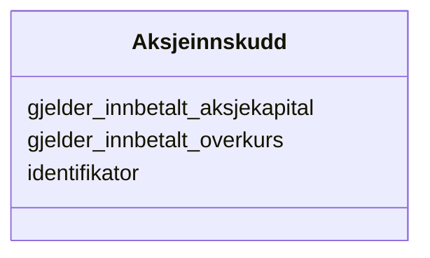

# Class: Aksjeinnskudd 


_Innskot knytt til aksjar i samband med selskapshending._


URI: [aksje:Aksjeinnskudd](https://example.no/ontology/aksje#Aksjeinnskudd)





<!-- no inheritance hierarchy -->

## Eigenskapar


  
  

  
  

  
  


  
  

  
  

  
  


  
  

  
  

  
  


  
  
  
  
    
  

  
  
  
  
    
  

  
  
  
  
    
  


### Andre

| Namn | Kardinalitet og domene | Beskriving |
| --- | --- | --- |
| [identifikator](identifikator.md) | 1 <br/> [Uriorcurie](uriorcurie.md) | Global identifikator for instansen |
| [gjelder_innbetalt_aksjekapital](gjelder_innbetalt_aksjekapital.md) | 0..1 <br/> [Decimal](decimal.md) | Innbetalt aksjekapital |
| [gjelder_innbetalt_overkurs](gjelder_innbetalt_overkurs.md) | 0..1 <br/> [Decimal](decimal.md) | Innbetalt overkurs |


## Usages

| used by | used in | type | used |
| ---  | --- | --- | --- |
| [Containerklasse](containerklasse.md) | [aksjeinnskudder](aksjeinnskudder.md) | range | [Aksjeinnskudd](aksjeinnskudd.md) |
| [Selskapshendelse](selskapshendelse.md) | [kan_ha_aksjeinnskudd](kan_ha_aksjeinnskudd.md) | range | [Aksjeinnskudd](aksjeinnskudd.md) |
| [Aksjeinnskudd](aksjeinnskudd.md) | [gjelder_innbetalt_aksjekapital](gjelder_innbetalt_aksjekapital.md) | domain | [Aksjeinnskudd](aksjeinnskudd.md) |
| [Aksjeinnskudd](aksjeinnskudd.md) | [gjelder_innbetalt_overkurs](gjelder_innbetalt_overkurs.md) | domain | [Aksjeinnskudd](aksjeinnskudd.md) |


## Identifier and Mapping Information


### Schema Source


* from schema: https://example.no/ontology/aksje-eierskap


## Mappings

| Mapping Type | Mapped Value |
| ---  | ---  |
| self | aksje:Aksjeinnskudd |
| native | aksje:Aksjeinnskudd |


## LinkML Source

<!-- TODO: investigate https://stackoverflow.com/questions/37606292/how-to-create-tabbed-code-blocks-in-mkdocs-or-sphinx -->

### Direct

<details>
```yaml
name: Aksjeinnskudd
description: Innskot knytt til aksjar i samband med selskapshending.
from_schema: https://example.no/ontology/aksje-eierskap
slots:
- identifikator
- gjelder_innbetalt_aksjekapital
- gjelder_innbetalt_overkurs

```
</details>

### Induced

<details>
```yaml
name: Aksjeinnskudd
description: Innskot knytt til aksjar i samband med selskapshending.
from_schema: https://example.no/ontology/aksje-eierskap
attributes:
  identifikator:
    name: identifikator
    description: Global identifikator for instansen.
    from_schema: https://example.no/ontology/aksje-eierskap
    rank: 1000
    identifier: true
    alias: identifikator
    owner: Aksjeinnskudd
    domain_of:
    - Containerklasse
    - Aksjeselskap
    - Aksjekapital
    - Aksje
    - Aksjeklasse
    - Aksjeeierrettighet
    - Aksjeeier
    - Eierposisjon
    - Aksjepost
    - Utbytte
    - Utdeling
    - Eierskapstransaksjon
    - Aksjeoverdragelse
    - Vederlag
    - Selskapshendelse
    - Aksjeinnskudd
    range: uriorcurie
    required: true
  gjelder_innbetalt_aksjekapital:
    name: gjelder_innbetalt_aksjekapital
    description: Innbetalt aksjekapital.
    from_schema: https://example.no/ontology/aksje-eierskap
    rank: 1000
    domain: Aksjeinnskudd
    alias: gjelder_innbetalt_aksjekapital
    owner: Aksjeinnskudd
    domain_of:
    - Aksjeinnskudd
    range: decimal
  gjelder_innbetalt_overkurs:
    name: gjelder_innbetalt_overkurs
    description: Innbetalt overkurs.
    from_schema: https://example.no/ontology/aksje-eierskap
    rank: 1000
    domain: Aksjeinnskudd
    alias: gjelder_innbetalt_overkurs
    owner: Aksjeinnskudd
    domain_of:
    - Aksjeinnskudd
    range: decimal

```
</details>