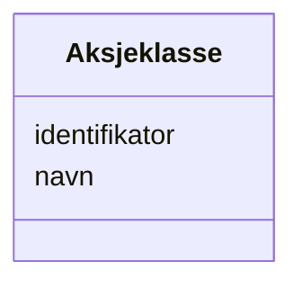

# Class: Aksjeklasse 


_Klasse aksjar høyrer til, med eigne rettigheiter._


URI: [aksje:Aksjeklasse](https://example.no/ontology/aksje#Aksjeklasse)





<!-- no inheritance hierarchy -->

## Eigenskapar


  
  

  
  


  
  

  
  


  
  

  
  


  
  
  
  
    
  

  
  
  
  
    
  


### Andre

| Namn | Kardinalitet og domene | Beskriving |
| --- | --- | --- |
| [identifikator](identifikator.md) | 1 <br/> [Uriorcurie](Uriorcurie.md) | Global identifikator for instansen |
| [navn](navn.md) | 0..1 <br/> [String](String.md) | Namn på instansen |


## Usages

| used by | used in | type | used |
| ---  | --- | --- | --- |
| [Containerklasse](Containerklasse.md) | [aksjeklasser](aksjeklasser.md) | range | [Aksjeklasse](Aksjeklasse.md) |
| [Aksje](Aksje.md) | [tilhorer_aksjeklasse](tilhorer_aksjeklasse.md) | range | [Aksjeklasse](Aksjeklasse.md) |
| [Aksjeeierrettighet](Aksjeeierrettighet.md) | [gjelder_aksjer_i_aksjeklasse](gjelder_aksjer_i_aksjeklasse.md) | range | [Aksjeklasse](Aksjeklasse.md) |
| [Aksjepost](Aksjepost.md) | [gjelder_aksjer_i_aksjeklasse](gjelder_aksjer_i_aksjeklasse.md) | range | [Aksjeklasse](Aksjeklasse.md) |


## Identifier and Mapping Information


### Schema Source


* from schema: https://example.no/ontology/aksje-eierskap


## Mappings

| Mapping Type | Mapped Value |
| ---  | ---  |
| self | aksje:Aksjeklasse |
| native | aksje:Aksjeklasse |


## LinkML Source

<!-- TODO: investigate https://stackoverflow.com/questions/37606292/how-to-create-tabbed-code-blocks-in-mkdocs-or-sphinx -->

### Direct

<details>
```yaml
name: Aksjeklasse
description: Klasse aksjar høyrer til, med eigne rettigheiter.
from_schema: https://example.no/ontology/aksje-eierskap
slots:
- identifikator
- navn

```
</details>

### Induced

<details>
```yaml
name: Aksjeklasse
description: Klasse aksjar høyrer til, med eigne rettigheiter.
from_schema: https://example.no/ontology/aksje-eierskap
attributes:
  identifikator:
    name: identifikator
    description: Global identifikator for instansen.
    from_schema: https://example.no/ontology/aksje-eierskap
    rank: 1000
    identifier: true
    alias: identifikator
    owner: Aksjeklasse
    domain_of:
    - Containerklasse
    - Aksjeselskap
    - Aksjekapital
    - Aksje
    - Aksjeklasse
    - Aksjeeierrettighet
    - Aksjeeier
    - Eierposisjon
    - Aksjepost
    - Utbytte
    - Utdeling
    - Eierskapstransaksjon
    - Aksjeoverdragelse
    - Vederlag
    - Selskapshendelse
    - Aksjeinnskudd
    range: uriorcurie
    required: true
  navn:
    name: navn
    description: Namn på instansen.
    from_schema: https://example.no/ontology/aksje-eierskap
    rank: 1000
    alias: navn
    owner: Aksjeklasse
    domain_of:
    - Aksjeselskap
    - Aksjeklasse
    - Aksjeeier
    range: string
    inlined: true

```
</details>