# Class: Containerklasse 


_Containerklasse for alle forretningsobjekt i modellen. Gjer det mogleg å ha fleire instansar av kvar klasse i ei datafil._

__


URI: [schema:Thing](http://schema.org/Thing)

```mermaid
 classDiagram
    class Containerklasse
    click Containerklasse href "../Containerklasse/"
      Containerklasse : aksjeeiere
        
          
    
        
        
        Containerklasse --> "*" Aksjeeier : aksjeeiere
        click Aksjeeier href "../Aksjeeier/"
    

        
      Containerklasse : aksjeeierrettigheter
        
          
    
        
        
        Containerklasse --> "*" Aksjeeierrettighet : aksjeeierrettigheter
        click Aksjeeierrettighet href "../Aksjeeierrettighet/"
    

        
      Containerklasse : aksjeinnskudder
        
          
    
        
        
        Containerklasse --> "*" Aksjeinnskudd : aksjeinnskudder
        click Aksjeinnskudd href "../Aksjeinnskudd/"
    

        
      Containerklasse : aksjekapitaler
        
          
    
        
        
        Containerklasse --> "*" Aksjekapital : aksjekapitaler
        click Aksjekapital href "../Aksjekapital/"
    

        
      Containerklasse : aksjeklasser
        
          
    
        
        
        Containerklasse --> "*" Aksjeklasse : aksjeklasser
        click Aksjeklasse href "../Aksjeklasse/"
    

        
      Containerklasse : aksjeoverdragelser
        
          
    
        
        
        Containerklasse --> "*" Aksjeoverdragelse : aksjeoverdragelser
        click Aksjeoverdragelse href "../Aksjeoverdragelse/"
    

        
      Containerklasse : aksjeposter
        
          
    
        
        
        Containerklasse --> "*" Aksjepost : aksjeposter
        click Aksjepost href "../Aksjepost/"
    

        
      Containerklasse : aksjer
        
          
    
        
        
        Containerklasse --> "*" Aksje : aksjer
        click Aksje href "../Aksje/"
    

        
      Containerklasse : aksjeselskaper
        
          
    
        
        
        Containerklasse --> "*" Aksjeselskap : aksjeselskaper
        click Aksjeselskap href "../Aksjeselskap/"
    

        
      Containerklasse : eierposisjoner
        
          
    
        
        
        Containerklasse --> "*" Eierposisjon : eierposisjoner
        click Eierposisjon href "../Eierposisjon/"
    

        
      Containerklasse : eierskapstransaksjoner
        
          
    
        
        
        Containerklasse --> "*" Eierskapstransaksjon : eierskapstransaksjoner
        click Eierskapstransaksjon href "../Eierskapstransaksjon/"
    

        
      Containerklasse : identifikator
        
      Containerklasse : innbetalt_aksjekapitaler
        
          
    
        
        
        Containerklasse --> "*" InnbetaltAksjekapital : innbetalt_aksjekapitaler
        click InnbetaltAksjekapital href "../InnbetaltAksjekapital/"
    

        
      Containerklasse : innbetalt_overkurser
        
          
    
        
        
        Containerklasse --> "*" InnbetaltOverkurs : innbetalt_overkurser
        click InnbetaltOverkurs href "../InnbetaltOverkurs/"
    

        
      Containerklasse : selskapshendelser
        
          
    
        
        
        Containerklasse --> "*" Selskapshendelse : selskapshendelser
        click Selskapshendelse href "../Selskapshendelse/"
    

        
      Containerklasse : utbytter
        
          
    
        
        
        Containerklasse --> "*" Utbytte : utbytter
        click Utbytte href "../Utbytte/"
    

        
      Containerklasse : utdelinger
        
          
    
        
        
        Containerklasse --> "*" Utdeling : utdelinger
        click Utdeling href "../Utdeling/"
    

        
      Containerklasse : vederlager
        
          
    
        
        
        Containerklasse --> "*" Vederlag : vederlager
        click Vederlag href "../Vederlag/"
    

        
      
```





<!-- no inheritance hierarchy -->

## Class Properties

| Property | Value |
| --- | --- |
| Class URI | [schema:Thing](http://schema.org/Thing) |
| Tree Root | Yes |


## Eigenskapar


  
  

  
  

  
  

  
  

  
  

  
  

  
  

  
  

  
  

  
  

  
  

  
  

  
  

  
  

  
  

  
  

  
  

  
  


  
  

  
  

  
  

  
  

  
  

  
  

  
  

  
  

  
  

  
  

  
  

  
  

  
  

  
  

  
  

  
  

  
  

  
  


  
  

  
  

  
  

  
  

  
  

  
  

  
  

  
  

  
  

  
  

  
  

  
  

  
  

  
  

  
  

  
  

  
  

  
  


  
  
  
  
    
  

  
  
  
  
    
  

  
  
  
  
    
  

  
  
  
  
    
  

  
  
  
  
    
  

  
  
  
  
    
  

  
  
  
  
    
  

  
  
  
  
    
  

  
  
  
  
    
  

  
  
  
  
    
  

  
  
  
  
    
  

  
  
  
  
    
  

  
  
  
  
    
  

  
  
  
  
    
  

  
  
  
  
    
  

  
  
  
  
    
  

  
  
  
  
    
  

  
  
  
  
    
  


### Andre

| Namn | Kardinalitet og domene | Beskriving |
| --- | --- | --- |
| [identifikator](identifikator.md) | 1 <br/> [Uriorcurie](Uriorcurie.md) | Global identifikator for instansen |
| [aksjeselskaper](aksjeselskaper.md) | * <br/> [Aksjeselskap](Aksjeselskap.md) | Samling av aksjeselskap |
| [aksjekapitaler](aksjekapitaler.md) | * <br/> [Aksjekapital](Aksjekapital.md) | Samling av aksjekapitalar |
| [aksjer](aksjer.md) | * <br/> [Aksje](Aksje.md) | Samling av aksjar |
| [aksjeklasser](aksjeklasser.md) | * <br/> [Aksjeklasse](Aksjeklasse.md) | Samling av aksjeklasser |
| [aksjeeierrettigheter](aksjeeierrettigheter.md) | * <br/> [Aksjeeierrettighet](Aksjeeierrettighet.md) | Samling av aksjeeierrettigheiter |
| [aksjeeiere](aksjeeiere.md) | * <br/> [Aksjeeier](Aksjeeier.md) | Samling av aksjeeigarar |
| [aksjeposter](aksjeposter.md) | * <br/> [Aksjepost](Aksjepost.md) | Samling av aksjepostar |
| [eierposisjoner](eierposisjoner.md) | * <br/> [Eierposisjon](Eierposisjon.md) | Samling av eigarposisjonar |
| [eierskapstransaksjoner](eierskapstransaksjoner.md) | * <br/> [Eierskapstransaksjon](Eierskapstransaksjon.md) | Samling av eigarskapstransaksjonar |
| [aksjeoverdragelser](aksjeoverdragelser.md) | * <br/> [Aksjeoverdragelse](Aksjeoverdragelse.md) | Samling av aksjeoverdragingar |
| [vederlager](vederlager.md) | * <br/> [Vederlag](Vederlag.md) | Samling av vederlag |
| [selskapshendelser](selskapshendelser.md) | * <br/> [Selskapshendelse](Selskapshendelse.md) | Samling av selskapshendingar |
| [aksjeinnskudder](aksjeinnskudder.md) | * <br/> [Aksjeinnskudd](Aksjeinnskudd.md) | Samling av aksjeinnskot |
| [utbytter](utbytter.md) | * <br/> [Utbytte](Utbytte.md) | Samling av utbytte |
| [utdelinger](utdelinger.md) | * <br/> [Utdeling](Utdeling.md) | Samling av utdelingar |
| [innbetalt_aksjekapitaler](innbetalt_aksjekapitaler.md) | * <br/> [InnbetaltAksjekapital](InnbetaltAksjekapital.md) | Samling av innbetalt aksjekapital |
| [innbetalt_overkurser](innbetalt_overkurser.md) | * <br/> [InnbetaltOverkurs](InnbetaltOverkurs.md) | Samling av innbetalt overkurs |


## Usages

| used by | used in | type | used |
| ---  | --- | --- | --- |
| [Containerklasse](Containerklasse.md) | [aksjeselskaper](aksjeselskaper.md) | domain | [Containerklasse](Containerklasse.md) |
| [Containerklasse](Containerklasse.md) | [aksjekapitaler](aksjekapitaler.md) | domain | [Containerklasse](Containerklasse.md) |
| [Containerklasse](Containerklasse.md) | [aksjer](aksjer.md) | domain | [Containerklasse](Containerklasse.md) |
| [Containerklasse](Containerklasse.md) | [aksjeklasser](aksjeklasser.md) | domain | [Containerklasse](Containerklasse.md) |
| [Containerklasse](Containerklasse.md) | [aksjeeierrettigheter](aksjeeierrettigheter.md) | domain | [Containerklasse](Containerklasse.md) |
| [Containerklasse](Containerklasse.md) | [aksjeeiere](aksjeeiere.md) | domain | [Containerklasse](Containerklasse.md) |
| [Containerklasse](Containerklasse.md) | [aksjeposter](aksjeposter.md) | domain | [Containerklasse](Containerklasse.md) |
| [Containerklasse](Containerklasse.md) | [eierposisjoner](eierposisjoner.md) | domain | [Containerklasse](Containerklasse.md) |
| [Containerklasse](Containerklasse.md) | [eierskapstransaksjoner](eierskapstransaksjoner.md) | domain | [Containerklasse](Containerklasse.md) |
| [Containerklasse](Containerklasse.md) | [aksjeoverdragelser](aksjeoverdragelser.md) | domain | [Containerklasse](Containerklasse.md) |
| [Containerklasse](Containerklasse.md) | [vederlager](vederlager.md) | domain | [Containerklasse](Containerklasse.md) |
| [Containerklasse](Containerklasse.md) | [selskapshendelser](selskapshendelser.md) | domain | [Containerklasse](Containerklasse.md) |
| [Containerklasse](Containerklasse.md) | [aksjeinnskudder](aksjeinnskudder.md) | domain | [Containerklasse](Containerklasse.md) |
| [Containerklasse](Containerklasse.md) | [utbytter](utbytter.md) | domain | [Containerklasse](Containerklasse.md) |
| [Containerklasse](Containerklasse.md) | [utdelinger](utdelinger.md) | domain | [Containerklasse](Containerklasse.md) |
| [Containerklasse](Containerklasse.md) | [innbetalt_aksjekapitaler](innbetalt_aksjekapitaler.md) | domain | [Containerklasse](Containerklasse.md) |
| [Containerklasse](Containerklasse.md) | [innbetalt_overkurser](innbetalt_overkurser.md) | domain | [Containerklasse](Containerklasse.md) |


## Identifier and Mapping Information


### Schema Source


* from schema: https://example.no/ontology/aksje-eierskap


## Mappings

| Mapping Type | Mapped Value |
| ---  | ---  |
| self | schema:Thing |
| native | aksje:Containerklasse |


## LinkML Source

<!-- TODO: investigate https://stackoverflow.com/questions/37606292/how-to-create-tabbed-code-blocks-in-mkdocs-or-sphinx -->

### Direct

<details>
```yaml
name: Containerklasse
description: 'Containerklasse for alle forretningsobjekt i modellen. Gjer det mogleg
  å ha fleire instansar av kvar klasse i ei datafil.

  '
from_schema: https://example.no/ontology/aksje-eierskap
slots:
- identifikator
- aksjeselskaper
- aksjekapitaler
- aksjer
- aksjeklasser
- aksjeeierrettigheter
- aksjeeiere
- aksjeposter
- eierposisjoner
- eierskapstransaksjoner
- aksjeoverdragelser
- vederlager
- selskapshendelser
- aksjeinnskudder
- utbytter
- utdelinger
- innbetalt_aksjekapitaler
- innbetalt_overkurser
class_uri: schema:Thing
tree_root: true

```
</details>

### Induced

<details>
```yaml
name: Containerklasse
description: 'Containerklasse for alle forretningsobjekt i modellen. Gjer det mogleg
  å ha fleire instansar av kvar klasse i ei datafil.

  '
from_schema: https://example.no/ontology/aksje-eierskap
attributes:
  identifikator:
    name: identifikator
    description: Global identifikator for instansen.
    from_schema: https://example.no/ontology/aksje-eierskap
    rank: 1000
    identifier: true
    alias: identifikator
    owner: Containerklasse
    domain_of:
    - Containerklasse
    - Aksjeselskap
    - Aksjekapital
    - Aksje
    - Aksjeklasse
    - Aksjeeierrettighet
    - Aksjeeier
    - Eierposisjon
    - Aksjepost
    - Utbytte
    - Utdeling
    - Eierskapstransaksjon
    - Aksjeoverdragelse
    - Vederlag
    - Selskapshendelse
    - Aksjeinnskudd
    range: uriorcurie
  aksjeselskaper:
    name: aksjeselskaper
    description: Samling av aksjeselskap.
    from_schema: https://example.no/ontology/aksje-eierskap
    rank: 1000
    domain: Containerklasse
    alias: aksjeselskaper
    owner: Containerklasse
    domain_of:
    - Containerklasse
    range: Aksjeselskap
    multivalued: true
    inlined: true
    inlined_as_list: true
  aksjekapitaler:
    name: aksjekapitaler
    description: Samling av aksjekapitalar.
    from_schema: https://example.no/ontology/aksje-eierskap
    rank: 1000
    domain: Containerklasse
    alias: aksjekapitaler
    owner: Containerklasse
    domain_of:
    - Containerklasse
    range: Aksjekapital
    multivalued: true
    inlined: true
    inlined_as_list: true
  aksjer:
    name: aksjer
    description: Samling av aksjar.
    from_schema: https://example.no/ontology/aksje-eierskap
    rank: 1000
    domain: Containerklasse
    alias: aksjer
    owner: Containerklasse
    domain_of:
    - Containerklasse
    range: Aksje
    multivalued: true
    inlined: true
    inlined_as_list: true
  aksjeklasser:
    name: aksjeklasser
    description: Samling av aksjeklasser.
    from_schema: https://example.no/ontology/aksje-eierskap
    rank: 1000
    domain: Containerklasse
    alias: aksjeklasser
    owner: Containerklasse
    domain_of:
    - Containerklasse
    range: Aksjeklasse
    multivalued: true
    inlined: true
    inlined_as_list: true
  aksjeeierrettigheter:
    name: aksjeeierrettigheter
    description: Samling av aksjeeierrettigheiter.
    from_schema: https://example.no/ontology/aksje-eierskap
    rank: 1000
    domain: Containerklasse
    alias: aksjeeierrettigheter
    owner: Containerklasse
    domain_of:
    - Containerklasse
    range: Aksjeeierrettighet
    multivalued: true
    inlined: true
    inlined_as_list: true
  aksjeeiere:
    name: aksjeeiere
    description: Samling av aksjeeigarar.
    from_schema: https://example.no/ontology/aksje-eierskap
    rank: 1000
    domain: Containerklasse
    alias: aksjeeiere
    owner: Containerklasse
    domain_of:
    - Containerklasse
    range: Aksjeeier
    multivalued: true
    inlined: true
    inlined_as_list: true
  aksjeposter:
    name: aksjeposter
    description: Samling av aksjepostar.
    from_schema: https://example.no/ontology/aksje-eierskap
    rank: 1000
    domain: Containerklasse
    alias: aksjeposter
    owner: Containerklasse
    domain_of:
    - Containerklasse
    range: Aksjepost
    multivalued: true
    inlined: true
    inlined_as_list: true
  eierposisjoner:
    name: eierposisjoner
    description: Samling av eigarposisjonar.
    from_schema: https://example.no/ontology/aksje-eierskap
    rank: 1000
    domain: Containerklasse
    alias: eierposisjoner
    owner: Containerklasse
    domain_of:
    - Containerklasse
    range: Eierposisjon
    multivalued: true
    inlined: true
    inlined_as_list: true
  eierskapstransaksjoner:
    name: eierskapstransaksjoner
    description: Samling av eigarskapstransaksjonar.
    from_schema: https://example.no/ontology/aksje-eierskap
    rank: 1000
    domain: Containerklasse
    alias: eierskapstransaksjoner
    owner: Containerklasse
    domain_of:
    - Containerklasse
    range: Eierskapstransaksjon
    multivalued: true
    inlined: true
    inlined_as_list: true
  aksjeoverdragelser:
    name: aksjeoverdragelser
    description: Samling av aksjeoverdragingar.
    from_schema: https://example.no/ontology/aksje-eierskap
    rank: 1000
    domain: Containerklasse
    alias: aksjeoverdragelser
    owner: Containerklasse
    domain_of:
    - Containerklasse
    range: Aksjeoverdragelse
    multivalued: true
    inlined: true
    inlined_as_list: true
  vederlager:
    name: vederlager
    description: Samling av vederlag.
    from_schema: https://example.no/ontology/aksje-eierskap
    rank: 1000
    domain: Containerklasse
    alias: vederlager
    owner: Containerklasse
    domain_of:
    - Containerklasse
    range: Vederlag
    multivalued: true
    inlined: true
    inlined_as_list: true
  selskapshendelser:
    name: selskapshendelser
    description: Samling av selskapshendingar.
    from_schema: https://example.no/ontology/aksje-eierskap
    rank: 1000
    domain: Containerklasse
    alias: selskapshendelser
    owner: Containerklasse
    domain_of:
    - Containerklasse
    range: Selskapshendelse
    multivalued: true
    inlined: true
    inlined_as_list: true
  aksjeinnskudder:
    name: aksjeinnskudder
    description: Samling av aksjeinnskot.
    from_schema: https://example.no/ontology/aksje-eierskap
    rank: 1000
    domain: Containerklasse
    alias: aksjeinnskudder
    owner: Containerklasse
    domain_of:
    - Containerklasse
    range: Aksjeinnskudd
    multivalued: true
    inlined: true
    inlined_as_list: true
  utbytter:
    name: utbytter
    description: Samling av utbytte.
    from_schema: https://example.no/ontology/aksje-eierskap
    rank: 1000
    domain: Containerklasse
    alias: utbytter
    owner: Containerklasse
    domain_of:
    - Containerklasse
    range: Utbytte
    multivalued: true
    inlined: true
    inlined_as_list: true
  utdelinger:
    name: utdelinger
    description: Samling av utdelingar.
    from_schema: https://example.no/ontology/aksje-eierskap
    rank: 1000
    domain: Containerklasse
    alias: utdelinger
    owner: Containerklasse
    domain_of:
    - Containerklasse
    range: Utdeling
    multivalued: true
    inlined: true
    inlined_as_list: true
  innbetalt_aksjekapitaler:
    name: innbetalt_aksjekapitaler
    description: Samling av innbetalt aksjekapital.
    from_schema: https://example.no/ontology/aksje-eierskap
    rank: 1000
    domain: Containerklasse
    alias: innbetalt_aksjekapitaler
    owner: Containerklasse
    domain_of:
    - Containerklasse
    range: InnbetaltAksjekapital
    multivalued: true
    inlined: true
    inlined_as_list: true
  innbetalt_overkurser:
    name: innbetalt_overkurser
    description: Samling av innbetalt overkurs.
    from_schema: https://example.no/ontology/aksje-eierskap
    rank: 1000
    domain: Containerklasse
    alias: innbetalt_overkurser
    owner: Containerklasse
    domain_of:
    - Containerklasse
    range: InnbetaltOverkurs
    multivalued: true
    inlined: true
    inlined_as_list: true
class_uri: schema:Thing
tree_root: true

```
</details>