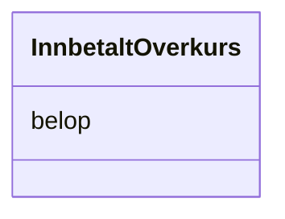

# Class: InnbetaltOverkurs 


_Innbetalt overkurs utover pålydande._


URI: [aksje:InnbetaltOverkurs](https://example.no/ontology/aksje#InnbetaltOverkurs)





<!-- no inheritance hierarchy -->

## Eigenskapar


  
  


  
  


  
  


  
  
  
  
    
  


### Andre

| Namn | Kardinalitet og domene | Beskriving |
| --- | --- | --- |
| [belop](belop.md) | 0..1 <br/> [Decimal](Decimal.md) | Monetært beløp |


## Usages

| used by | used in | type | used |
| ---  | --- | --- | --- |
| [Containerklasse](Containerklasse.md) | [innbetalt_overkurser](innbetalt_overkurser.md) | range | [InnbetaltOverkurs](InnbetaltOverkurs.md) |


## Identifier and Mapping Information


### Schema Source


* from schema: https://example.no/ontology/aksje-eierskap


## Mappings

| Mapping Type | Mapped Value |
| ---  | ---  |
| self | aksje:InnbetaltOverkurs |
| native | aksje:InnbetaltOverkurs |


## LinkML Source

<!-- TODO: investigate https://stackoverflow.com/questions/37606292/how-to-create-tabbed-code-blocks-in-mkdocs-or-sphinx -->

### Direct

<details>
```yaml
name: InnbetaltOverkurs
description: Innbetalt overkurs utover pålydande.
from_schema: https://example.no/ontology/aksje-eierskap
slots:
- belop

```
</details>

### Induced

<details>
```yaml
name: InnbetaltOverkurs
description: Innbetalt overkurs utover pålydande.
from_schema: https://example.no/ontology/aksje-eierskap
attributes:
  belop:
    name: belop
    description: Monetært beløp.
    from_schema: https://example.no/ontology/aksje-eierskap
    rank: 1000
    alias: belop
    owner: InnbetaltOverkurs
    domain_of:
    - Utdeling
    - Vederlag
    - InnbetaltAksjekapital
    - InnbetaltOverkurs
    range: decimal
    inlined: true

```
</details>