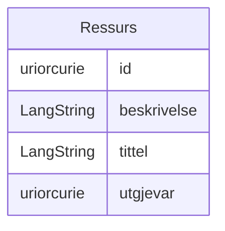

# referanse-schema.yaml

## Valideringsresultat

*Valideringsresultat ikkje tilgjengeleg — ingen validering enno.*

Annotert referanseskjema som viser alle hovudmønster: containerklasse, globale slots, import frå AP-NO-profil, class_uri/slot_uri, LangString, in_subset og lenking framfor inlining.

## Metadata

| Felt | Verdi |
| --- | --- |
| Schema URI | [https://example.org/linkml/referanse](https://example.org/linkml/referanse) |
| Versjon | 1.0.0 |
| Lisens | [https://data.norge.no/nlod/no/2.0](https://data.norge.no/nlod/no/2.0) |
| Utgjevar | [https://data.norge.no/organizations/974760673](https://data.norge.no/organizations/974760673) |
| Status | http://purl.org/adms/status/UnderDevelopment |
| Endringsdato | TODO |
| Utgivelsesdato | TODO |
| Imports | linkml:types ../ap-no/dcat-ap-no/dcat-ap-no-schema |

## Classes

### Obligatorisk

| Class | Description |
| --- | --- |
| [Ressurs](klasser/ressurs.md) | Ein generisk ressurs med tittel, skildring og utgjevar |

## Slots

| Slot | Description |
| --- | --- |
| [beskrivelse](klasser/beskrivelse.md) | Kortfatta skildring av ressursen |
| [id](klasser/id.md) | Unik URI-identifikator for ressursen |
| [tittel](klasser/tittel.md) | Namn eller tittel på ressursen |
| [utgjevar](klasser/utgjevar.md) | Organisasjon ansvarleg for ressursen (referert med URI) |

## Enumerations

| Enumeration | Description |
| --- | --- |

## Types

| Type | Description |
| --- | --- |

## Subsets

| Subset | Description |
| --- | --- |
| [Anbefalt](klasser/anbefalt.md) |  |
| [Metadata](klasser/metadata.md) | Klasser som beskriv metadata om ressursar, ikkje sjølve datainnhaldet |
| [Obligatorisk](klasser/obligatorisk.md) |  |
| [Valgfri](klasser/valgfri.md) |  |

## Generated artifacts

| Artefakt | Fil |
|----------|-----|
| ER-diagram (Mermaid) | [referanse-schema.yaml-erdiagram.md](referanse-schema.yaml-erdiagram.md) |
