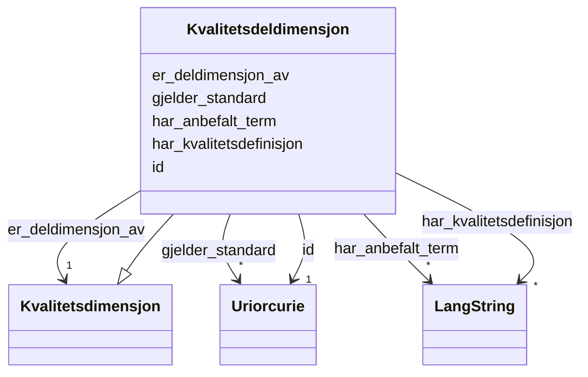

# Class: Kvalitetsdeldimensjon 


_Ein deldimensjon av ein kvalitetsdimensjon._


URI: [dqvno:SubDimension](https://data.norge.no/vocabulary/dqvno#SubDimension)





## Inheritance
* [Kvalitetsdimensjon](kvalitetsdimensjon.md)
    * **Kvalitetsdeldimensjon**


## Class Properties

| Property | Value |
| --- | --- |
| Class URI | [dqvno:SubDimension](https://data.norge.no/vocabulary/dqvno#SubDimension) |


## Eigenskapar


  
  
    
  


### Obligatorisk

| Namn | Kardinalitet og domene | Beskriving |
| --- | --- | --- |
| [er_deldimensjon_av](er_deldimensjon_av.md) | 1 <br/> [Kvalitetsdimensjon](kvalitetsdimensjon.md) | Overordna kvalitetsdimensjon denne deldimensjonen høyrer til |


  
  


  
  


  
  
  
    
      
    
      
    
      
    
  
  


### Arva

| Namn | Kardinalitet og domene | Beskriving | Frå |
| --- | --- | --- | --- || [id](id.md) | 1 <br/> [xsd:anyURI](http://www.w3.org/2001/XMLSchema#anyURI) | Unik URI-identifikator for ressursen | [Kvalitetsdimensjon](kvalitetsdimensjon.md) |
| [har_anbefalt_term](har_anbefalt_term.md) | * <br/> [LangString](langstring.md) | Føretrekt term/namn for dimensjonen eller målet | [Kvalitetsdimensjon](kvalitetsdimensjon.md) |
| [har_kvalitetsdefinisjon](har_kvalitetsdefinisjon.md) | * <br/> [LangString](langstring.md) | Definisjon av dimensjonen eller målet | [Kvalitetsdimensjon](kvalitetsdimensjon.md) |
| [gjelder_standard](gjelder_standard.md) | * <br/> [xsd:anyURI](http://www.w3.org/2001/XMLSchema#anyURI) | Standard(ar) denne kvalitetsdimensjonen gjeld for | [Kvalitetsdimensjon](kvalitetsdimensjon.md) |


## Usages

| used by | used in | type | used |
| ---  | --- | --- | --- |
| [Kvalitetsmaal](kvalitetsmaal.md) | [er_i_kvalitetsdeldimensjon](er_i_kvalitetsdeldimensjon.md) | range | [Kvalitetsdeldimensjon](kvalitetsdeldimensjon.md) |


## In Subsets


* [Metadata](metadata.md)


## Identifier and Mapping Information


### Schema Source


* from schema: https://data.norge.no/ap-no/dqv-core


## Mappings

| Mapping Type | Mapped Value |
| ---  | ---  |
| self | dqvno:SubDimension |
| native | https://data.norge.no/ap-no/dqv-core/Kvalitetsdeldimensjon |


## LinkML Source

<!-- TODO: investigate https://stackoverflow.com/questions/37606292/how-to-create-tabbed-code-blocks-in-mkdocs-or-sphinx -->

### Direct

<details>
```yaml
name: Kvalitetsdeldimensjon
description: Ein deldimensjon av ein kvalitetsdimensjon.
in_subset:
- Metadata
from_schema: https://data.norge.no/ap-no/dqv-core
is_a: Kvalitetsdimensjon
slots:
- er_deldimensjon_av
slot_usage:
  er_deldimensjon_av:
    name: er_deldimensjon_av
    in_subset:
    - Obligatorisk
    required: true
  har_anbefalt_term:
    name: har_anbefalt_term
    in_subset:
    - Anbefalt
  har_kvalitetsdefinisjon:
    name: har_kvalitetsdefinisjon
    in_subset:
    - Anbefalt
class_uri: dqvno:SubDimension

```
</details>

### Induced

<details>
```yaml
name: Kvalitetsdeldimensjon
description: Ein deldimensjon av ein kvalitetsdimensjon.
in_subset:
- Metadata
from_schema: https://data.norge.no/ap-no/dqv-core
is_a: Kvalitetsdimensjon
slot_usage:
  er_deldimensjon_av:
    name: er_deldimensjon_av
    in_subset:
    - Obligatorisk
    required: true
  har_anbefalt_term:
    name: har_anbefalt_term
    in_subset:
    - Anbefalt
  har_kvalitetsdefinisjon:
    name: har_kvalitetsdefinisjon
    in_subset:
    - Anbefalt
attributes:
  er_deldimensjon_av:
    name: er_deldimensjon_av
    description: Overordna kvalitetsdimensjon denne deldimensjonen høyrer til.
    in_subset:
    - Obligatorisk
    from_schema: https://data.norge.no/ap-no/dqv-core
    slot_uri: skos:broader
    owner: Kvalitetsdeldimensjon
    domain_of:
    - Kvalitetsdeldimensjon
    range: Kvalitetsdimensjon
    required: true
  id:
    name: id
    description: Unik URI-identifikator for ressursen.
    from_schema: https://example.org/linkml/referanse
    rank: 1000
    slot_uri: dct:identifier
    identifier: true
    owner: Kvalitetsdeldimensjon
    domain_of:
    - Mediatype
    - Konsept
    - Begrepssamling
    - Kvalitetsdimensjon
    - Kvalitetsmaal
    - Kvalitetsmerknad
    - Kvalitetsmaaling
    - Tekstdel
    - KatalogisertRessurs
    - Aktoer
    - Kontaktopplysning
    - Tidsrom
    - Standard
    - RegulativRessurs
    - Identifikator
    - Rettighetserklaring
    - Sjekksum
    - Gebyr
    - Relasjon
    - Distribusjon
    - Datasett
    - Katalogpost
    - Ressurs
    range: uriorcurie
    required: true
  har_anbefalt_term:
    name: har_anbefalt_term
    description: Føretrekt term/namn for dimensjonen eller målet.
    in_subset:
    - Anbefalt
    from_schema: https://data.norge.no/ap-no/dqv-core
    slot_uri: skos:prefLabel
    owner: Kvalitetsdeldimensjon
    domain_of:
    - Kvalitetsdimensjon
    - Kvalitetsmaal
    range: LangString
    multivalued: true
  har_kvalitetsdefinisjon:
    name: har_kvalitetsdefinisjon
    description: Definisjon av dimensjonen eller målet.
    in_subset:
    - Anbefalt
    from_schema: https://data.norge.no/ap-no/dqv-core
    slot_uri: skos:definition
    owner: Kvalitetsdeldimensjon
    domain_of:
    - Kvalitetsdimensjon
    - Kvalitetsmaal
    range: LangString
    multivalued: true
  gjelder_standard:
    name: gjelder_standard
    description: Standard(ar) denne kvalitetsdimensjonen gjeld for.
    in_subset:
    - Anbefalt
    from_schema: https://data.norge.no/ap-no/dqv-core
    slot_uri: dqvno:appliesToStandard
    owner: Kvalitetsdeldimensjon
    domain_of:
    - Kvalitetsdimensjon
    range: uriorcurie
    multivalued: true
class_uri: dqvno:SubDimension

```
</details>