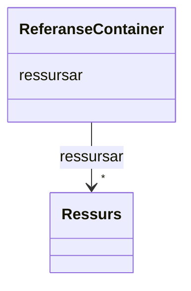

# Class: ReferanseContainer 


_Samling av ressursar — toppnivåobjekt for datafila._


URI: [https://example.org/linkml/referanse/ReferanseContainer](https://example.org/linkml/referanse/ReferanseContainer)





<!-- no inheritance hierarchy -->

## Class Properties

| Property | Value |
| --- | --- |
| Tree Root | Yes |


## Eigenskapar


  
  


  
  


  
  


  
  
  
  
    
  


### Andre

| Namn | Kardinalitet og domene | Beskriving |
| --- | --- | --- |
| [ressursar](ressursar.md) | * <br/> [Ressurs](ressurs.md) |  |


## Identifier and Mapping Information


### Schema Source


* from schema: https://example.org/linkml/referanse


## Mappings

| Mapping Type | Mapped Value |
| ---  | ---  |
| self | https://example.org/linkml/referanse/ReferanseContainer |
| native | https://example.org/linkml/referanse/ReferanseContainer |


## LinkML Source

<!-- TODO: investigate https://stackoverflow.com/questions/37606292/how-to-create-tabbed-code-blocks-in-mkdocs-or-sphinx -->

### Direct

<details>
```yaml
name: ReferanseContainer
description: Samling av ressursar — toppnivåobjekt for datafila.
from_schema: https://example.org/linkml/referanse
rank: 1000
attributes:
  ressursar:
    name: ressursar
    from_schema: https://example.org/linkml/referanse
    rank: 1000
    domain_of:
    - ReferanseContainer
    range: Ressurs
    multivalued: true
    inlined: true
    inlined_as_list: true
tree_root: true

```
</details>

### Induced

<details>
```yaml
name: ReferanseContainer
description: Samling av ressursar — toppnivåobjekt for datafila.
from_schema: https://example.org/linkml/referanse
rank: 1000
attributes:
  ressursar:
    name: ressursar
    from_schema: https://example.org/linkml/referanse
    rank: 1000
    owner: ReferanseContainer
    domain_of:
    - ReferanseContainer
    range: Ressurs
    multivalued: true
    inlined: true
    inlined_as_list: true
tree_root: true

```
</details>