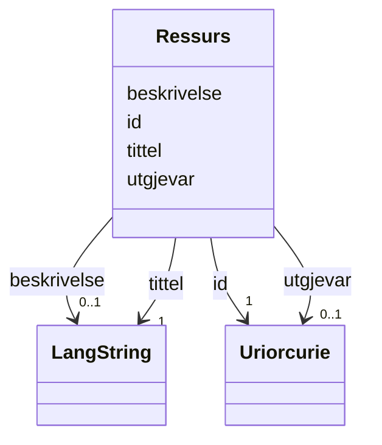

# Class: Ressurs 


_Ein generisk ressurs med tittel, skildring og utgjevar._


URI: [dct:BibliographicResource](http://purl.org/dc/terms/BibliographicResource)





<!-- no inheritance hierarchy -->

## Class Properties

| Property | Value |
| --- | --- |
| Class URI | [dct:BibliographicResource](http://purl.org/dc/terms/BibliographicResource) |


## Eigenskapar


  
  

  
  
    
  

  
  

  
  


### Obligatorisk

| Namn | Kardinalitet og domene | Beskriving |
| --- | --- | --- |
| [tittel](tittel.md) | 1 <br/> [LangString](langstring.md) | Namn eller tittel på ressursen |


  
  

  
  

  
  
    
  

  
  
    
  


### Anbefalt

| Namn | Kardinalitet og domene | Beskriving |
| --- | --- | --- |
| [beskrivelse](beskrivelse.md) | 0..1 <br/> [LangString](langstring.md) | Kortfatta skildring av ressursen |
| [utgjevar](utgjevar.md) | 0..1 <br/> [xsd:anyURI](http://www.w3.org/2001/XMLSchema#anyURI) | Organisasjon ansvarleg for ressursen (referert med URI) |


  
  

  
  

  
  

  
  


  
  
  
  
    
  

  
  
  
    
      
    
      
    
      
    
  
  

  
  
  
    
      
    
      
    
      
    
  
  

  
  
  
    
      
    
      
    
      
    
  
  


### Andre

| Namn | Kardinalitet og domene | Beskriving |
| --- | --- | --- |
| [id](id.md) | 1 <br/> [xsd:anyURI](http://www.w3.org/2001/XMLSchema#anyURI) | Unik URI-identifikator for ressursen |


## Usages

| used by | used in | type | used |
| ---  | --- | --- | --- |
| [ReferanseContainer](referansecontainer.md) | [ressursar](ressursar.md) | range | [Ressurs](ressurs.md) |


## Identifier and Mapping Information


### Annotations

| property | value |
| --- | --- |
| begrepsidentifikator | https://concept-catalog.fellesdatakatalog.digdir.no/collections/TODO/concepts/TODO |


### Schema Source


* from schema: https://example.org/linkml/referanse


## Mappings

| Mapping Type | Mapped Value |
| ---  | ---  |
| self | dct:BibliographicResource |
| native | https://example.org/linkml/referanse/Ressurs |


## LinkML Source

<!-- TODO: investigate https://stackoverflow.com/questions/37606292/how-to-create-tabbed-code-blocks-in-mkdocs-or-sphinx -->

### Direct

<details>
```yaml
name: Ressurs
annotations:
  begrepsidentifikator:
    tag: begrepsidentifikator
    value: https://concept-catalog.fellesdatakatalog.digdir.no/collections/TODO/concepts/TODO
description: Ein generisk ressurs med tittel, skildring og utgjevar.
from_schema: https://example.org/linkml/referanse
rank: 1000
slots:
- id
- tittel
- beskrivelse
- utgjevar
slot_usage:
  tittel:
    name: tittel
    in_subset:
    - Obligatorisk
    required: true
  beskrivelse:
    name: beskrivelse
    in_subset:
    - Anbefalt
  utgjevar:
    name: utgjevar
    in_subset:
    - Anbefalt
class_uri: dct:BibliographicResource

```
</details>

### Induced

<details>
```yaml
name: Ressurs
annotations:
  begrepsidentifikator:
    tag: begrepsidentifikator
    value: https://concept-catalog.fellesdatakatalog.digdir.no/collections/TODO/concepts/TODO
description: Ein generisk ressurs med tittel, skildring og utgjevar.
from_schema: https://example.org/linkml/referanse
rank: 1000
slot_usage:
  tittel:
    name: tittel
    in_subset:
    - Obligatorisk
    required: true
  beskrivelse:
    name: beskrivelse
    in_subset:
    - Anbefalt
  utgjevar:
    name: utgjevar
    in_subset:
    - Anbefalt
attributes:
  id:
    name: id
    description: Unik URI-identifikator for ressursen.
    from_schema: https://example.org/linkml/referanse
    rank: 1000
    slot_uri: dct:identifier
    identifier: true
    owner: Ressurs
    domain_of:
    - Mediatype
    - Konsept
    - Begrepssamling
    - Kvalitetsdimensjon
    - Kvalitetsmaal
    - Kvalitetsmerknad
    - Kvalitetsmaaling
    - Tekstdel
    - KatalogisertRessurs
    - Aktoer
    - Kontaktopplysning
    - Tidsrom
    - Standard
    - RegulativRessurs
    - Identifikator
    - Rettighetserklaring
    - Sjekksum
    - Gebyr
    - Relasjon
    - Distribusjon
    - Datasett
    - Katalogpost
    - Ressurs
    range: uriorcurie
    required: true
  tittel:
    name: tittel
    description: Namn eller tittel på ressursen.
    in_subset:
    - Obligatorisk
    from_schema: https://example.org/linkml/referanse
    rank: 1000
    slot_uri: dct:title
    owner: Ressurs
    domain_of:
    - Standard
    - RegulativRessurs
    - Distribusjon
    - Datasett
    - Datasettserie
    - Datatjeneste
    - Katalogpost
    - Katalog
    - Ressurs
    range: LangString
    required: true
  beskrivelse:
    name: beskrivelse
    description: Kortfatta skildring av ressursen.
    in_subset:
    - Anbefalt
    from_schema: https://example.org/linkml/referanse
    rank: 1000
    slot_uri: dct:description
    owner: Ressurs
    domain_of:
    - RegulativRessurs
    - Gebyr
    - Distribusjon
    - Datasett
    - Datasettserie
    - Datatjeneste
    - Katalogpost
    - Katalog
    - Ressurs
    range: LangString
  utgjevar:
    name: utgjevar
    description: Organisasjon ansvarleg for ressursen (referert med URI).
    in_subset:
    - Anbefalt
    from_schema: https://example.org/linkml/referanse
    rank: 1000
    slot_uri: dct:publisher
    owner: Ressurs
    domain_of:
    - Ressurs
    range: uriorcurie
class_uri: dct:BibliographicResource

```
</details>