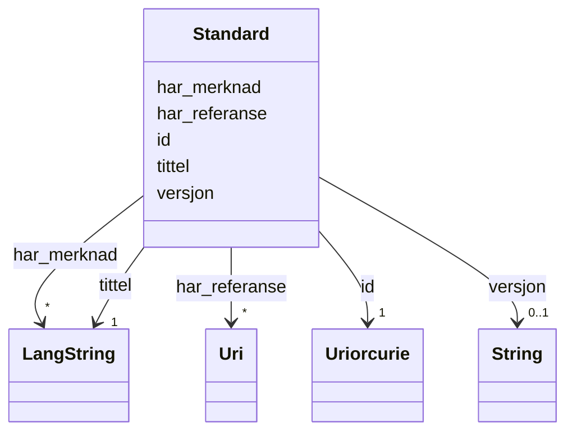

# Class: Standard 


_Ein standard eller spesifikasjon ein ressurs er i samsvar med._


URI: [dct:Standard](http://purl.org/dc/terms/Standard)





<!-- no inheritance hierarchy -->

## Class Properties

| Property | Value |
| --- | --- |
| Class URI | [dct:Standard](http://purl.org/dc/terms/Standard) |


## Eigenskapar


  
  

  
  
    
  

  
  

  
  

  
  


### Obligatorisk

| Namn | Kardinalitet og domene | Beskriving |
| --- | --- | --- |
| [tittel](tittel.md) | 1 <br/> [LangString](langstring.md) | Namn eller tittel på ressursen |


  
  

  
  

  
  
    
  

  
  

  
  


### Anbefalt

| Namn | Kardinalitet og domene | Beskriving |
| --- | --- | --- |
| [har_referanse](har_referanse.md) | * <br/> [xsd:anyURI](http://www.w3.org/2001/XMLSchema#anyURI) | Referanse til ekstern ressurs (rdfs:seeAlso) |


  
  

  
  

  
  

  
  
    
  

  
  
    
  


### Valgfri

| Namn | Kardinalitet og domene | Beskriving |
| --- | --- | --- |
| [har_merknad](har_merknad.md) | * <br/> [LangString](langstring.md) | Fritekstmerknad (rdfs:comment) |
| [versjon](versjon.md) | 0..1 <br/> [xsd:string](http://www.w3.org/2001/XMLSchema#string) | Versjonsnummer |


  
  
  
  
    
  

  
  
  
    
      
    
      
    
      
    
  
  

  
  
  
    
      
    
      
    
      
    
  
  

  
  
  
    
      
    
      
    
      
    
  
  

  
  
  
    
      
    
      
    
      
    
  
  


### Andre

| Namn | Kardinalitet og domene | Beskriving |
| --- | --- | --- |
| [id](id.md) | 1 <br/> [xsd:anyURI](http://www.w3.org/2001/XMLSchema#anyURI) | Unik URI-identifikator for ressursen |


## Usages

| used by | used in | type | used |
| ---  | --- | --- | --- |
| [Distribusjon](distribusjon.md) | [i_samsvar_med](i_samsvar_med.md) | range | [Standard](standard.md) |
| [Datasett](datasett.md) | [i_samsvar_med](i_samsvar_med.md) | range | [Standard](standard.md) |
| [Datatjeneste](datatjeneste.md) | [i_samsvar_med](i_samsvar_med.md) | range | [Standard](standard.md) |
| [Katalogpost](katalogpost.md) | [i_samsvar_med](i_samsvar_med.md) | range | [Standard](standard.md) |


## In Subsets


* [Metadata](metadata.md)


## Identifier and Mapping Information


### Schema Source


* from schema: https://data.norge.no/ap-no/dcat-ap-no


## Mappings

| Mapping Type | Mapped Value |
| ---  | ---  |
| self | dct:Standard |
| native | https://data.norge.no/ap-no/dcat-ap-no/Standard |


## LinkML Source

<!-- TODO: investigate https://stackoverflow.com/questions/37606292/how-to-create-tabbed-code-blocks-in-mkdocs-or-sphinx -->

### Direct

<details>
```yaml
name: Standard
description: Ein standard eller spesifikasjon ein ressurs er i samsvar med.
in_subset:
- Metadata
from_schema: https://data.norge.no/ap-no/dcat-ap-no
slots:
- id
- tittel
- har_referanse
- har_merknad
- versjon
slot_usage:
  tittel:
    name: tittel
    in_subset:
    - Obligatorisk
    required: true
  har_referanse:
    name: har_referanse
    in_subset:
    - Anbefalt
  har_merknad:
    name: har_merknad
    in_subset:
    - Valgfri
  versjon:
    name: versjon
    in_subset:
    - Valgfri
class_uri: dct:Standard

```
</details>

### Induced

<details>
```yaml
name: Standard
description: Ein standard eller spesifikasjon ein ressurs er i samsvar med.
in_subset:
- Metadata
from_schema: https://data.norge.no/ap-no/dcat-ap-no
slot_usage:
  tittel:
    name: tittel
    in_subset:
    - Obligatorisk
    required: true
  har_referanse:
    name: har_referanse
    in_subset:
    - Anbefalt
  har_merknad:
    name: har_merknad
    in_subset:
    - Valgfri
  versjon:
    name: versjon
    in_subset:
    - Valgfri
attributes:
  id:
    name: id
    description: Unik URI-identifikator for ressursen.
    from_schema: https://example.org/linkml/referanse
    rank: 1000
    slot_uri: dct:identifier
    identifier: true
    owner: Standard
    domain_of:
    - Mediatype
    - Konsept
    - Begrepssamling
    - Kvalitetsdimensjon
    - Kvalitetsmaal
    - Kvalitetsmerknad
    - Kvalitetsmaaling
    - Tekstdel
    - KatalogisertRessurs
    - Aktoer
    - Kontaktopplysning
    - Tidsrom
    - Standard
    - RegulativRessurs
    - Identifikator
    - Rettighetserklaring
    - Sjekksum
    - Gebyr
    - Relasjon
    - Distribusjon
    - Datasett
    - Katalogpost
    - Ressurs
    range: uriorcurie
    required: true
  tittel:
    name: tittel
    description: Namn eller tittel på ressursen.
    in_subset:
    - Obligatorisk
    from_schema: https://example.org/linkml/referanse
    rank: 1000
    slot_uri: dct:title
    owner: Standard
    domain_of:
    - Standard
    - RegulativRessurs
    - Distribusjon
    - Datasett
    - Datasettserie
    - Datatjeneste
    - Katalogpost
    - Katalog
    - Ressurs
    range: LangString
    required: true
  har_referanse:
    name: har_referanse
    description: Referanse til ekstern ressurs (rdfs:seeAlso).
    in_subset:
    - Anbefalt
    from_schema: https://data.norge.no/ap-no/common-ap-no
    slot_uri: rdfs:seeAlso
    owner: Standard
    domain_of:
    - Standard
    - RegulativRessurs
    range: uri
    multivalued: true
  har_merknad:
    name: har_merknad
    description: Fritekstmerknad (rdfs:comment).
    in_subset:
    - Valgfri
    from_schema: https://data.norge.no/ap-no/common-ap-no
    slot_uri: rdfs:comment
    owner: Standard
    domain_of:
    - Kvalitetsmerknad
    - Kvalitetsmaaling
    - Standard
    range: LangString
    multivalued: true
  versjon:
    name: versjon
    description: Versjonsnummer.
    in_subset:
    - Valgfri
    from_schema: https://data.norge.no/ap-no/dcat-ap-no
    slot_uri: dcat:version
    owner: Standard
    domain_of:
    - Standard
    - Datasett
    - Datatjeneste
    range: string
class_uri: dct:Standard

```
</details>