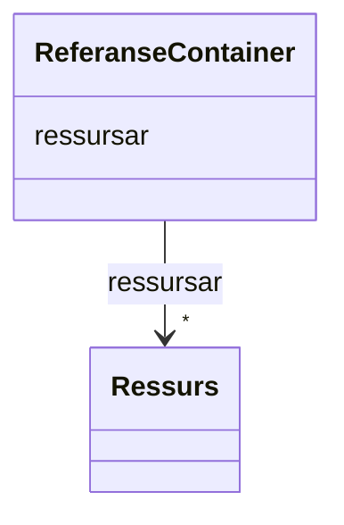

# Class: ReferanseContainer 


_Samling av ressursar — toppnivåobjekt for datafila._


URI: [https://data.norge.no/linkml/referansemodell/ReferanseContainer](https://data.norge.no/linkml/referansemodell/ReferanseContainer)




!!! note "Om diagrammet"
    Klikk på attributt-radene i klasseboksen ovanfor opnar same side som
    klassenamnet — Mermaid sin `classDiagram`-syntaks støttar berre éin
    klikkbar lenkje per klasseboks, ikkje éin per attributt (BUG-14).
    `## Eigenskapar`-tabellen lenger nede på sida er fasiten for
    slot-spesifikke lenkjer.


<!-- no inheritance hierarchy -->

## Class Properties

| Property | Value |
| --- | --- |
| Tree Root | Yes |

## Eigenskapar

### Andre

| Namn | Kardinalitet og domene | Beskriving |
| --- | --- | --- |
| [ressursar](ressursar.md) | * <br/> [Ressurs](ressurs.md) |  |


## Identifier and Mapping Information


### Schema Source


* from schema: https://data.norge.no/linkml/referansemodell


## Mappings

| Mapping Type | Mapped Value |
| ---  | ---  |
| self | https://data.norge.no/linkml/referansemodell/ReferanseContainer |
| native | https://data.norge.no/linkml/referansemodell/ReferanseContainer |


## LinkML Source

<!-- TODO: investigate https://stackoverflow.com/questions/37606292/how-to-create-tabbed-code-blocks-in-mkdocs-or-sphinx -->

### Direct

<details>
```yaml
name: ReferanseContainer
description: Samling av ressursar — toppnivåobjekt for datafila.
from_schema: https://data.norge.no/linkml/referansemodell
rank: 1000
attributes:
  ressursar:
    name: ressursar
    from_schema: https://data.norge.no/linkml/referansemodell
    domain_of:
    - ReferanseContainer
    range: Ressurs
    multivalued: true
    inlined: true
    inlined_as_list: true
tree_root: true

```
</details>

### Induced

<details>
```yaml
name: ReferanseContainer
description: Samling av ressursar — toppnivåobjekt for datafila.
from_schema: https://data.norge.no/linkml/referansemodell
rank: 1000
attributes:
  ressursar:
    name: ressursar
    from_schema: https://data.norge.no/linkml/referansemodell
    owner: ReferanseContainer
    domain_of:
    - ReferanseContainer
    range: Ressurs
    multivalued: true
    inlined: true
    inlined_as_list: true
tree_root: true

```
</details>