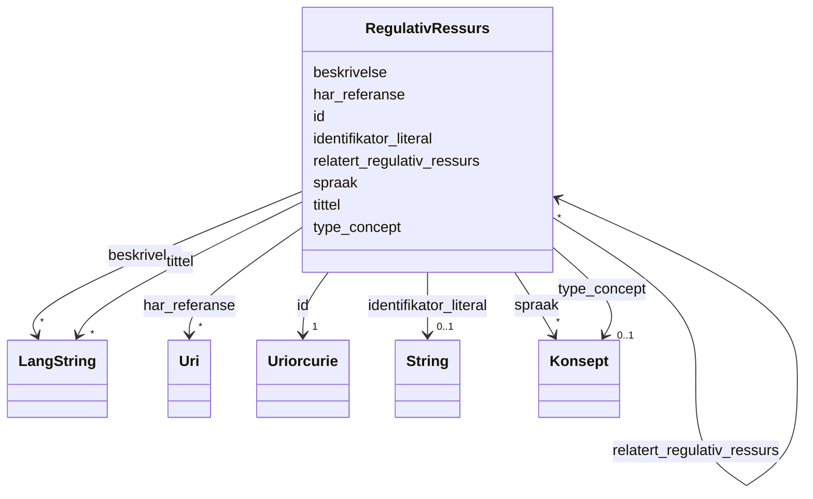

# Class: RegulativRessurs 


_Ein regulativ ressurs (lov, forskrift o.l.) som gjeld for ein ressurs._


URI: [eli:LegalResource](http://data.europa.eu/eli/ontology#LegalResource)





<!-- no inheritance hierarchy -->

## Class Properties

| Property | Value |
| --- | --- |
| Class URI | [eli:LegalResource](http://data.europa.eu/eli/ontology#LegalResource) |

## Eigenskapar

### Anbefalt

| Namn | Kardinalitet og domene | Beskriving |
| --- | --- | --- |
| [beskrivelse](beskrivelse.md) | * <br/> [LangString](langstring.md) | Fritekstbeskrivelse av ressursen (dct:description). |
| [identifikator_literal](identifikator_literal.md) | 0..1 <br/> [xsd:string](http://www.w3.org/2001/XMLSchema#string) | Tekstleg identifikator for ressursen (dct:identifier). |
| [har_referanse](har_referanse.md) | * <br/> [xsd:anyURI](http://www.w3.org/2001/XMLSchema#anyURI) | Referanse til ekstern ressurs (rdfs:seeAlso). |
| [spraak](spraak.md) | * <br/> [Konsept](konsept.md) | Språk brukt i ressursen. |
| [tittel](tittel.md) | * <br/> [LangString](langstring.md) | Namn/tittel på ressursen (dct:title). |
| [type_concept](type_concept.md) | 0..1 <br/> [Konsept](konsept.md) | Type ressurs frå eit kontrollert vokabular (dct:type). |

### Valgfri

| Namn | Kardinalitet og domene | Beskriving |
| --- | --- | --- |
| [relatert_regulativ_ressurs](relatert_regulativ_ressurs.md) | * <br/> [RegulativRessurs](regulativressurs.md) | Relatert regulativ ressurs. |

### Andre

| Namn | Kardinalitet og domene | Beskriving |
| --- | --- | --- |
| [id](id.md) | 1 <br/> [xsd:anyURI](http://www.w3.org/2001/XMLSchema#anyURI) | URI-identifikator for ressursen. |


## Usages

| used by | used in | type | used |
| ---  | --- | --- | --- |
| [RegulativRessurs](regulativressurs.md) | [relatert_regulativ_ressurs](relatert_regulativ_ressurs.md) | range | [RegulativRessurs](regulativressurs.md) |
| [Distribusjon](distribusjon.md) | [gjeldende_lovgivning](gjeldende_lovgivning.md) | range | [RegulativRessurs](regulativressurs.md) |
| [Datasett](datasett.md) | [gjeldende_lovgivning](gjeldende_lovgivning.md) | range | [RegulativRessurs](regulativressurs.md) |
| [Datasettserie](datasettserie.md) | [gjeldende_lovgivning](gjeldende_lovgivning.md) | range | [RegulativRessurs](regulativressurs.md) |
| [Datatjeneste](datatjeneste.md) | [gjeldende_lovgivning](gjeldende_lovgivning.md) | range | [RegulativRessurs](regulativressurs.md) |
| [Katalog](katalog.md) | [gjeldende_lovgivning](gjeldende_lovgivning.md) | range | [RegulativRessurs](regulativressurs.md) |


## In Subsets


* [Metadata](metadata.md)


## Identifier and Mapping Information


### Schema Source


* from schema: https://data.norge.no/ap-no/dcat-ap-no


## Mappings

| Mapping Type | Mapped Value |
| ---  | ---  |
| self | eli:LegalResource |
| native | https://data.norge.no/ap-no/dcat-ap-no/RegulativRessurs |


## LinkML Source

<!-- TODO: investigate https://stackoverflow.com/questions/37606292/how-to-create-tabbed-code-blocks-in-mkdocs-or-sphinx -->

### Direct

<details>
```yaml
name: RegulativRessurs
description: Ein regulativ ressurs (lov, forskrift o.l.) som gjeld for ein ressurs.
in_subset:
- Metadata
from_schema: https://data.norge.no/ap-no/dcat-ap-no
slots:
- id
- beskrivelse
- identifikator_literal
- har_referanse
- spraak
- tittel
- type_concept
- relatert_regulativ_ressurs
slot_usage:
  beskrivelse:
    name: beskrivelse
    in_subset:
    - Anbefalt
  identifikator_literal:
    name: identifikator_literal
    in_subset:
    - Anbefalt
  har_referanse:
    name: har_referanse
    in_subset:
    - Anbefalt
  spraak:
    name: spraak
    in_subset:
    - Anbefalt
  tittel:
    name: tittel
    in_subset:
    - Anbefalt
  type_concept:
    name: type_concept
    in_subset:
    - Anbefalt
  relatert_regulativ_ressurs:
    name: relatert_regulativ_ressurs
    in_subset:
    - Valgfri
class_uri: eli:LegalResource

```
</details>

### Induced

<details>
```yaml
name: RegulativRessurs
description: Ein regulativ ressurs (lov, forskrift o.l.) som gjeld for ein ressurs.
in_subset:
- Metadata
from_schema: https://data.norge.no/ap-no/dcat-ap-no
slot_usage:
  beskrivelse:
    name: beskrivelse
    in_subset:
    - Anbefalt
  identifikator_literal:
    name: identifikator_literal
    in_subset:
    - Anbefalt
  har_referanse:
    name: har_referanse
    in_subset:
    - Anbefalt
  spraak:
    name: spraak
    in_subset:
    - Anbefalt
  tittel:
    name: tittel
    in_subset:
    - Anbefalt
  type_concept:
    name: type_concept
    in_subset:
    - Anbefalt
  relatert_regulativ_ressurs:
    name: relatert_regulativ_ressurs
    in_subset:
    - Valgfri
attributes:
  id:
    name: id
    description: URI-identifikator for ressursen.
    from_schema: https://data.norge.no/ap-no/common-ap-no
    identifier: true
    owner: RegulativRessurs
    domain_of:
    - Lisensdokument
    - Mediatype
    - Konsept
    - Begrepssamling
    - Kvalitetsdimensjon
    - Kvalitetsmaal
    - Kvalitetsmerknad
    - Kvalitetsmaaling
    - Tekstdel
    - KatalogisertRessurs
    - Aktoer
    - Kontaktopplysning
    - Tidsrom
    - Standard
    - RegulativRessurs
    - Identifikator
    - Rettighetserklaring
    - Sjekksum
    - Gebyr
    - Relasjon
    - Distribusjon
    - Datasett
    - Katalogpost
    - Ressurs
    range: uriorcurie
    required: true
  beskrivelse:
    name: beskrivelse
    description: Fritekstbeskrivelse av ressursen (dct:description).
    in_subset:
    - Anbefalt
    from_schema: https://data.norge.no/ap-no/common-ap-no
    slot_uri: dct:description
    owner: RegulativRessurs
    domain_of:
    - RegulativRessurs
    - Gebyr
    - Distribusjon
    - Datasett
    - Datasettserie
    - Datatjeneste
    - Katalogpost
    - Katalog
    - Ressurs
    range: LangString
    multivalued: true
  identifikator_literal:
    name: identifikator_literal
    description: Tekstleg identifikator for ressursen (dct:identifier).
    in_subset:
    - Anbefalt
    from_schema: https://data.norge.no/ap-no/common-ap-no
    slot_uri: dct:identifier
    owner: RegulativRessurs
    domain_of:
    - Aktoer
    - RegulativRessurs
    - Datasett
    - Datatjeneste
    - Katalog
    range: string
  har_referanse:
    name: har_referanse
    description: Referanse til ekstern ressurs (rdfs:seeAlso).
    in_subset:
    - Anbefalt
    from_schema: https://data.norge.no/ap-no/common-ap-no
    slot_uri: rdfs:seeAlso
    owner: RegulativRessurs
    domain_of:
    - Standard
    - RegulativRessurs
    range: uri
    multivalued: true
  spraak:
    name: spraak
    annotations:
      gyldige_verdier:
        tag: gyldige_verdier
        value: http://publications.europa.eu/resource/authority/language/
      vokabular_krav:
        tag: vokabular_krav
        value: skal
      vokabular_pattern:
        tag: vokabular_pattern
        value: ^http://publications\.europa\.eu/resource/authority/language/[A-Z]{3}$
      enum_referanse:
        tag: enum_referanse
        value: EULanguage
      enum_dekning:
        tag: enum_dekning
        value: delvis
    description: Språk brukt i ressursen. Verdien SKAL veljast frå EUs kontrollerte
      vokabular Language (http://publications.europa.eu/resource/authority/language/).
      Enumerasjonen EULanguage i common-ap-no dekkjer norske språk (bokmål, nynorsk,
      samiske språk). For andre språk, bruk URI frå EU Language-vokabularet (t.d.
      ENG for engelsk, SWE for svensk).
    in_subset:
    - Anbefalt
    from_schema: https://data.norge.no/ap-no/common-ap-no
    slot_uri: dct:language
    owner: RegulativRessurs
    domain_of:
    - Tekstdel
    - RegulativRessurs
    - Distribusjon
    - Datasett
    - Katalogpost
    - Katalog
    range: Konsept
    multivalued: true
  tittel:
    name: tittel
    description: Namn/tittel på ressursen (dct:title).
    in_subset:
    - Anbefalt
    from_schema: https://data.norge.no/ap-no/common-ap-no
    slot_uri: dct:title
    owner: RegulativRessurs
    domain_of:
    - Standard
    - RegulativRessurs
    - Distribusjon
    - Datasett
    - Datasettserie
    - Datatjeneste
    - Katalogpost
    - Katalog
    - Ressurs
    range: LangString
    multivalued: true
  type_concept:
    name: type_concept
    description: Type ressurs frå eit kontrollert vokabular (dct:type).
    in_subset:
    - Anbefalt
    from_schema: https://data.norge.no/ap-no/common-ap-no
    slot_uri: dct:type
    owner: RegulativRessurs
    domain_of:
    - Lisensdokument
    - Aktoer
    - RegulativRessurs
    - Datasett
    range: Konsept
  relatert_regulativ_ressurs:
    name: relatert_regulativ_ressurs
    description: Relatert regulativ ressurs.
    in_subset:
    - Valgfri
    from_schema: https://data.norge.no/ap-no/dcat-ap-no
    slot_uri: dct:relation
    owner: RegulativRessurs
    domain_of:
    - RegulativRessurs
    range: RegulativRessurs
    multivalued: true
class_uri: eli:LegalResource

```
</details>