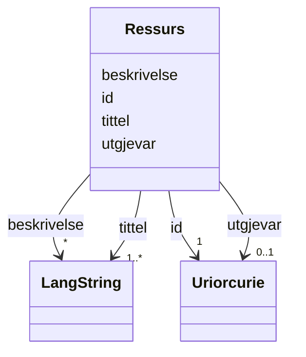

# Class: Ressurs 


_Ein generisk ressurs med tittel, skildring og utgjevar._


URI: [dct:BibliographicResource](http://purl.org/dc/terms/BibliographicResource)





<!-- no inheritance hierarchy -->

## Class Properties

| Property | Value |
| --- | --- |
| Class URI | [dct:BibliographicResource](http://purl.org/dc/terms/BibliographicResource) |

## Eigenskapar

### Obligatorisk

| Namn | Kardinalitet og domene | Beskriving |
| --- | --- | --- |
| [tittel](tittel.md) | 1..* <br/> [LangString](langstring.md) | Namn/tittel på ressursen (dct:title). |

### Anbefalt

| Namn | Kardinalitet og domene | Beskriving |
| --- | --- | --- |
| [beskrivelse](beskrivelse.md) | * <br/> [LangString](langstring.md) | Fritekstbeskrivelse av ressursen (dct:description). |
| [utgjevar](utgjevar.md) | 0..1 <br/> [xsd:anyURI](http://www.w3.org/2001/XMLSchema#anyURI) | Organisasjon ansvarleg for ressursen (referert med URI). |

### Andre

| Namn | Kardinalitet og domene | Beskriving |
| --- | --- | --- |
| [id](id.md) | 1 <br/> [xsd:anyURI](http://www.w3.org/2001/XMLSchema#anyURI) | URI-identifikator for ressursen. |


## Usages

| used by | used in | type | used |
| ---  | --- | --- | --- |
| [ReferanseContainer](referansecontainer.md) | [ressursar](ressursar.md) | range | [Ressurs](ressurs.md) |


## Identifier and Mapping Information


### Schema Source


* from schema: https://data.norge.no/linkml/referansemodell


## Mappings

| Mapping Type | Mapped Value |
| ---  | ---  |
| self | dct:BibliographicResource |
| native | https://data.norge.no/linkml/referansemodell/Ressurs |


## LinkML Source

<!-- TODO: investigate https://stackoverflow.com/questions/37606292/how-to-create-tabbed-code-blocks-in-mkdocs-or-sphinx -->

### Direct

<details>
```yaml
name: Ressurs
description: Ein generisk ressurs med tittel, skildring og utgjevar.
from_schema: https://data.norge.no/linkml/referansemodell
rank: 1000
slots:
- id
- tittel
- beskrivelse
- utgjevar
slot_usage:
  tittel:
    name: tittel
    in_subset:
    - Obligatorisk
    required: true
  beskrivelse:
    name: beskrivelse
    in_subset:
    - Anbefalt
  utgjevar:
    name: utgjevar
    in_subset:
    - Anbefalt
class_uri: dct:BibliographicResource

```
</details>

### Induced

<details>
```yaml
name: Ressurs
description: Ein generisk ressurs med tittel, skildring og utgjevar.
from_schema: https://data.norge.no/linkml/referansemodell
rank: 1000
slot_usage:
  tittel:
    name: tittel
    in_subset:
    - Obligatorisk
    required: true
  beskrivelse:
    name: beskrivelse
    in_subset:
    - Anbefalt
  utgjevar:
    name: utgjevar
    in_subset:
    - Anbefalt
attributes:
  id:
    name: id
    description: URI-identifikator for ressursen.
    from_schema: https://data.norge.no/ap-no/common-ap-no
    identifier: true
    owner: Ressurs
    domain_of:
    - Lisensdokument
    - Mediatype
    - Konsept
    - Begrepssamling
    - Kvalitetsdimensjon
    - Kvalitetsmaal
    - Kvalitetsmerknad
    - Kvalitetsmaaling
    - Tekstdel
    - KatalogisertRessurs
    - Aktoer
    - Kontaktopplysning
    - Tidsrom
    - Standard
    - RegulativRessurs
    - Identifikator
    - Rettighetserklaring
    - Sjekksum
    - Gebyr
    - Relasjon
    - Distribusjon
    - Datasett
    - Katalogpost
    - Ressurs
    range: uriorcurie
    required: true
  tittel:
    name: tittel
    description: Namn/tittel på ressursen (dct:title).
    in_subset:
    - Obligatorisk
    from_schema: https://data.norge.no/ap-no/common-ap-no
    slot_uri: dct:title
    owner: Ressurs
    domain_of:
    - Standard
    - RegulativRessurs
    - Distribusjon
    - Datasett
    - Datasettserie
    - Datatjeneste
    - Katalogpost
    - Katalog
    - Ressurs
    range: LangString
    required: true
    multivalued: true
  beskrivelse:
    name: beskrivelse
    description: Fritekstbeskrivelse av ressursen (dct:description).
    in_subset:
    - Anbefalt
    from_schema: https://data.norge.no/ap-no/common-ap-no
    slot_uri: dct:description
    owner: Ressurs
    domain_of:
    - RegulativRessurs
    - Gebyr
    - Distribusjon
    - Datasett
    - Datasettserie
    - Datatjeneste
    - Katalogpost
    - Katalog
    - Ressurs
    range: LangString
    multivalued: true
  utgjevar:
    name: utgjevar
    description: Organisasjon ansvarleg for ressursen (referert med URI).
    in_subset:
    - Anbefalt
    from_schema: https://data.norge.no/linkml/referansemodell
    slot_uri: dct:publisher
    owner: Ressurs
    domain_of:
    - Ressurs
    range: uriorcurie
class_uri: dct:BibliographicResource

```
</details>