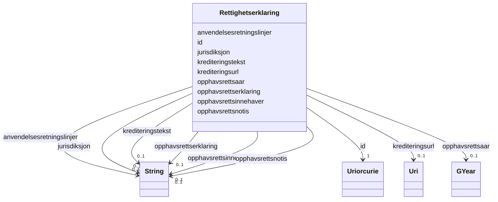

# Class: Rettighetserklaring 


_Ei erklæring om rettar til ein ressurs (ODRS)._


URI: [dct:RightsStatement](http://purl.org/dc/terms/RightsStatement)




!!! note "Om diagrammet"
    Klikk på attributt-radene i klasseboksen ovanfor opnar same side som
    klassenamnet — Mermaid sin `classDiagram`-syntaks støttar berre éin
    klikkbar lenkje per klasseboks, ikkje éin per attributt (BUG-14).
    `## Eigenskapar`-tabellen lenger nede på sida er fasiten for
    slot-spesifikke lenkjer.


<!-- no inheritance hierarchy -->

## Class Properties

| Property | Value |
| --- | --- |
| Class URI | [dct:RightsStatement](http://purl.org/dc/terms/RightsStatement) |

## Eigenskapar

### Anbefalt

| Namn | Kardinalitet og domene | Beskriving |
| --- | --- | --- |
| [anvendelsesretningslinjer](anvendelsesretningslinjer.md) | 0..1 <br/> [xsd:string](http://www.w3.org/2001/XMLSchema#string) | Retningslinjer for gjenbruk av data. |
| [jurisdiksjon](jurisdiksjon.md) | 0..1 <br/> [xsd:string](http://www.w3.org/2001/XMLSchema#string) | Jurisdiksjon for rettigheitserklæringa. |
| [krediteringstekst](krediteringstekst.md) | 0..1 <br/> [xsd:string](http://www.w3.org/2001/XMLSchema#string) | Tekst som skal brukast ved kreditering. |
| [krediteringsurl](krediteringsurl.md) | 0..1 <br/> [xsd:anyURI](http://www.w3.org/2001/XMLSchema#anyURI) | URL for kreditering av rettshavar. |
| [opphavsrettserklaring](opphavsrettserklaring.md) | 0..1 <br/> [xsd:string](http://www.w3.org/2001/XMLSchema#string) | Opphavsrettserklæring. |
| [opphavsrettsinnehaver](opphavsrettsinnehaver.md) | 0..1 <br/> [xsd:string](http://www.w3.org/2001/XMLSchema#string) | Namn på opphavsrettsinnehavar. |

### Valgfri

| Namn | Kardinalitet og domene | Beskriving |
| --- | --- | --- |
| [opphavsrettsnotis](opphavsrettsnotis.md) | 0..1 <br/> [xsd:string](http://www.w3.org/2001/XMLSchema#string) | Opphavsrettsnotis. |
| [opphavsrettsaar](opphavsrettsaar.md) | 0..1 <br/> [GYear](gyear.md) | Årstal for opphavsrett. |

### Andre

| Namn | Kardinalitet og domene | Beskriving |
| --- | --- | --- |
| [id](id.md) | 1 <br/> [xsd:anyURI](http://www.w3.org/2001/XMLSchema#anyURI) | URI-identifikator for ressursen. |


## Usages

| used by | used in | type | used |
| ---  | --- | --- | --- |
| [Distribusjon](distribusjon.md) | [rettigheter](rettigheter.md) | range | [Rettighetserklaring](rettighetserklaring.md) |
| [Datatjeneste](datatjeneste.md) | [rettigheter](rettigheter.md) | range | [Rettighetserklaring](rettighetserklaring.md) |
| [Katalog](katalog.md) | [rettigheter](rettigheter.md) | range | [Rettighetserklaring](rettighetserklaring.md) |


## In Subsets


* [Metadata](metadata.md)


## Identifier and Mapping Information


### Schema Source


* from schema: https://data.norge.no/ap-no/dcat-ap-no


## Mappings

| Mapping Type | Mapped Value |
| ---  | ---  |
| self | dct:RightsStatement |
| native | https://data.norge.no/ap-no/dcat-ap-no/Rettighetserklaring |


## LinkML Source

<!-- TODO: investigate https://stackoverflow.com/questions/37606292/how-to-create-tabbed-code-blocks-in-mkdocs-or-sphinx -->

### Direct

<details>
```yaml
name: Rettighetserklaring
description: Ei erklæring om rettar til ein ressurs (ODRS).
in_subset:
- Metadata
from_schema: https://data.norge.no/ap-no/dcat-ap-no
slots:
- id
- anvendelsesretningslinjer
- jurisdiksjon
- krediteringstekst
- krediteringsurl
- opphavsrettserklaring
- opphavsrettsinnehaver
- opphavsrettsnotis
- opphavsrettsaar
slot_usage:
  anvendelsesretningslinjer:
    name: anvendelsesretningslinjer
    in_subset:
    - Anbefalt
  jurisdiksjon:
    name: jurisdiksjon
    in_subset:
    - Anbefalt
  krediteringstekst:
    name: krediteringstekst
    in_subset:
    - Anbefalt
  krediteringsurl:
    name: krediteringsurl
    in_subset:
    - Anbefalt
  opphavsrettserklaring:
    name: opphavsrettserklaring
    in_subset:
    - Anbefalt
  opphavsrettsinnehaver:
    name: opphavsrettsinnehaver
    in_subset:
    - Anbefalt
  opphavsrettsnotis:
    name: opphavsrettsnotis
    in_subset:
    - Valgfri
  opphavsrettsaar:
    name: opphavsrettsaar
    in_subset:
    - Valgfri
class_uri: dct:RightsStatement

```
</details>

### Induced

<details>
```yaml
name: Rettighetserklaring
description: Ei erklæring om rettar til ein ressurs (ODRS).
in_subset:
- Metadata
from_schema: https://data.norge.no/ap-no/dcat-ap-no
slot_usage:
  anvendelsesretningslinjer:
    name: anvendelsesretningslinjer
    in_subset:
    - Anbefalt
  jurisdiksjon:
    name: jurisdiksjon
    in_subset:
    - Anbefalt
  krediteringstekst:
    name: krediteringstekst
    in_subset:
    - Anbefalt
  krediteringsurl:
    name: krediteringsurl
    in_subset:
    - Anbefalt
  opphavsrettserklaring:
    name: opphavsrettserklaring
    in_subset:
    - Anbefalt
  opphavsrettsinnehaver:
    name: opphavsrettsinnehaver
    in_subset:
    - Anbefalt
  opphavsrettsnotis:
    name: opphavsrettsnotis
    in_subset:
    - Valgfri
  opphavsrettsaar:
    name: opphavsrettsaar
    in_subset:
    - Valgfri
attributes:
  id:
    name: id
    description: URI-identifikator for ressursen.
    from_schema: https://data.norge.no/ap-no/common-ap-no
    identifier: true
    owner: Rettighetserklaring
    domain_of:
    - Lisensdokument
    - Mediatype
    - Konsept
    - Begrepssamling
    - Kvalitetsdimensjon
    - Kvalitetsmaal
    - Kvalitetsmerknad
    - Kvalitetsmaaling
    - Tekstdel
    - KatalogisertRessurs
    - Aktoer
    - Kontaktopplysning
    - Tidsrom
    - Standard
    - RegulativRessurs
    - Identifikator
    - Rettighetserklaring
    - Sjekksum
    - Gebyr
    - Relasjon
    - Distribusjon
    - Datasett
    - Katalogpost
    - Ressurs
    range: uriorcurie
    required: true
  anvendelsesretningslinjer:
    name: anvendelsesretningslinjer
    description: Retningslinjer for gjenbruk av data.
    in_subset:
    - Anbefalt
    from_schema: https://data.norge.no/ap-no/dcat-ap-no
    slot_uri: odrs:reuserGuidelines
    owner: Rettighetserklaring
    domain_of:
    - Rettighetserklaring
    range: string
  jurisdiksjon:
    name: jurisdiksjon
    description: Jurisdiksjon for rettigheitserklæringa.
    in_subset:
    - Anbefalt
    from_schema: https://data.norge.no/ap-no/dcat-ap-no
    slot_uri: odrs:jurisdiction
    owner: Rettighetserklaring
    domain_of:
    - Rettighetserklaring
    range: string
  krediteringstekst:
    name: krediteringstekst
    description: Tekst som skal brukast ved kreditering.
    in_subset:
    - Anbefalt
    from_schema: https://data.norge.no/ap-no/dcat-ap-no
    slot_uri: odrs:attributionText
    owner: Rettighetserklaring
    domain_of:
    - Rettighetserklaring
    range: string
  krediteringsurl:
    name: krediteringsurl
    description: URL for kreditering av rettshavar.
    in_subset:
    - Anbefalt
    from_schema: https://data.norge.no/ap-no/dcat-ap-no
    slot_uri: odrs:attributionURL
    owner: Rettighetserklaring
    domain_of:
    - Rettighetserklaring
    range: uri
  opphavsrettserklaring:
    name: opphavsrettserklaring
    description: Opphavsrettserklæring.
    in_subset:
    - Anbefalt
    from_schema: https://data.norge.no/ap-no/dcat-ap-no
    slot_uri: odrs:copyrightStatement
    owner: Rettighetserklaring
    domain_of:
    - Rettighetserklaring
    range: string
  opphavsrettsinnehaver:
    name: opphavsrettsinnehaver
    description: Namn på opphavsrettsinnehavar.
    in_subset:
    - Anbefalt
    from_schema: https://data.norge.no/ap-no/dcat-ap-no
    slot_uri: odrs:copyrightHolder
    owner: Rettighetserklaring
    domain_of:
    - Rettighetserklaring
    range: string
  opphavsrettsnotis:
    name: opphavsrettsnotis
    description: Opphavsrettsnotis.
    in_subset:
    - Valgfri
    from_schema: https://data.norge.no/ap-no/dcat-ap-no
    slot_uri: odrs:copyrightNotice
    owner: Rettighetserklaring
    domain_of:
    - Rettighetserklaring
    range: string
  opphavsrettsaar:
    name: opphavsrettsaar
    description: Årstal for opphavsrett.
    in_subset:
    - Valgfri
    from_schema: https://data.norge.no/ap-no/dcat-ap-no
    slot_uri: odrs:copyrightYear
    owner: Rettighetserklaring
    domain_of:
    - Rettighetserklaring
    range: GYear
class_uri: dct:RightsStatement

```
</details>