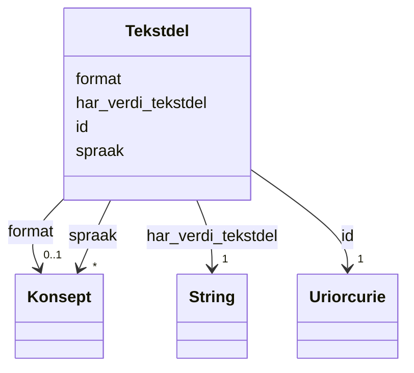

# Class: Tekstdel 


_Ein tekstleg del av ein kvalitetsmerknad (Web Annotation)._


URI: [oa:TextualBody](http://www.w3.org/ns/oa#TextualBody)





<!-- no inheritance hierarchy -->

## Class Properties

| Property | Value |
| --- | --- |
| Class URI | [oa:TextualBody](http://www.w3.org/ns/oa#TextualBody) |

## Eigenskapar

### Obligatorisk

| Namn | Kardinalitet og domene | Beskriving |
| --- | --- | --- |
| [har_verdi_tekstdel](har_verdi_tekstdel.md) | 1 <br/> [xsd:string](http://www.w3.org/2001/XMLSchema#string) | Tekstinnhaldet i tekstdelen. |

### Anbefalt

| Namn | Kardinalitet og domene | Beskriving |
| --- | --- | --- |
| [format](format.md) | 0..1 <br/> [Konsept](konsept.md) | Filformat eller medietype. |
| [spraak](spraak.md) | * <br/> [Konsept](konsept.md) | Språk brukt i ressursen. |

### Andre

| Namn | Kardinalitet og domene | Beskriving |
| --- | --- | --- |
| [id](id.md) | 1 <br/> [xsd:anyURI](http://www.w3.org/2001/XMLSchema#anyURI) | URI-identifikator for ressursen. |


## Usages

| used by | used in | type | used |
| ---  | --- | --- | --- |
| [Kvalitetsmerknad](kvalitetsmerknad.md) | [har_tekstdel](har_tekstdel.md) | range | [Tekstdel](tekstdel.md) |
| [Brukartilbakemelding](brukartilbakemelding.md) | [har_tekstdel](har_tekstdel.md) | range | [Tekstdel](tekstdel.md) |
| [Kvalitetssertifikat](kvalitetssertifikat.md) | [har_tekstdel](har_tekstdel.md) | range | [Tekstdel](tekstdel.md) |


## In Subsets


* [Metadata](metadata.md)


## Identifier and Mapping Information


### Schema Source


* from schema: https://data.norge.no/ap-no/dqv-core


## Mappings

| Mapping Type | Mapped Value |
| ---  | ---  |
| self | oa:TextualBody |
| native | https://data.norge.no/ap-no/dqv-core/Tekstdel |


## LinkML Source

<!-- TODO: investigate https://stackoverflow.com/questions/37606292/how-to-create-tabbed-code-blocks-in-mkdocs-or-sphinx -->

### Direct

<details>
```yaml
name: Tekstdel
description: Ein tekstleg del av ein kvalitetsmerknad (Web Annotation).
in_subset:
- Metadata
from_schema: https://data.norge.no/ap-no/dqv-core
slots:
- id
- har_verdi_tekstdel
- format
- spraak
slot_usage:
  har_verdi_tekstdel:
    name: har_verdi_tekstdel
    in_subset:
    - Obligatorisk
    required: true
  format:
    name: format
    in_subset:
    - Anbefalt
  spraak:
    name: spraak
    in_subset:
    - Anbefalt
class_uri: oa:TextualBody

```
</details>

### Induced

<details>
```yaml
name: Tekstdel
description: Ein tekstleg del av ein kvalitetsmerknad (Web Annotation).
in_subset:
- Metadata
from_schema: https://data.norge.no/ap-no/dqv-core
slot_usage:
  har_verdi_tekstdel:
    name: har_verdi_tekstdel
    in_subset:
    - Obligatorisk
    required: true
  format:
    name: format
    in_subset:
    - Anbefalt
  spraak:
    name: spraak
    in_subset:
    - Anbefalt
attributes:
  id:
    name: id
    description: URI-identifikator for ressursen.
    from_schema: https://data.norge.no/ap-no/common-ap-no
    identifier: true
    owner: Tekstdel
    domain_of:
    - Lisensdokument
    - Mediatype
    - Konsept
    - Begrepssamling
    - Kvalitetsdimensjon
    - Kvalitetsmaal
    - Kvalitetsmerknad
    - Kvalitetsmaaling
    - Tekstdel
    - KatalogisertRessurs
    - Aktoer
    - Kontaktopplysning
    - Tidsrom
    - Standard
    - RegulativRessurs
    - Identifikator
    - Rettighetserklaring
    - Sjekksum
    - Gebyr
    - Relasjon
    - Distribusjon
    - Datasett
    - Katalogpost
    - Ressurs
    range: uriorcurie
    required: true
  har_verdi_tekstdel:
    name: har_verdi_tekstdel
    description: Tekstinnhaldet i tekstdelen.
    in_subset:
    - Obligatorisk
    from_schema: https://data.norge.no/ap-no/dqv-core
    slot_uri: rdfs:value
    owner: Tekstdel
    domain_of:
    - Tekstdel
    range: string
    required: true
  format:
    name: format
    annotations:
      gyldige_verdier:
        tag: gyldige_verdier
        value: http://publications.europa.eu/resource/authority/file-type/
      vokabular_krav:
        tag: vokabular_krav
        value: skal
      vokabular_pattern:
        tag: vokabular_pattern
        value: ^http://publications\.europa\.eu/resource/authority/file-type/[A-Z_]+$
      enum_referanse:
        tag: enum_referanse
        value: EUFileType
      enum_dekning:
        tag: enum_dekning
        value: delvis
    description: Filformat eller medietype. Verdien SKAL veljast frå EUs kontrollerte
      vokabular File type (http://publications.europa.eu/resource/authority/file-type/).
      Enumerasjonen EUFileType i common-ap-no dekkjer dei mest brukte formata (RDF,
      JSON, CSV, PDF, osv.). For andre format, bruk URI frå EU File Type-vokabularet.
    in_subset:
    - Anbefalt
    from_schema: https://data.norge.no/ap-no/common-ap-no
    slot_uri: dct:format
    owner: Tekstdel
    domain_of:
    - Tekstdel
    - Distribusjon
    - Datatjeneste
    range: Konsept
  spraak:
    name: spraak
    annotations:
      gyldige_verdier:
        tag: gyldige_verdier
        value: http://publications.europa.eu/resource/authority/language/
      vokabular_krav:
        tag: vokabular_krav
        value: skal
      vokabular_pattern:
        tag: vokabular_pattern
        value: ^http://publications\.europa\.eu/resource/authority/language/[A-Z]{3}$
      enum_referanse:
        tag: enum_referanse
        value: EULanguage
      enum_dekning:
        tag: enum_dekning
        value: delvis
    description: Språk brukt i ressursen. Verdien SKAL veljast frå EUs kontrollerte
      vokabular Language (http://publications.europa.eu/resource/authority/language/).
      Enumerasjonen EULanguage i common-ap-no dekkjer norske språk (bokmål, nynorsk,
      samiske språk). For andre språk, bruk URI frå EU Language-vokabularet (t.d.
      ENG for engelsk, SWE for svensk).
    in_subset:
    - Anbefalt
    from_schema: https://data.norge.no/ap-no/common-ap-no
    slot_uri: dct:language
    owner: Tekstdel
    domain_of:
    - Tekstdel
    - RegulativRessurs
    - Distribusjon
    - Datasett
    - Katalogpost
    - Katalog
    range: Konsept
    multivalued: true
class_uri: oa:TextualBody

```
</details>