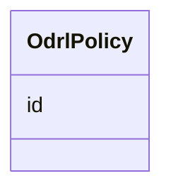

# Class: OdrlPolicy 


_Ein ODRL-policy._


URI: [odrl:Policy](http://www.w3.org/ns/odrl/2/Policy)





<!-- no inheritance hierarchy -->

## Class Properties

| Property | Value |
| --- | --- |
| Class URI | [odrl:Policy](http://www.w3.org/ns/odrl/2/Policy) |


## Eigenskapar


  
  


  
  


  
  


  
  
  
  
    
  


### Andre

| Namn | Kardinalitet og domene | Beskriving |
| --- | --- | --- |
| [id](id.md) | 1 <br/> [Uriorcurie](uriorcurie.md) | URI-identifikator for ressursen |


## Usages

| used by | used in | type | used |
| ---  | --- | --- | --- |
| [Distribusjon](distribusjon.md) | [policy](policy.md) | range | [OdrlPolicy](odrlpolicy.md) |


## Identifier and Mapping Information


### Schema Source


* from schema: https://example.no/ontology/samt-bu-skole


## Mappings

| Mapping Type | Mapped Value |
| ---  | ---  |
| self | odrl:Policy |
| native | samtbuskole:OdrlPolicy |


## LinkML Source

<!-- TODO: investigate https://stackoverflow.com/questions/37606292/how-to-create-tabbed-code-blocks-in-mkdocs-or-sphinx -->

### Direct

<details>
```yaml
name: OdrlPolicy
description: Ein ODRL-policy.
from_schema: https://example.no/ontology/samt-bu-skole
slots:
- id
class_uri: odrl:Policy

```
</details>

### Induced

<details>
```yaml
name: OdrlPolicy
description: Ein ODRL-policy.
from_schema: https://example.no/ontology/samt-bu-skole
attributes:
  id:
    name: id
    description: URI-identifikator for ressursen.
    from_schema: https://example.no/ontology/samt-bu-skole
    rank: 1000
    identifier: true
    alias: id
    owner: OdrlPolicy
    domain_of:
    - Spraak
    - Mediatype
    - Konsept
    - Begrepssamling
    - Frekvens
    - ProvenanceStatement
    - OdrlPolicy
    - ProvAktivitet
    - ProvAttributering
    - Tidsinstant
    - KatalogisertRessurs
    - Aktor
    - Kontaktopplysning
    - Tidsrom
    - Standard
    - RegulativRessurs
    - Identifikator
    - Rettighetserklaring
    - Sjekksum
    - Gebyr
    - Relasjon
    - Distribusjon
    - Katalogpost
    range: uriorcurie
    required: true
class_uri: odrl:Policy

```
</details>