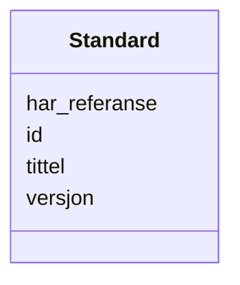

# Class: Standard 


_Ein standard som ein ressurs er i samsvar med._


URI: [dct:Standard](http://purl.org/dc/terms/Standard)





<!-- no inheritance hierarchy -->

## Class Properties

| Property | Value |
| --- | --- |
| Class URI | [dct:Standard](http://purl.org/dc/terms/Standard) |


## Eigenskapar


  
  

  
  
    
  

  
  

  
  


### Obligatorisk

| Namn | Kardinalitet og domene | Beskriving |
| --- | --- | --- |
| [tittel](tittel.md) | 1..* <br/> [LangString](langstring.md) | Namn/tittel på ressursen (dct:title) |


  
  

  
  

  
  

  
  


  
  

  
  

  
  

  
  


  
  
  
  
    
  

  
  
  
    
      
    
      
    
      
    
  
  

  
  
  
  
    
  

  
  
  
  
    
  


### Andre

| Namn | Kardinalitet og domene | Beskriving |
| --- | --- | --- |
| [id](id.md) | 1 <br/> [Uriorcurie](uriorcurie.md) | URI-identifikator for ressursen |
| [har_referanse](har_referanse.md) | * <br/> [Uri](uri.md) | Referanse til ekstern ressurs (rdfs:seeAlso) |
| [versjon](versjon.md) | 0..1 <br/> [String](string.md) | Versjonsnummer |


## Usages

| used by | used in | type | used |
| ---  | --- | --- | --- |
| [Containerklasse](containerklasse.md) | [standarder](standarder.md) | range | [Standard](standard.md) |
| [Distribusjon](distribusjon.md) | [i_samsvar_med](i_samsvar_med.md) | range | [Standard](standard.md) |
| [Datasett](datasett.md) | [i_samsvar_med](i_samsvar_med.md) | range | [Standard](standard.md) |
| [Datatjeneste](datatjeneste.md) | [i_samsvar_med](i_samsvar_med.md) | range | [Standard](standard.md) |
| [Katalogpost](katalogpost.md) | [i_samsvar_med](i_samsvar_med.md) | range | [Standard](standard.md) |


## Identifier and Mapping Information


### Schema Source


* from schema: https://example.no/ontology/samt-bu-skole


## Mappings

| Mapping Type | Mapped Value |
| ---  | ---  |
| self | dct:Standard |
| native | samtbuskole:Standard |


## LinkML Source

<!-- TODO: investigate https://stackoverflow.com/questions/37606292/how-to-create-tabbed-code-blocks-in-mkdocs-or-sphinx -->

### Direct

<details>
```yaml
name: Standard
description: Ein standard som ein ressurs er i samsvar med.
from_schema: https://example.no/ontology/samt-bu-skole
slots:
- id
- tittel
- har_referanse
- versjon
slot_usage:
  tittel:
    name: tittel
    in_subset:
    - Obligatorisk
    required: true
class_uri: dct:Standard

```
</details>

### Induced

<details>
```yaml
name: Standard
description: Ein standard som ein ressurs er i samsvar med.
from_schema: https://example.no/ontology/samt-bu-skole
slot_usage:
  tittel:
    name: tittel
    in_subset:
    - Obligatorisk
    required: true
attributes:
  id:
    name: id
    description: URI-identifikator for ressursen.
    from_schema: https://example.no/ontology/samt-bu-skole
    rank: 1000
    identifier: true
    alias: id
    owner: Standard
    domain_of:
    - Spraak
    - Mediatype
    - Konsept
    - Begrepssamling
    - Frekvens
    - ProvenanceStatement
    - OdrlPolicy
    - ProvAktivitet
    - ProvAttributering
    - Tidsinstant
    - KatalogisertRessurs
    - Aktor
    - Kontaktopplysning
    - Tidsrom
    - Standard
    - RegulativRessurs
    - Identifikator
    - Rettighetserklaring
    - Sjekksum
    - Gebyr
    - Relasjon
    - Distribusjon
    - Katalogpost
    range: uriorcurie
    required: true
  tittel:
    name: tittel
    description: Namn/tittel på ressursen (dct:title).
    in_subset:
    - Obligatorisk
    from_schema: https://example.no/ontology/samt-bu-skole
    rank: 1000
    slot_uri: dct:title
    alias: tittel
    owner: Standard
    domain_of:
    - Standard
    - RegulativRessurs
    - Distribusjon
    - Datasett
    - Datasettserie
    - Datatjeneste
    - Katalogpost
    - Katalog
    range: LangString
    required: true
    multivalued: true
  har_referanse:
    name: har_referanse
    description: Referanse til ekstern ressurs (rdfs:seeAlso).
    from_schema: https://example.no/ontology/samt-bu-skole
    rank: 1000
    slot_uri: rdfs:seeAlso
    alias: har_referanse
    owner: Standard
    domain_of:
    - Standard
    - RegulativRessurs
    range: uri
    multivalued: true
  versjon:
    name: versjon
    description: Versjonsnummer.
    from_schema: https://example.no/ontology/samt-bu-skole
    rank: 1000
    slot_uri: dcat:version
    alias: versjon
    owner: Standard
    domain_of:
    - Standard
    - Datasett
    - Datatjeneste
    range: string
class_uri: dct:Standard

```
</details>