# samt-bu

```mermaid
erDiagram
Aktor {
    uriorcurie id  
    string identifikator_literal  
    LangStringList navn_aktor  
}
Basisgruppe {
    uriorcurie id  
    string navn  
    string trinniva  
}
Brukartilbakemelding {
    uriorcurie id  
    uriorcurie er_motivert_av  
    uri har_maal  
    LangStringList har_merknad  
}
Datasett {
    stringList annen_ansvarlig_aktor  
    stringList begrep  
    LangStringList beskrivelse  
    uriList ble_generert_ved  
    uriList dokumentasjon  
    stringList eierskapshistorikk  
    date endringsdato  
    string identifikator_literal  
    uriList landingsside  
    LangStringList nokkelord  
    uriList relatert_ressurs  
    SpraakList spraak  
    stringList tema  
    uriList tilgangsrettigheter  
    LangStringList tittel  
    date utgivelsesdato  
    string versjon  
    LangStringList versjonsmerknad  
    uriorcurie id  
}
Datasettserie {
    LangStringList beskrivelse  
    date endringsdato  
    string frekvens  
    stringList tema  
    LangStringList tittel  
    date utgivelsesdato  
    uriorcurie id  
}
Datatjeneste {
    LangStringList beskrivelse  
    uriList dokumentasjon  
    uriList endepunkts_url  
    uriList endepunktsbeskrivelse  
    string format  
    string identifikator_literal  
    uriList landingsside  
    string lisens  
    LangStringList nokkelord  
    stringList tema  
    uriList tilgangsrettigheter  
    string tilgjengelighet  
    LangStringList tittel  
    string versjon  
    LangStringList versjonsmerknad  
    uriorcurie id  
}
Distribusjon {
    uriorcurie id  
    LangStringList beskrivelse  
    uriList dokumentasjon  
    date endringsdato  
    NonNegativeInteger filstorrelse  
    string format  
    string lisens  
    uriList nedlastningslenke  
    string policy  
    SpraakList spraak  
    Duration tidsopplosning  
    uriList tilgangs_url  
    string tilgjengelighet  
    LangStringList tittel  
    date utgivelsesdato  
}
Elev {
    uriorcurie id  
    string navn  
}
Fylke {
    string fylkesnummer  
    uriorcurie id  
    string navn  
}
Gebyr {
    uriorcurie id  
    string belop  
    LangStringList beskrivelse  
    uriList dokumentasjon  
}
Identifikator {
    uriorcurie id  
    string notasjon  
}
Kommune {
    string kommunenummer  
    uriorcurie id  
    string navn  
}
Konsept {
    uriorcurie id  
}
Kontaktlaerer {
    uriorcurie id  
    string navn  
}
Kontaktopplysning {
    uriorcurie id  
    string har_epost  
    string har_kontaktside  
    LangStringList navn_vcard  
}
Kvalitetsdeldimensjon {
    LangStringList har_anbefalt_term  
    LangStringList har_definisjon  
    uriorcurie id  
}
Kvalitetsdimensjon {
    uriorcurie id  
    LangStringList har_anbefalt_term  
    LangStringList har_definisjon  
}
Kvalitetsmaal {
    uriorcurie id  
    LangStringList har_anbefalt_term  
    LangStringList har_definisjon  
    uriorcurie har_forventet_datatype  
}
Kvalitetsmaaling {
    uriorcurie id  
    LangStringList har_merknad  
    string har_verdi  
}
Kvalitetsmerknad {
    uriorcurie id  
    uriorcurie er_motivert_av  
    uri har_maal  
    LangStringList har_merknad  
}
Mediatype {
    uriorcurie id  
}
PrivatVirksomhet {
    string organisasjonsnummer  
    uriorcurie id  
    string navn  
}
RegulativRessurs {
    uriorcurie id  
    LangStringList beskrivelse  
    uriList har_referanse  
    string identifikator_literal  
    SpraakList spraak  
    LangStringList tittel  
}
Rektor {
    uriorcurie id  
    string navn  
}
Relasjon {
    uriorcurie id  
    string har_rolle  
    uri relasjon_til  
}
Rettighetserklaring {
    uriorcurie id  
    string anvendelsesretningslinjer  
    string jurisdiksjon  
    string krediteringstekst  
    uri krediteringsurl  
    GYear opphavsrettsaar  
    string opphavsrettserklaring  
    string opphavsrettsinnehaver  
    string opphavsrettsnotis  
}
Sjekksum {
    uriorcurie id  
    string algoritme  
    string sjekksumverdi  
}
Skole {
    uriorcurie id  
    string navn  
}
Skoleeier {
    uriorcurie id  
    string navn  
}
Standard {
    uriorcurie id  
    LangStringList har_merknad  
    uriList har_referanse  
    string har_versjonsnummer  
    LangStringList tittel  
}
Tekstdel {
    uriorcurie id  
    string format  
    string har_verdi_tekstdel  
    SpraakList spraak  
}
Tidsrom {
    uriorcurie id  
    datetime begynnelse  
    datetime slutt  
    date sluttdato  
    date startdato  
}

Aktor ||--|o Konsept : "type_concept"
Basisgruppe ||--|o Skole : "del_av_skole"
Brukartilbakemelding ||--|o Tekstdel : "har_tekstdel"
Brukartilbakemelding ||--}o Kvalitetsdimensjon : "er_i_kvalitetsdimensjon"
Datasett ||--|o Aktor : "produsent"
Datasett ||--|o Konsept : "type_concept"
Datasett ||--|| Aktor : "utgiver"
Datasett ||--}o Datasett : "kilde_datasett"
Datasett ||--}o Datasettserie : "i_serie"
Datasett ||--}o Distribusjon : "datasettdistribusjon, eksempeldata"
Datasett ||--}o Identifikator : "annen_identifikator"
Datasett ||--}o Konsept : "dekningsomraade"
Datasett ||--}o Kvalitetsmaaling : "har_kvalitetsmaaling"
Datasett ||--}o Kvalitetsmerknad : "har_kvalitetsmerknad"
Datasett ||--}o RegulativRessurs : "gjeldende_lovgivning"
Datasett ||--}o Relasjon : "annen_spesifikk_relasjon"
Datasett ||--}o Standard : "i_samsvar_med"
Datasett ||--}o Tidsrom : "tidsrom"
Datasett ||--}| Kontaktopplysning : "kontaktpunkt"
Datasettserie ||--|o Datasett : "forste, siste"
Datasettserie ||--|| Aktor : "utgiver"
Datasettserie ||--}o Konsept : "dekningsomraade"
Datasettserie ||--}o RegulativRessurs : "gjeldende_lovgivning"
Datasettserie ||--}o Tidsrom : "tidsrom"
Datasettserie ||--}| Kontaktopplysning : "kontaktpunkt"
Datatjeneste ||--|o Konsept : "status"
Datatjeneste ||--|o Rettighetserklaring : "rettigheter"
Datatjeneste ||--|| Aktor : "utgiver"
Datatjeneste ||--}o Datasett : "tilgjengeliggjor_datasett"
Datatjeneste ||--}o Gebyr : "har_gebyr"
Datatjeneste ||--}o RegulativRessurs : "gjeldende_lovgivning"
Datatjeneste ||--}o Standard : "i_samsvar_med"
Datatjeneste ||--}| Kontaktopplysning : "kontaktpunkt"
Distribusjon ||--|o Konsept : "status"
Distribusjon ||--|o Mediatype : "komprimeringsformat, medietype, pakkeformat"
Distribusjon ||--|o Rettighetserklaring : "rettigheter"
Distribusjon ||--|o Sjekksum : "sjekksum"
Distribusjon ||--}o Datatjeneste : "tilgangstjeneste"
Distribusjon ||--}o RegulativRessurs : "gjeldende_lovgivning"
Distribusjon ||--}o Standard : "i_samsvar_med"
Elev ||--|o Basisgruppe : "horer_til_basisgruppe"
Gebyr ||--|o Konsept : "valuta"
Kontaktlaerer ||--|o Basisgruppe : "tilknyttet_basisgruppe"
Kontaktlaerer ||--|o Elev : "har_saerlig_ansvar_for"
Kontaktlaerer ||--|o Skole : "jobber_paa_skole"
Kvalitetsdeldimensjon ||--|| Kvalitetsdimensjon : "er_deldimensjon_av"
Kvalitetsmaal ||--|| Kvalitetsdeldimensjon : "er_i_kvalitetsdeldimensjon"
Kvalitetsmaaling ||--|| Kvalitetsmaal : "er_kvalitetsmaaling_av"
Kvalitetsmerknad ||--|o Tekstdel : "har_tekstdel"
Kvalitetsmerknad ||--}o Kvalitetsdimensjon : "er_i_kvalitetsdimensjon"
RegulativRessurs ||--|o Konsept : "type_concept"
RegulativRessurs ||--}o RegulativRessurs : "relatert_regulativ_ressurs"
Rektor ||--|o Skole : "enhetsleder_for"
Skole ||--|o Skoleeier : "har_skoleeier"
Standard ||--}o Kvalitetsdimensjon : "er_i_kvalitetsdimensjon"

```

Ontodia-vennlig LinkML-modell for skoler

URI: https://example.no/ontology/samt-bu-skole

Name: skole_ontologi

## Classes

| Class | Description |
| --- | --- |
| [Basisgruppe](klasser/basisgruppe.md) | Skoleklasse som hovedsaklig samler elever i ulike fag |
| [Person](klasser/person.md) | Eit menneske individ |
| &nbsp;&nbsp;&nbsp;&nbsp;&nbsp;&nbsp;&nbsp;&nbsp;[Elev](klasser/elev.md) | En person som går på skole |
| &nbsp;&nbsp;&nbsp;&nbsp;&nbsp;&nbsp;&nbsp;&nbsp;[Kontaktlaerer](klasser/kontaktlaerer.md) | En lærer med ansvar for ei basisgruppe og er skolens kontaktpunkt for elevane... |
| &nbsp;&nbsp;&nbsp;&nbsp;&nbsp;&nbsp;&nbsp;&nbsp;[Rektor](klasser/rektor.md) | Høgaste akademiske leder av en skole |
| [Skole](klasser/skole.md) | En skole er en privat eller offentlig institusjon eller et lærested hvor lære... |
| [Skoleeier](klasser/skoleeier.md) | Superklasse for alle typer skoleeiere |
| &nbsp;&nbsp;&nbsp;&nbsp;&nbsp;&nbsp;&nbsp;&nbsp;[Fylke](klasser/fylke.md) | Fylke (etter norrønt fylki) er en betegnelse på et undernasjonalt, regionalt ... |
| &nbsp;&nbsp;&nbsp;&nbsp;&nbsp;&nbsp;&nbsp;&nbsp;[Kommune](klasser/kommune.md) | En kommune er et geografisk avgrenset område som utgjør en egen politisk og a... |
| &nbsp;&nbsp;&nbsp;&nbsp;&nbsp;&nbsp;&nbsp;&nbsp;[PrivatVirksomhet](klasser/privatvirksomhet.md) | Virksomhet, eller foretak, er betegnelser for en juridisk person eller en org... |

## Slots

| Slot | Description |
| --- | --- |
| [brukertilbakemeldinger](klasser/brukertilbakemeldinger.md) | Brukartilbakemeldingar for datasettet |
| [dataset_metadata](klasser/dataset_metadata.md) | Metadata om datasettet |
| [datasettdistribusjoner](klasser/datasettdistribusjoner.md) | Distribusjonar av datasettet |
| [del_av_skole](klasser/del_av_skole.md) | Skolen basisgruppa tilhører |
| [enhetsleder_for](klasser/enhetsleder_for.md) | Enhet rektor er enhetsleder for |
| [fylkesnummer](klasser/fylkesnummer.md) | Fylkesnummer er definerte identifikasjonskoder for Norges fylker og to territ... |
| [gjeldende_lovgivninger](klasser/gjeldende_lovgivninger.md) | Gjeldande lovgiving for datasettet |
| [grupper](klasser/grupper.md) | Grupper knytt til datasettet |
| [har_saerlig_ansvar_for](klasser/har_saerlig_ansvar_for.md) | Elev kontaktlæreren har særlig ansvar for |
| [har_skoleeier](klasser/har_skoleeier.md) | Skoleeier for skolen |
| [horer_til_basisgruppe](klasser/horer_til_basisgruppe.md) | Basisgruppe elev tilhører |
| [jobber_paa_skole](klasser/jobber_paa_skole.md) | Skolen kontaktlæreren jobber på |
| [kommunenummer](klasser/kommunenummer.md) | Kommunenummer er en nummerrekke som identifiserer kommuner eller kommunefrie ... |
| [kontaktpunkter](klasser/kontaktpunkter.md) | Kontaktpunkt for datasettet |
| [kvalitetsdimensjoner](klasser/kvalitetsdimensjoner.md) | Kvalitetsdimensjoner for datasettet |
| [kvalitetsmaalinger](klasser/kvalitetsmaalinger.md) | Kvalitetsmålingar for datasettet |
| [kvalitetsmerknader](klasser/kvalitetsmerknader.md) | Kvalitetsmerknader for datasettet |
| [navn](klasser/navn.md) | Namn på ressursen |
| [organisasjoner](klasser/organisasjoner.md) | Organisasjonar knytt til datasettet |
| [organisasjonsnummer](klasser/organisasjonsnummer.md) | Organisasjonsnummer er i Norge et ni-sifret registreringsnummer som tildeles ... |
| [standarder](klasser/standarder.md) | Standardar datasettet følgjer |
| [tekstdeler](klasser/tekstdeler.md) | Tekstdel for kvalitetsmerknad |
| [tidsromer](klasser/tidsromer.md) | Tidsrom for kvalitetsmerknad |
| [tilknyttet_basisgruppe](klasser/tilknyttet_basisgruppe.md) | Basisgruppe kontaktlærer er tilknyttet |
| [trinniva](klasser/trinniva.md) | Grunnskolen (6-15 år) er delt opp i 10 trinn, eit for kvart år |
| [utgivere](klasser/utgivere.md) | Utgjevarar av datasettet |

## Enumerations

| Enumeration | Description |
| --- | --- |

## Types

| Type | Description |
| --- | --- |

## Subsets

| Subset | Description |
| --- | --- |
| [Anbefalt](klasser/anbefalt.md) | Anbefalte eigenskapar i ein AP-NO-profil |
| [Obligatorisk](klasser/obligatorisk.md) | Obligatoriske eigenskapar i ein AP-NO-profil |
| [Valgfri](klasser/valgfri.md) | Valfrie eigenskapar i ein AP-NO-profil |

## Generated artifacts

| Artefakt | Fil |
|----------|-----|
| SHACL shapes | [samt-bu-shapes.ttl](samt-bu-shapes.ttl) |
| JSON-LD kontekst | [samt-bu-context.jsonld](samt-bu-context.jsonld) |
| JSON Schema | [samt-bu-schema.json](samt-bu-schema.json) |
| OWL ontologi | [samt-bu-ontology.ttl](samt-bu-ontology.ttl) |
| Python-klasser | [samt-bu-model.py](samt-bu-model.py) |
| ER-diagram (Mermaid) | [samt-bu-erdiagram.md](samt-bu-erdiagram.md) |
| Eksempeldata (Turtle) | [samt-bu-eksempel.ttl](samt-bu-eksempel.ttl) |
