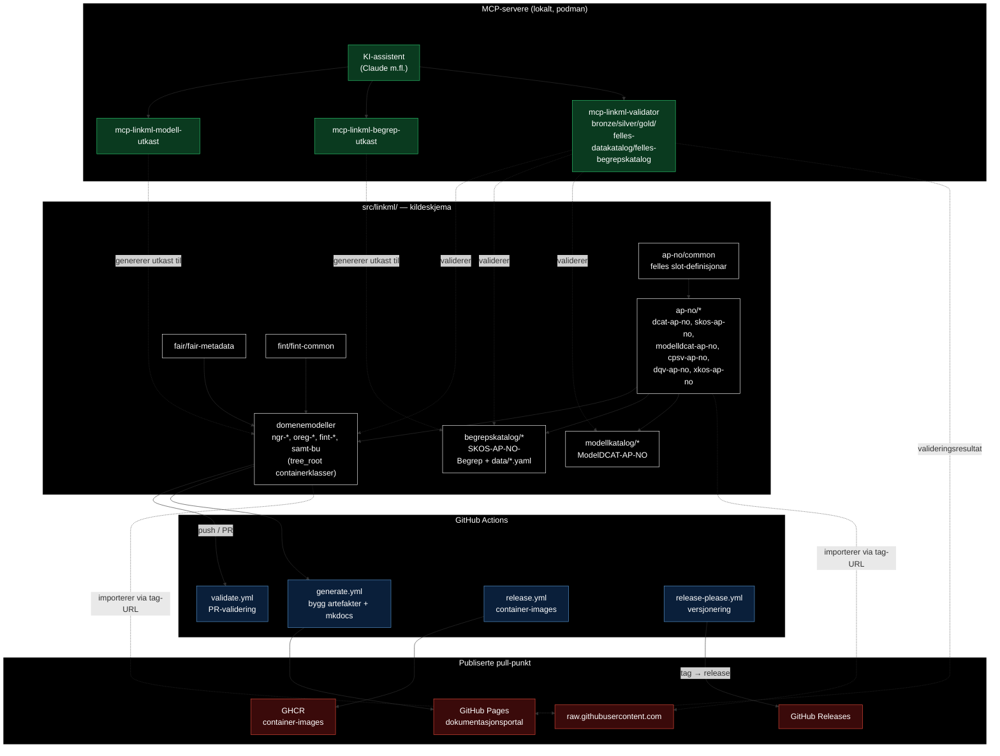
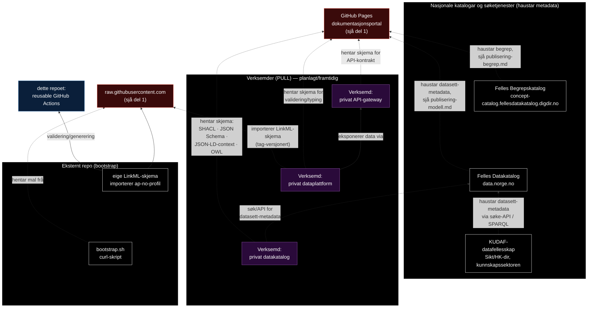

# Arkitekturoversikt

Diagramma under viser dei vesentlege delane av repoet og korleis dei spiller
saman med eksterne offentlege tenester. Dette er ein orienteringsskisse, ikkje
ein endringsplan — sjå `specs/README.md` for konvensjonen om kva som høyrer
under `backlog/`, `done/`, `rejected/` og `bugs/`.

Skissa er delt i to diagram (i staden for eitt breidt) for å halde tekstboksane
store og lesbare: del 1 dekkjer den interne flyten frå kildeskjema til
publiserte artefaktar, del 2 dekkjer korleis nasjonale katalogar, KUDAF og
verksemder hentar frå dei publiserte punkta. Usynlege lenkjer (`~~~`) brukast
berre for å tvinge nodar utan reell relasjon til å stable seg vertikalt i
staden for å spre seg i breidda — dei representerer ikkje ein avhengigheit.

## Del 1 — Frå kildeskjema til publiserte artefaktar

## Del 2 — Korleis nasjonale katalogar, KUDAF og verksemder hentar frå dette repoet

## Forklaring av dei vesentlege delane

- **Kildeskjema** (`src/linkml/`) — LinkML-skjema organisert i eit
  importhierarki (sjå `CLAUDE.md` § "LinkML Importhierarki"): AP-NO-profilar
  og FAIR-metadata er ikkje-sjølvstendige byggeklossar som domenemodellane
  importerer. `begrepskatalog/` og `modellkatalog/` er spesialtilfelle som
  importerer AP-NO-profilar for å publisere til eksterne katalogar.
- **MCP-servere** — tre lokale containerbaserte MCP-servere lèt KI-assistentar
  generere skjemautkast frå JSON Schema, generere SKOS-begrepsutkast, og
  validere skjema/instansar mot policy-nivå, utan å forlate det lokale miljøet.
- **GitHub Actions** — validerer PR-ar, byggjer artefakt + portal ved push til
  `main`, byggjer/pushar container-images ved release-tag, og fangar
  valideringshistorikk ved release-please-versjonering.
- **Publiserte pull-punkt** — repoet **pullar aldri til, berre frå**: GitHub
  Pages er den publiserte portalen; GitHub Releases og
  `raw.githubusercontent.com` er stabile hente-punkt for skjema-import frå
  andre repo; GHCR distribuerer container-images.
- **Nasjonale katalogar** — publisering til Felles Begrepskatalog og Felles
  Datakatalog er **manuelle** steg gjort av eit menneske som følgjer
  rettleiingane i portalen — repoet pushar ikkje direkte til desse katalogane
  (jf. "Pull, ikkje push"-prinsippet i `CLAUDE.md`).
- **Eksternt repo** — andre repo kan bootstrappe seg sjølve med
  `bootstrap.sh` og importere AP-NO-profilar direkte via tag-baserte
  `raw.githubusercontent.com`-URL-ar, og validerer/genererer via dei same
  reusable GitHub Actions-workflowane som dette repoet eksponerer.
- **Konsumentar av Felles Datakatalog og publiserte skjema** — dette er
  framtidige/planlagde integrasjonar (sjå
  `specs/backlog/nasjonal-datamesh-arkitektur.md` for full vurdering), ikkje
  noko som er implementert i dette repoet i dag:
  - **KUDAF** (Sikt/HK-dir sitt datafellesskap for kunnskapssektoren) haustar
    datasett-metadata frå Felles Datakatalog sitt søk-API/SPARQL-endepunkt —
    same mønster som data.norge.no sjølv brukar for å hauste
    DCAT-AP-NO-metadata frå GitHub Pages. Repoet leverer altså data til KUDAF
    *indirekte*, via Felles Datakatalog som mellomlager/hub.
  - **Private datakatalogar** i verksemder kan søke/spørje Felles Datakatalog
    for datasett-metadata på same måte, og/eller hente skjemaartefaktar
    (SHACL, JSON Schema, JSON-LD-context, OWL) direkte frå GitHub Pages for å
    validere og typesette eigne data mot dei nasjonale profilane.
  - **Dataplattformar** i verksemder kan importere LinkML-skjema direkte via
    tag-versjonerte `raw.githubusercontent.com`-URL-ar (samme mekanisme som
    eksterne repo) for å bruke skjema i eigen pipeline, eller hente genererte
    artefaktar (JSON Schema, SHACL) frå GitHub Pages for validering.
  - **API-gateway** i verksemder kan hente JSON Schema/JSON-LD-context frå
    GitHub Pages for å validere API-kontrakta mot dei nasjonale profilane, og
    eksponerer data frå verksemda sin eigen dataplattform i samsvar med dei
    samme skjemaa.
  - Alle desse koplingane er **pull**: ingen av konsumentane mottek push frå
    dette repoet, i tråd med "Pull, ikkje push"-prinsippet.
