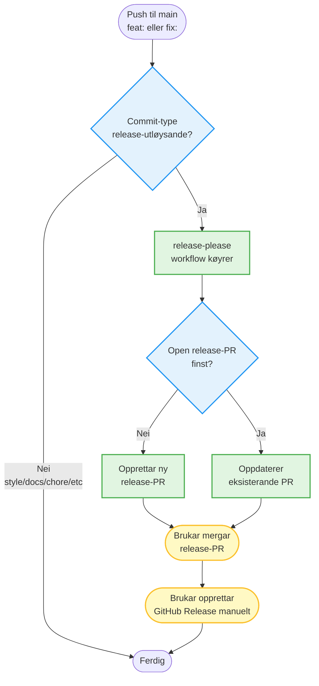
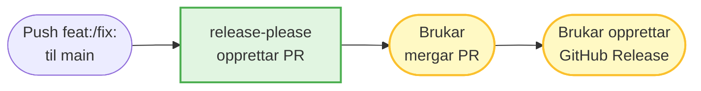

# Plan: Mermaid diagram for release-arbeidsflyt i monitorering.md

## Bakgrunn

Etter rollback av release-please (sjå `specs/done/rollback-release-please.md`) har me no ein forenkla arbeidsflyt der:
1. Release-please opprettar automatisk release-PR-ar
2. Brukar mergar PR-ar manuelt
3. Brukar opprettar GitHub Releases manuelt

Denne arbeidsflyten må dokumenterast visuelt i `mkdocs/docs/monitorering.md` med eit mermaid diagram.

## Målet

Lage eit oversiktleg mermaid-diagram som viser:
- Kva som triggar release-please
- Kva release-please gjer automatisk
- Kva brukar må gjere manuelt
- Kva som skjer ved ulike hendingar (push, PR merge, osv.)

## Handlingsliste (prioritert)

### RD1: Analysere gjeldande monitorering.md
- [ ] Les `mkdocs/docs/monitorering.md` for å forstå struktur og eksisterande innhald
- [ ] Identifiser beste plassering for diagrammet (eigen seksjon eller under eksisterande?)
- [ ] Sjekk om det finst andre mermaid diagram i fila for å matche stilen

### RD2: Designe mermaid diagrammet
- [ ] Vel diagram-type: `flowchart TD` (top-down) eller `graph LR` (left-right)
- [ ] Definer hovudkomponentar:
  - Brukar-handlingar (push til main, merge PR, opprette release)
  - Automatiske prosessar (release-please workflow)
  - GitHub-artifact (PR, Release, Tag)
- [ ] Definer flyt og avgjerdspunkt
- [ ] Legg til fargekodar for å skilje automatisk vs. manuelt (bruk `classDef` og `class`)

**Utkast til diagram-struktur:**



**Alternative:** Bruk `graph LR` (venstre-til-høgre) for meir kompakt framstilling.

### RD3: Legg til diagram i monitorering.md
- [ ] Finn eller opprett passande seksjon (t.d. `## Release-arbeidsflyt` eller `## Automatisk release-PR`)
- [ ] Skriv introduksjonstekst før diagrammet (1-2 avsnitt som forklarar arbeidsflyten)
- [ ] Legg til mermaid-blokk med diagrammet
- [ ] Legg til forklarande tekst etter diagrammet (kva kvar farge betyr, kva steg er kritiske)

**Seksjonsutkast:**

```markdown
## Release-arbeidsflyt

Repoet brukar [release-please](https://github.com/googleapis/release-please) for å automatisere release-PR-oppretting basert på [Conventional Commits](https://www.conventionalcommits.org/). Arbeidsflyten er todelt: automatisk PR-oppretting og manuell release-publisering.

### Flytdiagram

```mermaid
[diagram her]
```

**Fargekodar:**
- 🟢 **Grøn** — automatisk prosess (køyrer utan brukarinngripen)
- 🟡 **Gul** — manuell prosess (krev brukarhandling)
- 🔵 **Blå** — avgjerdspunkt (logikk i workflow)

### Manuell release-publisering

Etter at release-PR er merga, må brukar opprette GitHub Release manuelt:

```bash
# Hent versjon frå manifest
VERSION=$(jq -r '."src/linkml/<domain>/<modell>"' .release-please-manifest.json)
COMPONENT="<modell>"

# Opprett release
gh release create "${COMPONENT}-v${VERSION}" \
  --title "${COMPONENT} ${VERSION}" \
  --notes-file "src/linkml/<domain>/<modell>/CHANGELOG.md"
```

Sjå [CONTRIBUTING.md](../CONTRIBUTING.md) for fullstendig prosedyre.
```

**Why:** Dokumenterer både visuelt og tekstleg korleis release-flyten fungerer etter rollback.

**How to apply:** Plasséring kan variere avhengig av eksisterande struktur i monitorering.md — tilpass etter gjeldande seksjonar.

### RD4: Oppdater relaterte seksjoner
- [ ] Sjekk om monitorering.md har seksjoner om GitHub Actions workflows som må oppdaterast
- [ ] Sjekk om det finst referansar til `capture-validation` eller `update-dates` som må fjernast
- [ ] Oppdater eventuelle steg-for-steg-rettleiingar som refererer til gamal release-flyt

### RD5: Verifiser diagram-rendering
- [ ] Bygg mkdocs lokalt: `make publish` (eller tilsvarande)
- [ ] Sjekk at mermaid-diagrammet rendrar korrekt i nettlesaren
- [ ] Verifiser at fargekodar er synlege og intuitive
- [ ] Test at diagram er lesbart på både stor og liten skjerm

**Kommando for lokal test:**
```bash
cd mkdocs
mkdocs serve
# Opne http://localhost:8000/monitorering/ i nettlesar
```

### RD6: Oppdater CONTRIBUTING.md (valgfritt)
- [ ] Vurder om CONTRIBUTING.md treng same diagram eller ei forenkla variant
- [ ] Legg til lenke frå CONTRIBUTING.md til monitorering.md for utfyllande dokumentasjon

**Why:** CONTRIBUTING.md er brukarvendt rettleiing, medan monitorering.md er teknisk dokumentasjon — dei kan ha ulike nivå av detalj.

### RD7: Commit og dokumenter
- [ ] Commit endringane med passande melding
- [ ] Oppdater denne specen med resultat og faktisk diagram brukt
- [ ] Flytt spec til `specs/done/`

**Commit-melding:**
```
docs(monitorering): legg til mermaid diagram for release-arbeidsflyt

- mkdocs/docs/monitorering.md: ny seksjon "Release-arbeidsflyt" med mermaid flowchart som viser automatisk PR-oppretting og manuell release-publisering
- Fargekodar: grøn (automatisk), gul (manuell), blå (avgjerdspunkt)
- Inkluderer kommandodoeme for manuell release-oppretting
- specs/done/release-arbeidsflyt-diagram.md: fullført plan
```

## Risiko

- **Mermaid syntaks-feil:** Test lokalt før commit — feil syntaks resulterer i tomt diagram i mkdocs
- **For komplekst diagram:** Hald det enkelt — ikkje vis kvar detalj, fokuser på hovudflyten
- **Feil plassering:** Dersom monitorering.md ikkje er rett stad, vurder eigen fil (`release-flyt.md`) eller seksjon i CONTRIBUTING.md

## Suksesskriterium

- [ ] Mermaid diagram rendrar korrekt i mkdocs
- [ ] Diagrammet viser klart automatisk vs. manuell prosess
- [ ] Forklarande tekst før og etter diagrammet er tydeleg
- [ ] Brukar kan forstå arbeidsflyten berre ved å sjå diagrammet
- [ ] Ingen referansar til gamal flyt (capture-validation, update-dates, auto-merge) i dokumentasjonen

## Alternativ diagram-type

Dersom `flowchart` vert for komplekst, vurder:

1. **Sequence diagram** — viser interaksjon mellom brukar, GitHub Actions og GitHub API over tid
2. **State diagram** — viser tilstandar for ein release-PR (open → merga → release publisert)
3. **Enklare flowchart** — berre 3-4 hovudsteg utan avgjerdspunkt

**Eksempel på enklare variant:**



Vel basert på kva som kommuniserer best til målgruppa (utviklararar som skal bidra til repoet).
