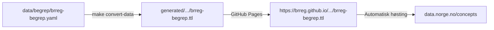

# Plan: Dokumentasjon av publiseringspipeline for Felles Begrepskatalog

## Mål

Gjere publiseringspipelinen forståeleg og operativ for:

1. **Fagpersonar hos Brønnøysund** som redigerer `data/begrep/brreg-begrep.yaml`
2. **Utviklarar** som skal sette opp tilsvarande pipeline for ein ny organisasjon
3. **Framtidige bidragsytarar** til repoet

Dokumentasjonen skal ligge i `mkdocs/docs/` og vere tilgjengeleg via
[GitHub Pages-portalen](https://brreg.github.io/linkml-datamodellering-no/).

---

## Kva er implementert (dokumentasjonsgrunnlaget)

Følgjande er implementert og skal dokumenterast:

| Komponent | Plassering | Skildring |
|---|---|---|
| Produksjonsdatafil | `data/begrep/brreg-begrep.yaml` | Reelle begrepsdefinisjonar — det som vert publisert |
| Publiseringspolicy | `src/mcp-linkml-validator/policies/felles-begrepskatalog.yaml` | 30+ valideringssjekkar mot SKOS-AP-NO-Begrep |
| URI-register | `src/linkml/begrep/brreg-begrep/published-uris.lock` | Sporar publiserte URI-ar; forhindrar utilsikta sletting |
| `data_policy`-felt | `generate.yaml` for kvart skjema med datafil | Knyter datafil til publiseringspolicy |
| Makefile-reglar | `convert-data`, `domain-validate-data`, `check-published-uris` | Konvertering, validering og URI-sjekk |
| `flatten-and-validate.bash` | Tredje argument for eksplisitt instansfil | Gjer det mogleg å validere `data/`-filer |
| CI-pipeline | `validate.yml` + `generate.yml` | Automatisk validering og publisering ved push |

---

## Del 1 — Ny mkdocs-side: `publisering-begrep.md`

**Plassering:** `mkdocs/docs/publisering-begrep.md`

**Nav-plassering (mkdocs.yml):**
```yaml
nav:
  - Rettleiingar:
      - Ny domenemodell: ny-domenemodell.md
      - Ny begrepskatalog: ny-begrepsmodell.md
      - Publiser til Felles Begrepskatalog: publisering-begrep.md   # ny
      - Generatorkonfigurasjon: generate-config.md
```

**Innhald:**

### Avsnitt 1 — Oversikt

Kort skildring av pipelinen med eit flytdiagram (Mermaid):



Tabellen frå `specs/publisering-felles-begrepskatalog.md §Bakgrunn`:

| Katalog | Føremål | Publiserast? |
|---|---|---|
| `examples/<domene>/` | Illustrative døme for gen-doc | Nei |
| `data/<domene>/` | Reelle produksjonsdata | Ja |

### Avsnitt 2 — Føresetnader

```bash
make check-prereqs
make mcp-val-build   # mcp-linkml-validator
```

### Avsnitt 3 — Dagleg arbeidsflyt: redigere begrep

Steg-for-steg for den vanlege arbeidsoppgåva:

```
1. Rediger data/begrep/brreg-begrep.yaml
2. Valider (skjema + datafil + utgjevar-URI):
   make mcp-validate \
     SCHEMA=src/linkml/begrep/brreg-begrep/brreg-begrep-schema.yaml \
     POLICY=felles-begrepskatalog \
     INSTANCE=data/begrep/brreg-begrep.yaml
3. Push til main → CI publiserer automatisk
```

Tabell: kva `felles-begrepskatalog`-policyen sjekkar (obligatorisk vs. anbefalt).

Admonition om URI-stabilitet:
> **Merk:** `id:`-feltane i `data/begrep/brreg-begrep.yaml` er permanente frå
> første publisering. Val av slug er eit permanent val — sjå §URI-stabilitet.

### Avsnitt 4 — Legg til eit nytt begrep

Steg-for-steg med konkrete YAML-eksempel for å legge til eit nytt `Begrep`-objekt
og tilhøyrande `Definisjon`. Viser korleis `id:`, `identifikator_literal` og URI-ar
heng saman. Forklarer at den nye URI-en skal leggast til i `published-uris.lock`
etter vellykka publisering.

### Avsnitt 5 — URI-stabilitet

Kvifor URI-ar er permanente, kva `published-uris.lock` er og korleis han fungerer:

```
# Legg til ny URI etter publisering (ikkje før):
echo "https://begrep.brreg.no/nytt-begrep" >> \
  src/linkml/begrep/brreg-begrep/published-uris.lock
```

Åtvaring: kva som skjer ved utilsikta sletting av ein URI (duplikat i katalogen,
brotne lenkjer). Skildring av depreceringsprosedyre via `er_erstatta_av`.

### Avsnitt 6 — Registrering av nytt høstingsendepunkt (éin gong)

Komprimert versjon av steg 2-5 frå `specs/publisering-felles-begrepskatalog.md §Del 3`:

| Felt | Verdi |
|---|---|
| Utgjevar | Registerenheten i Brønnøysund (974760673) |
| Katalogtype | Begreper |
| Datakildentype | SKOS-AP-NO |
| Format | Turtle |
| Datakjelde-URL | `https://brreg.github.io/linkml-datamodellering-no/begrep/brreg-begrep/brreg-begrep.ttl` |

Admonition med krav om ID-porten-innlogging og Altinn-rolle.

### Avsnitt 7 — CI-pipeline

Kva som skjer automatisk ved push til `main`:

| Trigger | Jobb | Resultat |
|---|---|---|
| `data/begrep/**` endra | `validate` → `domain-validate-data` | Feil ved ugyldige data |
| `data/begrep/**` endra | `validate` → `check-published-uris` | Feil viss URI er fjerna frå lock-fil |
| `data/begrep/**` endra | `generate` → `domain-gen-data` | Ny `.ttl` publisert på GitHub Pages |

### Avsnitt 8 — Set opp publisering for ny organisasjon

Rettleiing for ein annan organisasjon som vil bruke same mønster:

1. Lag skjema (`src/linkml/begrep/<org>-begrep/`) — sjå `ny-begrepsmodell.md`
2. Legg til `data_policy: felles-begrepskatalog` i `generate.yaml`
3. Lag `data/<domene>/<org>-begrep.yaml` med produksjonsdata
4. Lag `src/linkml/begrep/<org>-begrep/published-uris.lock` (tom til første publisering)
5. Valider, push og registrer høstingsendepunkt
6. Legg til URI-ar i lock-fila etter stadfesta publisering

### Avsnitt 9 — Sjå òg

- Referanse til `felles-begrepskatalog.yaml`-policy (inline-lenke til GitHub)
- `specs/publisering-felles-begrepskatalog.md` — teknisk spesifikasjon
- `specs/begrep-modellering.md` — skjemamodellering
- [SKOS-AP-NO-Begrep-spesifikasjonen](https://informasjonsforvaltning.github.io/skos-ap-no-begrep/)

---

## Del 2 — Oppdater `ny-begrepsmodell.md`

**Plassering:** `mkdocs/docs/ny-begrepsmodell.md` (eksisterande fil)

**Endringar:**

### Steg 3 — Skriv `generate.yaml`

Legg til `data_policy`-feltet i kodeeksempelet og forklaring:

```yaml
generators:
  ...
  example_rdf: true
data_policy: felles-begrepskatalog   # ny linje
```

> `data_policy` peikar til publiseringspolicyen som vert brukt av
> `make domain-validate-data`. Berre påkravd for katalogar som skal
> publiserast til Felles Begrepskatalog.

### Nytt steg 8 — Opprett datafil og URI-register

Etter det eksisterande steget «Generer RDF/Turtle»:

**Steg 8 — Datafil for publisering (valfritt)**

Viss katalogen skal publiserast til Felles Begrepskatalog:

1. Lag `data/begrep/<katalognavn>.yaml` med same struktur som eksempelfila,
   men med stabile produksjons-URI-ar
2. Lag `src/linkml/begrep/<katalognavn>/published-uris.lock` (tom til start)
3. Valider: `make mcp-validate SCHEMA=... POLICY=felles-begrepskatalog INSTANCE=...`

For fullstendig rettleiing: sjå [Publiser til Felles Begrepskatalog](publisering-begrep.md).

### Oppdater §CI-pipeline

Noverande tekst: «Ingen endringar i workflowfiler nødvendig.»

Ny tekst forklarer at `validate.yml` no òg sjekkar `data/`-filer og lock-fila
automatisk — ingen manuelle endringar nødvendig der heller.

---

## Del 3 — Oppdater `begrep/brreg-begrep/index.md`

**Plassering:** `mkdocs/docs/begrep/brreg-begrep/index.md` (eksisterande fil)

Legg til ein boks øvst (admonition `info` eller linje i innleiinga) som viser:

- At katalogen er publisert til Felles Begrepskatalog
- URL til høstingsendepunktet:
  `https://brreg.github.io/linkml-datamodellering-no/begrep/brreg-begrep/brreg-begrep.ttl`
- Lenke til Felles Begrepskatalog: `https://data.norge.no/concepts`

---

## Del 4 — Oppdater `mkdocs/docs/begrep/index.md`

**Plassering:** `mkdocs/docs/begrep/index.md` (eksisterande fil)

I tabellen over modellar, legg til ein «Publisert til»-kolonne:

| Modell | Tilgjengelege artefakter | Publisert til |
|---|---|---|
| brreg-begrep | ... | [Felles Begrepskatalog](https://data.norge.no/concepts) |

---

## Del 5 — Oppdater `README.md` (repo-rot)

**Plassering:** `README.md`

I katalogtabellen i `## Domener`:

```markdown
| begrep | Begrepskatalogmodellar etter SKOS-AP-NO-Begrep. Produksjonsdatafiler i `data/`
  eksportert til SKOS/RDF for automatisk publisering til Felles Begrepskatalog. | ...
```

Og i `## Katalogstruktur`, legg til `data/`-katalogen:

```
├──data/        # Produksjonsdata per domene (publiserast til Felles Begrepskatalog o.l.)
├──examples/    # Eksempeldata per domene (aldri publisert)
```

---

## Prioritet og rekkjefølgje

| # | Dokument | Prioritet | Grunngjeving |
|---|---|---|---|
| 1 | `publisering-begrep.md` (ny) | Høg | Hovuddokumentasjonen — manglar heilt |
| 2 | `ny-begrepsmodell.md` (oppdater) | Høg | Refererer til gammal prosess utan `data/` og `data_policy` |
| 3 | `begrep/brreg-begrep/index.md` (oppdater) | Middels | Viser at katalogen er publisert — nyttig for oppdaging |
| 4 | `README.md` (oppdater) | Middels | Katalogtabellen er foreldra utan `data/`-omtale |
| 5 | `begrep/index.md` (oppdater) | Låg | Fin-å-ha-kolonne i tabellen |

---

## Tekniske detaljar for skriving

### Flytdiagram (Mermaid)

Bruk `flowchart LR` for å vise konverteringspipelinen. MkDocs Material støttar
Mermaid via `pymdownx.superfences` (sjå `mkdocs.yml`).

### Kodeeksempel

Alle Make-kommandoar skal vere copy-paste-klare med fulle SCHEMA/POLICY/INSTANCE-verdiar.

### Admonitions

Bruk `!!! warning` for URI-stabilitetsåtvaringar og `!!! note` for forklaringar
om `examples/` vs. `data/`-skiljet.

### Skriftspråk

Heile `mkdocs/docs/`-dokumentasjonen er på **nynorsk** (dokumentasjonsspråk per
CLAUDE.md). Det gjeld eksisterende og nye filer.

---

## Referansar

- `specs/publisering-felles-begrepskatalog.md` — teknisk spesifikasjon (Del 1-4)
- `src/mcp-linkml-validator/policies/felles-begrepskatalog.yaml` — policy-definisjon
- `data/begrep/brreg-begrep.yaml` — produksjonsdatafil
- `src/linkml/begrep/brreg-begrep/published-uris.lock` — URI-register
