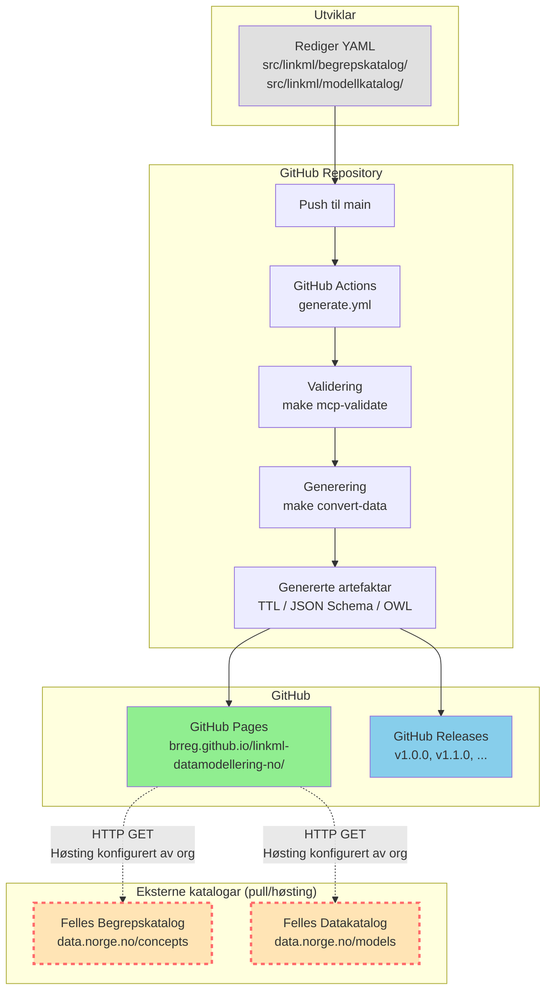

# Konsolidering: arkitektur-oversikt.md og publiseringsflyt-oversikt.md

\*\*Status:\*\* Utført  
**Dato:** 2026-06-29  
**Problem:** `mkdocs/docs/arkitektur-oversikt.md` og `mkdocs/docs/publiseringsflyt-oversikt.md` har overlappande innhald som fører til duplisering og risiko for inkonsistens.

---

## Analyse av overlapp

### Felles innhald (duplisert)

| Tema | arkitektur-oversikt.md | publiseringsflyt-oversikt.md |
|---|---|---|
| **Publiseringsflyt-diagram** | ✅ Mermaid flowchart | ✅ Mermaid flowchart (meir detaljert) |
| **"Pull, ikkje push"-prinsipp** | ✅ Tabell + forklaring | ✅ Seksjon "Kva repoet IKKJE gjer" |
| **Manifest-konfigurasjon** | ✅ `publish_external`-tabell | ✅ Same seksjon |
| **Dataflyt: YAML → data.norge.no** | ✅ Sequence diagram | ✅ Steg-for-steg med bash-eksempel |

### Unikt innhald per fil

**arkitektur-oversikt.md (137 liner):**
- Sequence diagram (Mermaid) som viser steg-for-steg-interaksjon
- Kompakt framstilling (brukarvendt)

**publiseringsflyt-oversikt.md (255 liner):**
- **Kvar genererte filer endar** (3 seksjonar: `generated/`, GitHub Pages, GitHub Releases)
- **Workflow: frå commit til synleg på data.norge.no** (bash-eksempel, steg-for-steg)
- **Feilsøking** (2 scenario med løysingar)
- **Oppsummering** (tabell med ansvar, automatisering, verifiserbarheit)
- Meir detaljert (teknisk referanse)

---

## Problem med noverande situasjon

1. **Duplisering:** "Pull, ikkje push"-prinsippet er forklart i begge filer
2. **Inkonsistens-risiko:** Dersom éin fil vert oppdatert, må den andre òg oppdaterast
3. **Forvirrande for brukarar:** Kva er forskjellen mellom dei to filene?
4. **Brudd på DRY-prinsippet:** Same informasjon ligg to stader

---

## Forslag til løysing

### Alternativ A: Slå saman til éin fil (ANBEFALT)

**Ny fil:** `mkdocs/docs/arkitektur-oversikt.md` (ca. 300 liner)

**Struktur:**

```markdown
# Arkitektur-oversikt

Kompakt intro (2-3 liner).

---

## Publiseringsflyt til eksterne system

**VIKTIG:** Behold Mermaid flowchart frå **arkitektur-oversikt.md** (ikkje publiseringsflyt-oversikt.md).

Grunngjeving:
- arkitektur-oversikt.md sitt diagram er meir kompakt og brukarvendt
- Viser tydeleg ekstern prosess med raud stipla ramme (`classDef external`)
- Betre visualisering av ansvarsdeling (repo vs. eksterne system)
- publiseringsflyt-oversikt.md sitt diagram har for mange subgraphs og er vanskeleg å lese



**Nøkkel:**
- **Solid pil (→):** Automatisk prosess, kontrollert av repoet
- **Stipla pil (-.->):** Ekstern prosess, **ikkje** kontrollert av repoet
- **Raud stipla ramme:** Eksterne system utanfor repoets kontroll

---

## Prinsipp: Pull, ikkje push

[Tabell frå arkitektur-oversikt.md]

Kvifor?
- Enklare arkitektur
- Færre avhengigheiter
- Fleksibilitet

---

## Kvar genererte filer endar

### 1. generated/ (lokal build)
### 2. GitHub Pages (automatisk publisering)
### 3. GitHub Releases (versjonerte artefaktar)

[Frå publiseringsflyt-oversikt.md]

---

## Dataflyt: frå YAML til data.norge.no

### Steg 1-4: Repoet sitt ansvar (automatisk)

[Sequence diagram frå arkitektur-oversikt.md]

### Steg 5-6: Ekstern prosess (manuell koordinering)

[Frå publiseringsflyt-oversikt.md]

---

## Workflow: frå commit til synleg på data.norge.no

### 1. Utviklar lager pullrequest til main
### 2. CI kjører validering og generering
### 3. GitHub Pages er oppdatert
### 4. Felles Begrepskatalog høstar (ekstern prosess)
### 5. Synleg på data.norge.no

[Bash-eksempel og steg-for-steg frå publiseringsflyt-oversikt.md]

---

## Manifest-konfigurasjon

[Tabell frå arkitektur-oversikt.md]

---

## Feilsøking

### Problem: "Eg har pusha til main, men ser ikkje endringane på GitHub Pages"
### Problem: "GitHub Pages er oppdatert, men eg ser ikkje endringane på data.norge.no"

[Frå publiseringsflyt-oversikt.md]

---

## Oppsummering

[Tabell frå publiseringsflyt-oversikt.md]

---

## Sjå òg

- [publisering-begrep.md](publisering-begrep.md) — rettleiing for begrepskatalog
- [publisering-modell.md](publisering-modell.md) — rettleiing for modellkatalog
- [monitorering.md](monitorering.md) — korleis monitorere publisering
- [GOVERNANCE.md](https://github.com/brreg/linkml-datamodellering-no/blob/main/GOVERNANCE.md) — publiseringspolicy
```

**Resultat:**
- Éin fil som kombinerer det beste frå begge
- Brukarvendt (diagram + tabell) + teknisk referanse (bash-eksempel, feilsøking)
- Slutt på duplisering

**Konsekvensar:**
- Slett `mkdocs/docs/publiseringsflyt-oversikt.md`
- Oppdater lenker i andre filer (`monitorering.md`, `publisering-begrep.md`, osv.)

---

### Alternativ B: Delar opp ansvar tydeleg (IKKJE ANBEFALT)

**arkitektur-oversikt.md** — Brukarvendt oversikt (kompakt)
- Flowchart
- "Pull, ikkje push"-prinsipp
- Manifest-konfigurasjon
- Lenke til publiseringsflyt-oversikt.md for detaljar

**publiseringsflyt-oversikt.md** — Teknisk referanse (detaljert)
- Kvar genererte filer endar
- Workflow med bash-eksempel
- Feilsøking
- Oppsummering

**Problem med alternativ B:**
- Brukarar må lese **begge** filene for å få full forståing
- Fortsatt duplisering ("Pull, ikkje push"-prinsipp i begge)
- Uklart kva som høyrer til kvar fil

---

## Anbefaling

**Gå for Alternativ A** — slå saman til éin fil `arkitektur-oversikt.md`.

**Fordeler:**
- ✅ Éin autoritativ kjelde (DRY)
- ✅ Full oversikt på éin stad (betre brukaropplevelse)
- ✅ Lettare å vedlikehalde (berre éin fil)
- ✅ Slutt på duplisering og inkonsistens-risiko

**Ulemper:**
- Lengre fil (~300 liner i staden for 137)
- Men: det er OK for ein referansedokument

---

## Implementeringsplan

### Steg 1: Slå saman innhald

Oppdater `mkdocs/docs/arkitektur-oversikt.md`:

1. Legg til seksjon "Kvar genererte filer endar" (frå publiseringsflyt-oversikt.md)
2. Legg til seksjon "Workflow: frå commit til synleg på data.norge.no" (frå publiseringsflyt-oversikt.md)
3. Legg til seksjon "Feilsøking" (frå publiseringsflyt-oversikt.md)
4. Legg til seksjon "Oppsummering" (frå publiseringsflyt-oversikt.md)
5. Erstatt flowchart med meir detaljert versjon frå publiseringsflyt-oversikt.md
6. Oppdater "Sjå òg"-lenker

### Steg 2: Slett publiseringsflyt-oversikt.md

```bash
git rm mkdocs/docs/publiseringsflyt-oversikt.md
```

### Steg 3: Oppdater lenker

Oppdater lenker i desse filene:

| Fil | Lenke som må oppdaterast |
|---|---|
| `mkdocs/docs/monitorering.md` | Fjern lenke til publiseringsflyt-oversikt.md (arkitektur-oversikt.md er allereie lenka) |
| `mkdocs/docs/publisering-begrep.md` | Endra lenke frå publiseringsflyt-oversikt.md til arkitektur-oversikt.md |
| `mkdocs/docs/publisering-modell.md` | Endra lenke frå publiseringsflyt-oversikt.md til arkitektur-oversikt.md |

### Steg 4: Verifiser

```bash
# Sjekk at ingen døde lenker:
grep -r "publiseringsflyt-oversikt" mkdocs/docs/

# Bygg og sjekk lokalt:
make docs-publish && make docs-serve
```

---

## Eksempel på oppdatert arkitektur-oversikt.md

**Nye seksjonar å legge til:**

```markdown
## Kvar genererte filer endar

### 1. `generated/` (lokal build)

**Kvar:** `/generated/<domain>/<modell>/`

**Innhald:**
- SHACL shapes (`.ttl`)
- JSON Schema (`.json`)
- OWL ontologi (`.ttl`)
- Python-klassar (`.py`)
- Protobuf (`.proto`)
- Dokumentasjon (`docs/`)
- PlantUML-diagram (`.puml`, `.svg`)
- ER-diagram (`.md`)

**Git-status:** Ignorert (i `.gitignore`) — vert ikkje sjekka inn

**Formål:** Lokal testing og verifisering før push

### 2. GitHub Pages (automatisk publisering)

**URL:** `https://brreg.github.io/linkml-datamodellering-no/`

**Innhald:**
- Alle genererte artefaktar (same som `generated/`)
- Begrepskatalogar: `.ttl`-filer frå `src/linkml/begrepskatalog/*/data/`
- Modellkatalogar: `.ttl`-filer frå `src/linkml/modellkatalog/*/data/`
- MkDocs-dokumentasjonsportal

**Versjonering:** Peikar alltid til siste versjon på `main` — **ikkje versjonsstabil**

**Formål:**
- Dokumentasjonsportal for menneskelege brukarar
- Høstingsendepunkt for Felles Begrepskatalog / Felles Datakatalog

### 3. GitHub Releases (versjonerte artefaktar)

**URL:** `https://github.com/brreg/linkml-datamodellering-no/releases`

**Versjonering:** Semantisk versjonering (`v1.0.0`, `v1.1.0`, osv.) — **versjonsstabil**

**Formål:**
- Stabile URI-ar for import frå eksterne repo
- Historisk arkiv av tidlegare versjonar

---

## Workflow: frå commit til synleg på data.norge.no

### 1. Utviklar lager pullrequest til `main`

```bash
# Oppdater main
git switch main
git pull origin main

# Lag ny arbeidsbranch
git switch -c feature/mi-endring

# Gjer endringar
git add src/linkml/begrepskatalog/brreg-begrepskatalog/data/brreg-begrepskatalog/brreg-begrepskatalog.yaml
git commit -m "feat(brreg-begrepskatalog): legg til nytt begrep 'aksjonær'"

# Push branch
git push -u origin feature/mi-endring

# Opprett Pull Request til main i GitHub-grensesnittet
```

### 2. CI kjører validering og generering

GitHub Actions (`generate.yml`):
1. Validerer datafila: `make mcp-validate POLICY=felles-begrepskatalog`
2. Genererer `.ttl`-fil: `make convert-data`
3. Publiserer til GitHub Pages: `actions/deploy-pages@v1`

**Tidsbruk:** ~3-5 minutt

### 3. GitHub Pages er oppdatert

`https://brreg.github.io/linkml-datamodellering-no/begrepskatalog/brreg-begrepskatalog/brreg-begrepskatalog.ttl`
inneheld no den oppdaterte datafila i SKOS/Turtle-format.

### 4. Felles Begrepskatalog høstar (ekstern prosess)

**Kven:** Digitaliseringsdirektoratet / Felles Begrepskatalog-systemet  
**Når:** Avhengig av høstingsintervall (t.d. dagleg, ukentleg)  
**Korleis:** HTTP GET frå GitHub Pages-URL  
**Kontroll:** Repoet har ingen kontroll over når/om høsting skjer

**Tidsbruk:** Varierer — frå minutt til dagar

### 5. Synleg på data.norge.no

Begrepet visast på [data.norge.no/concepts](https://data.norge.no/concepts) etter at
høsting og indeksering er fullført.

---

## Feilsøking

### Problem: "Eg har pusha til main, men ser ikkje endringane på GitHub Pages"

**Løysing:**
1. Sjekk at CI-jobben `generate` er grøn: https://github.com/brreg/linkml-datamodellering-no/actions
2. Sjekk at `publish_external: true` i `manifest.yaml`
3. Vent 3-5 minutt for at GitHub Pages skal oppdaterast
4. Hard-refresh i nettlesaren (Ctrl+Shift+R)

### Problem: "GitHub Pages er oppdatert, men eg ser ikkje endringane på data.norge.no"

**Løysing:**
1. Verifiser at høstingsendepunktet er registrert på [admin.fellesdatakatalog.digdir.no](https://admin.fellesdatakatalog.digdir.no)
2. Kontakt Digitaliseringsdirektoratet (dataopen@digdir.no) for å verifisere høstingsstatus
3. Vurder manuell høsting via admin-grensesnittet ("Høst no"-knappen)

**NB:** Repoet har ingen måte å verifisere om høsting faktisk skjer — det er utanfor repoets kontroll.

---

## Oppsummering

| Steg | Ansvarleg | Automatisk? | Verifiserbart? |
|---|---|---|---|
| 1. Rediger YAML | Utviklar | Nei | Ja (lokal validering) |
| 2. Pullrequest til `main` | Utviklar | Nei | Ja (GitHub) |
| 3. CI genererer artefaktar | GitHub Actions | Ja | Ja (Actions-logg) |
| 4. Publiser til GitHub Pages | GitHub Actions | Ja | Ja (sjekk URL) |
| 5. Høsting frå Felles Begrepskatalog/Datakatalog | Org i den enkelte virksomhet | Nei (manuell setup) | Nei (ikkje tilgjengeleg for repoet) |
| 6. Synleg på data.norge.no | Digitaliseringsdirektoratet | Ja (etter høsting) | Ja (manuell sjekk) |

**Konklusjon:** Repoet kontrollerer steg 1-4. Steg 5-6 er eksterne prosessar som må
koordinerast med Digitaliseringsdirektoratet.
```

---

## Endeleg filstruktur

**Før:**
```
mkdocs/docs/
  arkitektur-oversikt.md     (137 liner, kompakt)
  publiseringsflyt-oversikt.md  (255 liner, detaljert)
```

**Etter:**
```
mkdocs/docs/
  arkitektur-oversikt.md     (~320 liner, kombinert)
```

---

## Prioritet

**MEDIUM** — ikkje blokkerar for PoC-lansering, men bør gjerast før eksterne organisasjonar kjem inn for å unngå forvirring og inkonsistens.
