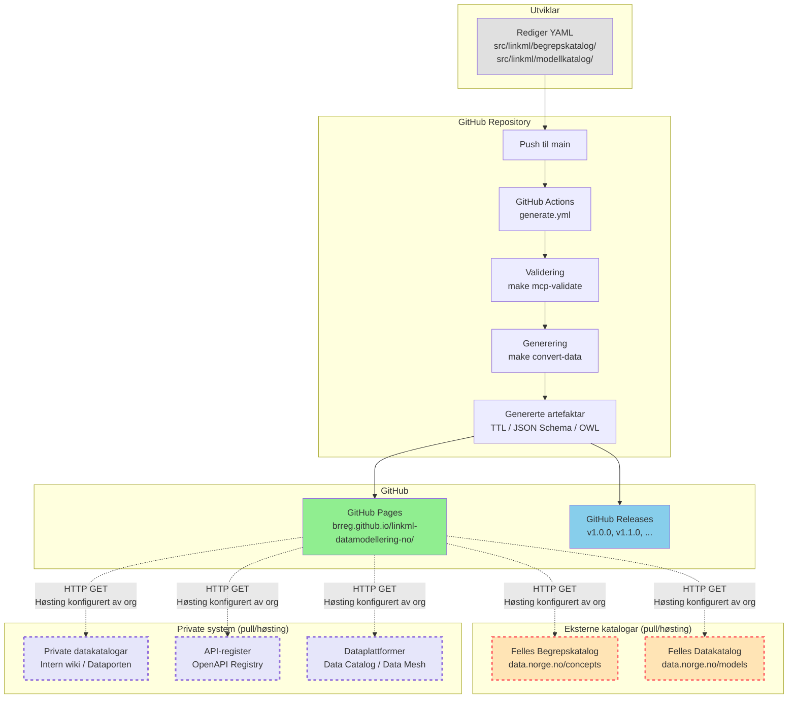
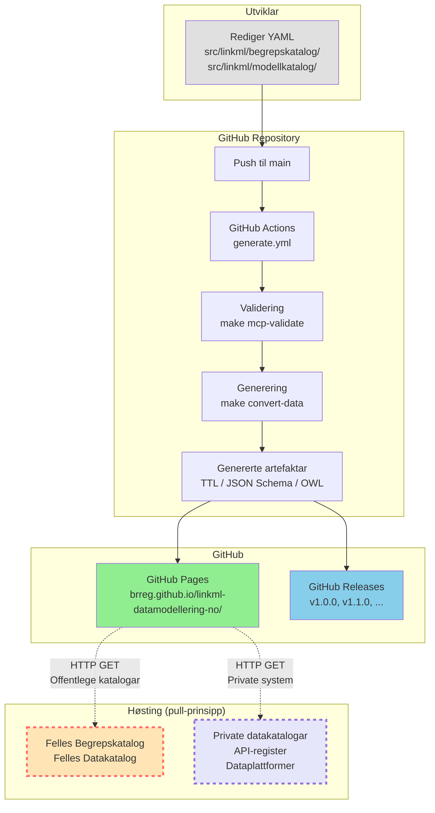

# Utvid publiseringsflyt-diagram med private system

## Bakgrunn

Eksisterande diagram i `mkdocs/docs/arkitektur-oversikt.md` viser publiseringsflyt
til **Felles Begrepskatalog** og **Felles Datakatalog** (offentlege katalogar).

Desse to katalogane er **ikkje** dei einaste systema som kan høste frå repoet.
Andre typar system kan også høste artefaktar frå GitHub Pages:

1. **Private datakatalogar** (organisasjonsinterne katalogar, t.d. Dataporten, Confluence, intern wiki)
2. **API-register** (dokumentasjon av API-ar, t.d. API-portal, OpenAPI Registry)
3. **Dataplattformer** (data mesh, data lakehouse, t.d. Databricks, Snowflake, Google Cloud Data Catalog)

Desse systema følgjer same pull-prinsipp som Felles Begrepskatalog/Datakatalog,
men er **ikkje** kontrollerte av Digitaliseringsdirektoratet.

**Mål:** Oppdater diagrammet for å synleggjere at private system også kan høste,
og at repoet er ein **generell katalog-/datainfrastrukturkomponent** — ikkje berre
ein "Felles Begrepskatalog/Datakatalog-feeder".

## Endringar i diagrammet

### Noverande struktur

```
GitHub Pages
  ├─→ Felles Begrepskatalog (data.norge.no/concepts)
  └─→ Felles Datakatalog (data.norge.no/models)
```

### Ny struktur

```
GitHub Pages
  ├─→ Eksterne katalogar (pull/høsting)
  │     ├─ Felles Begrepskatalog (data.norge.no/concepts)
  │     └─ Felles Datakatalog (data.norge.no/models)
  │
  └─→ Private system (pull/høsting)
        ├─ Private datakatalogar
        ├─ API-register
        └─ Dataplattformer
```

**Visuelt:** To separate `subgraph`-boksar ved sida av kvarandre:
- **"Eksterne katalogar (pull/høsting)"** — offentlege Digdir-katalogar
- **"Private system (pull/høsting)"** — organisasjonsinterne system

## Oppdatert Mermaid-diagram



**Visuelle forskjellar:**
- **Eksterne katalogar**: raud stipla ramme (#FF6B6B), beige bakgrunn (#FFE4B5)
- **Private system**: lilla stipla ramme (#9370DB), lavendel bakgrunn (#E6E6FA)

## Oppdatert nøkkel

**Nøkkel:**
- **Solid pil (→):** Automatisk prosess, kontrollert av repoet
- **Stipla pil (-.->):** Ekstern prosess, **ikkje** kontrollert av repoet
- **Raud stipla ramme:** Eksterne offentlege katalogar (Digdir)
- **Lilla stipla ramme:** Private organisasjonsinterne system

## Oppdatert "Pull, ikkje push"-prinsipp-tabell

Legg til rad for private system:

| Kva repoet GØR | Kva repoet IKKJE gjer |
|---|---|
| ✅ Publiserer artefaktar til GitHub Pages | ❌ Pusher ikkje til data.norge.no |
| ✅ Publiserer releases til GitHub | ❌ Har ikkje API-credentials for Felles Begrepskatalog |
| ✅ Validerer data mot policies | ❌ Har ikkje API-credentials for Felles Datakatalog |
| ✅ Genererer høstingsklare TTL-filer | ❌ Kontrollerer ikkje når høsting skjer |
| ✅ Genererer JSON Schema / OWL / Python | ❌ Har ikkje API-credentials for private datakatalogar |
| ✅ Artefaktane kan høstast av kven som helst | ❌ Krev ikkje autentisering for GitHub Pages (offentleg) |

**Ny rad:**
- ✅ Artefaktane kan høstast av kven som helst
- ❌ Krev ikkje autentisering for GitHub Pages (offentleg)

## Ny seksjon: "Private system som kan høste"

Legg til etter "Pull, ikkje push"-seksjonen:

```markdown
## Private system som kan høste

Artefaktane publiserte på GitHub Pages kan høstast av alle typar system,
ikkje berre Felles Begrepskatalog og Felles Datakatalog.

### Private datakatalogar

Organisasjonsinterne datakatalogar kan høste LinkML-skjema og datafiler for:
- Intern begrepskatalog (SKOS/Turtle)
- Intern datamodell-register (JSON Schema / OWL)
- Intern dokumentasjon (Markdown / HTML)

**Eksempel:**
- Dataporten (intern datakatalog)
- Confluence (intern wiki med datakatalog-plugin)
- Alation / Collibra (kommersielle datakatalog-løysingar)

**Høstingsformat:**
- `.ttl` (Turtle/RDF) for semantiske datakatalogar
- `.json` (JSON Schema) for API-drivne datakatalogar
- `.md` (Markdown) for dokumentasjonsportalar

### API-register

API-register kan høste OpenAPI/AsyncAPI-spesifikasjonar genererte frå LinkML-skjema:
- OpenAPI 3.1 (REST API)
- AsyncAPI 3.0 (event-driven API)
- JSON Schema (datavalidering)

**Eksempel:**
- OpenAPI Registry (intern API-portal)
- SwaggerHub (kommersielt API-register)
- API-katalog i dataplattform (t.d. Apigee, Kong)

**Høstingsformat:**
- `openapi.yaml` (OpenAPI 3.1)
- `asyncapi.yaml` (AsyncAPI 3.0)
- `.json` (JSON Schema for request/response-validering)

### Dataplattformer

Data mesh / data lakehouse-plattformar kan høste metadata for:
- Data lineage (kvar kom dataen frå, kvar gjekk ho)
- Data schema (kva struktur har dataen)
- Data quality (kva kvalitetskrav gjeld)

**Eksempel:**
- Google Cloud Data Catalog
- AWS Glue Data Catalog
- Databricks Unity Catalog
- Snowflake Data Sharing

**Høstingsformat:**
- `.ttl` (RDF/OWL for semantisk metadata)
- `.json` (JSON Schema for strukturell metadata)
- `.proto` (Protobuf for schema-evolusjon)
```

## Steg

### 1. Oppdater Mermaid-diagram
✓ Erstatt eksisterande diagram i `mkdocs/docs/arkitektur-oversikt.md` (linje 11-44)
med det nye diagrammet som inkluderer to `subgraph`-boksar:
- "Eksterne katalogar (pull/høsting)"
- "Private system (pull/høsting)"

### 2. Oppdater nøkkel
✓ Legg til lilla stipla ramme i nøkkelen (linje 46-49):
```markdown
**Nøkkel:**
- **Solid pil (→):** Automatisk prosess, kontrollert av repoet
- **Stipla pil (-.->):** Ekstern prosess, **ikkje** kontrollert av repoet
- **Raud stipla ramme:** Eksterne offentlege katalogar (Digdir)
- **Lilla stipla ramme:** Private organisasjonsinterne system
```

### 3. Oppdater "Pull, ikkje push"-tabell
✓ Legg til rad i tabellen (linje 58-62):
```markdown
| ✅ Artefaktane kan høstast av kven som helst | ❌ Krev ikkje autentisering for GitHub Pages (offentleg) |
```

### 4. Legg til ny seksjon "Private system som kan høste"
✓ Legg til etter "Pull, ikkje push"-seksjonen (etter linje 69), før
"Kvar genererte filer endar"-seksjonen.

Innhald:
- Introduksjon: Private system kan også høste
- Tre underseksjonar:
  1. Private datakatalogar (Dataporten, Confluence, Alation/Collibra)
  2. API-register (OpenAPI Registry, SwaggerHub, API-katalog)
  3. Dataplattformer (Google Cloud Data Catalog, AWS Glue, Databricks, Snowflake)
- Kvar underseksjon har:
  - Kort skildring av bruksområde
  - Eksempel på konkrete system
  - Høstingsformat (`.ttl`, `.json`, `.yaml`, `.proto`)

### 5. Oppdater oppsummeringstabell
✓ Oppdater tabellen i "Oppsummering"-seksjonen (linje 266-275) for å
inkludere private system:

```markdown
| Steg | Ansvarleg | Automatisk? | Verifiserbart? |
|---|---|---|---|
| 1. Rediger YAML | Utviklar | Nei | Ja (lokal validering) |
| 2. Pullrequest til `main` | Utviklar | Nei | Ja (GitHub) |
| 3. CI genererer artefaktar | GitHub Actions | Ja | Ja (Actions-logg) |
| 4. Publiser til GitHub Pages | GitHub Actions | Ja | Ja (sjekk URL) |
| 5a. Høsting frå Felles Begrepskatalog/Datakatalog | Org i den enkelte virksomhet | Nei (manuell setup) | Nei (ikkje tilgjengeleg for repoet) |
| 5b. Høsting frå private system | Organisasjon | Nei (manuell setup) | Nei (ikkje tilgjengeleg for repoet) |
| 6. Synleg på data.norge.no / internt system | Digitaliseringsdirektoratet / Organisasjon | Ja (etter høsting) | Ja (manuell sjekk) |
```

**Endring:** Steg 5 og 6 delte i 5a/5b og 6 for å skilje offentlege og private system.

## Prioritert handlingsliste

1. ✓ Oppdater Mermaid-diagram med to subgraph-boksar
2. ✓ Oppdater nøkkel med lilla stipla ramme
3. ✓ Oppdater "Pull, ikkje push"-tabell med ny rad
4. ✓ Legg til ny seksjon "Private system som kan høste"
5. ✓ Oppdater oppsummeringstabell med 5a/5b-steg

## Avhengigheiter

- Ingen avhengigheiter til andre specs
- Føresett at `mkdocs/docs/arkitektur-oversikt.md` er oppdatert (allereie til stades)

## Utført

Alle 5 steg er gjennomførte:

1. **Mermaid-diagram oppdatert**: To separate `subgraph`-boksar lagt til:
   - "Eksterne katalogar (pull/høsting)" med Felles Begrepskatalog og Felles Datakatalog
   - "Private system (pull/høsting)" med Private datakatalogar, API-register og Dataplattformer
   - Fem stipla peilarar frå GitHub Pages til kvart system
   - Fargepalett: beige (#FFE4B5) for eksterne, lavendel (#E6E6FA) for private
   - Rammefargar: raud (#FF6B6B) for eksterne, lilla (#9370DB) for private

2. **Nøkkel oppdatert**: Lagt til lilla stipla ramme for private system:
   - Raud stipla ramme → Eksterne offentlege katalogar (Digdir)
   - Lilla stipla ramme → Private organisasjonsinterne system

3. **"Pull, ikkje push"-tabell oppdatert**: To nye rader lagt til:
   - ✅ Genererer JSON Schema / OWL / Python | ❌ Har ikkje API-credentials for private datakatalogar
   - ✅ Artefaktane kan høstast av kven som helst | ❌ Krev ikkje autentisering for GitHub Pages (offentleg)

4. **Ny seksjon "Private system som kan høste" lagt til**: 67 linjer med tre underseksjonar:
   - Private datakatalogar (Dataporten, Confluence, Alation/Collibra) — `.ttl`, `.json`, `.md`
   - API-register (OpenAPI Registry, SwaggerHub, API-katalog) — `openapi.yaml`, `asyncapi.yaml`, `.json`
   - Dataplattformer (Google Cloud Data Catalog, AWS Glue, Databricks, Snowflake) — `.ttl`, `.json`, `.proto`

5. **Oppsummeringstabell oppdatert**: Steg 5 og 6 delte i 5a/5b:
   - 5a: Høsting frå Felles Begrepskatalog/Datakatalog (Org i den enkelte virksomhet)
   - 5b: Høsting frå private system (Organisasjon)
   - 6: Synleg på data.norge.no / internt system (Digitaliseringsdirektoratet / Organisasjon)
   - Konklusjon oppdatert for å inkludere "eigen organisasjon"

**Avvik frå opphavleg plan:**
- Ingen avvik — alle steg gjennomførte som planlagt
- Full variant (to subgraph-boksar) brukt, ikkje kompakt variant

**Resultat:**
Publiseringsflyt-diagrammet viser no at repoet er ein **generell katalog-/datainfrastrukturkomponent**
som kan høstast av både offentlege katalogar (Digdir) og private organisasjonsinterne system.

## Implementasjonsdetaljar

### Mermaid-syntaks for to subgraph-boksar ved sida av kvarandre

Mermaid rendrer `subgraph`-boksar vertikalt (under kvarandre) som standard.
For å få to boksar ved sida av kvarandre, bruk **eksplisitte peikarar** frå
`GitHub Pages` til kvar enkelt boks (ikkje til subgraph-containeren):

```mermaid
G -.->|HTTP GET<br/>Høsting konfigurert av org| I
G -.->|HTTP GET<br/>Høsting konfigurert av org| J
G -.->|HTTP GET<br/>Høsting konfigurert av org| K
G -.->|HTTP GET<br/>Høsting konfigurert av org| L
G -.->|HTTP GET<br/>Høsting konfigurert av org| M
```

Dette gjer at Mermaid legg "Eksterne katalogar" og "Private system" på same nivå
(side-by-side) i staden for under kvarandre.

### Alternativ: LR (left-to-right) layout

Dersom side-by-side ikkje fungerer med TB (top-to-bottom) layout, kan `flowchart LR`
brukast:


Men TB er vanlegvis betre for vertikale flytdiagram.

### Fargepalett

| System | Bakgrunn | Ramme | Merknad |
|---|---|---|---|
| Felles Begrepskatalog | `#FFE4B5` (beige) | `#FF6B6B` (raud stipla) | Eksterne offentlege |
| Felles Datakatalog | `#FFE4B5` (beige) | `#FF6B6B` (raud stipla) | Eksterne offentlege |
| Private datakatalogar | `#E6E6FA` (lavendel) | `#9370DB` (lilla stipla) | Private |
| API-register | `#E6E6FA` (lavendel) | `#9370DB` (lilla stipla) | Private |
| Dataplattformer | `#E6E6FA` (lavendel) | `#9370DB` (lilla stipla) | Private |

## Alternativ diagram-variant (kompakt)

Dersom det nye diagrammet blir for stort, kan ein alternativ kompakt variant brukast:



Dette kompakte diagrammet kombinerer:
- Felles Begrepskatalog og Felles Datakatalog i éin boks
- Private datakatalogar, API-register og dataplattformer i éin boks

**Anbefaling:** Bruk den **fulle varianten** (to subgraph-boksar) for klarheit,
med mindre diagrammet blir for stort i mkdocs-renderinga.
